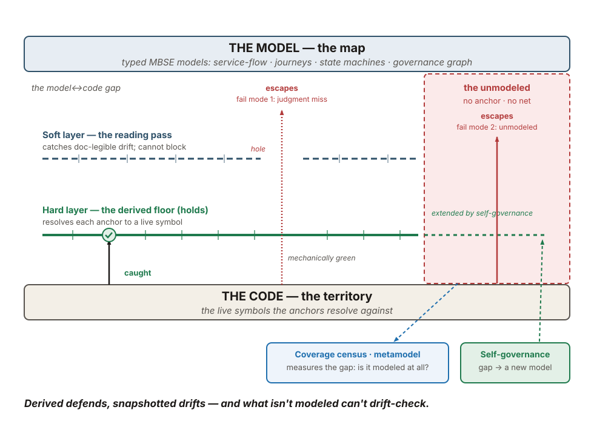

<!-- DRAFT for author review — NOT a numbered chapter, NOT deployed into the book build.
     This _design/*.md is skipped by build_book_html.py. Placement is recommended below;
     the author decides where (if anywhere) it lands. -->

# DRAFT — Keeping the model in sync with the code: the drift-detection evidence

**Status:** DRAFT for author review. Preliminary field-report result — small genuine-drift N per
window; read the honest-reading section before quoting any number. Source data:
the model↔code sync thesis note and the two drift-detection efficacy audits (original N=36, refresh
N=20, cumulative N=56 Epic closes) in the parent repo's field notes.

## Recommended placement (author decides)

This is evidence, not a new concept. It belongs where the book already develops **keeping
representations equal to reality** — the CAP-SYNC capability and its mechanisms (the drift/parity
gate, the symbol-anchored traceability graph, the coverage census). Two homes fit:

- **Preferred — a dedicated data section in Part 3, adjacent to 3.7 "The Scope of Modeling."** Failure
  mode 2 below (the unmodeled) *is* a scope-of-modeling question, so the evidence lands next to the
  chapter that asks what belongs in the model at all. Call it a short "Does the sync hold? — the
  drift-detection evidence" section, cross-linked to the drift/parity-gates and
  symbol-anchored-traceability appendix entries.
- **Alternative — fold the tables into the drift/parity-gates appendix entry** as a "Known uses →
  measured efficacy" block. Lighter touch; loses the failure-mode framing that the author wants
  load-bearing.

Recommendation: the dedicated Part-3 data section. The two failure modes and their cross-refs are the
point, and they need room the appendix entry won't give.

---

## The question: the map must equal the territory, or the bridge lies

A context-bounded fleet governs a context-exceeding codebase *through* typed models. The models are
the bridge the agents reason across. So the models must equal the territory — if a model claims
something the code no longer does, every agent that trusts the model inherits the lie.

"Keep the model in sync with the code, automatically" is the thesis question. It has a cheap-sounding
answer and an expensive-sounding one, and the honest result is that neither alone is enough.

## The mechanism: a two-layer net, and liveness as a property

Sync holds through two layers stacked over the model↔code gap.

- **The soft layer — the reading pass.** A definition-of-done review reads the model's prose surface
  against the code: a frozen status header, a phase index missing a landed phase, a stale count in a
  sentence. A human or an Opus catches these because they live in prose. This layer aims; it cannot
  block, and it is fallible.
- **The hard layer — the derived floor.** A reconciliation lint resolves each model anchor against a
  live symbol in the code. The anchor points at a function or class definition a static resolver can
  find, not at a line number and not at a snapshotted copy. Reading the anchor *is* reading current
  truth. There is nothing to re-sync, so nothing can lag between runs.

The load-bearing property is **liveness as a property, not a process.** A snapshot-plus-sync-process
can drift between runs; a resolver over live code cannot. This is the whole finding compressed:
**derived defends, snapshotted drifts.** Anchor to a symbol, not a line — and where there is no clean
symbol to anchor to, that absence is itself a signal that the model is missing a point of abstraction
(a refactoring target, not a gap to paper over).

## The model grows with the system: two worked examples

Sync is a living practice, not a one-time alignment. The territory grows; the model is edited to
match; a derived gate fails the build if it is not. Two real cases from the study period show the
loop.

**Adding a service endpoint (2026-08-01).** The "pictures-not-pages" PDF pilot added a new editor
endpoint, `GET /api/pdf-page-image/{job_id}/{page}` — the PDF analogue of the existing slide-image and
docx-page-image endpoints. The service-flow model (the Backstage-dialect Component/API catalogue under
`system-models/services/`) had to gain that endpoint or the generated catalogue would no longer match
the source. The commit that landed it (`6fd0b6d51a`) says so in its own words: the endpoint "was added
to the editor cluster YAML but the generated Backstage entity was not regenerated," which "Restores
`gen-web-api-entities --check` to green." The added model fragment is real:

```yaml
/api/pdf-page-image/{job_id}/{page}:
  get:
    summary: Return the rendered page image for a completed PDF job
             (pictures-not-pages pilot ... the PDF analogue of
             /api/slide-image / /api/docx-page-image)
    responses:
      "200": { description: Rendered PDF page image (PNG) for the SPA PdfViewAdapter }
      "400": { description: Job not completed, or not a PDF job }
      "404": { description: Job / output file / page not found }
      "502": { description: Render service failed (systemic) }
```

A new service or endpoint is, by construction, either a model edit or a parity failure. The
service-flow parity gate (`gen-web-api-entities --check`, backed by the service-flow-model and
service-call-graph drift lints) would have failed the build had the model not been edited to match.

**Adding user journeys (2026-07-16; the model kept growing through the drift window).** The
user-journey model gained three Journey entities — `batch-remediate`, `editor-edit`,
`editor-edit-remediate` — authored in commit `01699c8c47`, which in the same change extended the
service-flow lint to admit the `Journey` kind. A Journey names an actor, a goal, and ordered steps,
and each step names the service endpoints it calls. The `batch-remediate` Journey, for instance:

```yaml
kind: Journey
spec:
  actor: uploader
  goal: Get an uploaded document remediated end-to-end (chunk, remediate, merge, validate).
  steps:
    - seq: 1   # chunk-decision
      calls: [genai-service-capacity, lo-service-convert]
    - seq: 2   # per-chunk C# remediation
      calls: [genai-service-batch, genai-service-complete, genai-service-transcribe,
              genai-service-detect-bboxes, ocr-service-ocr, font-svc-fonts, font-svc-cmap]
    - seq: 3   # post-remediation validation
      calls: [render-service-render, accessibility-conformance-service-check,
              accessibility-quality-service-validate, ...]
```

The two-way call-site drift lint (`lint-journey-endpoint-coverage.py` / `lint-journey-service-drift.py`)
holds each journey's declared endpoints to the real `internal_service_client(...)` call sites, in both
directions — a journey that names an endpoint no code calls, or code that calls an endpoint no journey
declares, fails. The model kept growing in the drift window too: the same journey model gained a typed
MAJOR/MINOR criticality tier and a `JourneyClosure` join-key substrate (late July), each with its own
derived check.

*Honesty note:* the three Journey entities were authored 2026-07-16 — inside the broader study period,
before the 07-22 start of the drift-audit corpus. No brand-new Journey entity landed in the
07-28→08-04 refresh window; the journey model's growth there was the criticality-tier and closure-key
expansion. The service-endpoint example (08-01) is squarely in-window.

## The evidence

### Table A — model-sync evidence (the derived floor under load)

Documentation drift is excluded here by construction; this table is model↔code sync only.

| Signal | Value | Caught by |
|---|---|---|
| Model-bridge churn, window 07-28→08-04 | **+8,970 / −173 lines across 63 commits** (query/reactor + governance-graph + frontend-build models) | — (this is the load the net held under) |
| Model↔code drift reaching a post-close reopen | **0** across cumulative N=56 closes | — |
| Genuine model-drift catches, refresh window | traceability-broken ×3 (un-registered model consumer / missing component entry / service-call-graph), stale-anchor / stale-test ×3 | the **derived floor re-run at HEAD** (symbol-anchored drift lint · consumer-registry-fresh · service-call-graph drift), not human reading |
| Pre-floor retro-audit (before the derived floor existed) | **~27 genuine model↔code drifts at S:N ≈ 1.0**, zero false positives, in closed Epics with green DoDs — including a **prod-blocking pointer-drift incident** and a fully-typed function shipped to zero consumers | the audit re-ran each Epic's own lints; the drift had escaped the green DoDs |

The pre-floor row is the "hope-for-the-best fails" evidence: real drift, used to escape, silently,
past green definitions-of-done. The floor was built to close exactly that class, and the top rows are
it holding.

### Table B — documentation-hygiene aside (NOT model sync)

Stale headers and stale prose numbers are **documentation drift, not model drift.** They are the
soft layer's true positives, and they are cheap: a reader catches them, and the close tool heals them.
Kept here, clearly labelled, so they are never counted as model-sync evidence.

| Doc-hygiene drift | Refresh-window count | Caught by | Healed by |
|---|---|---|---|
| STALE-HEADER (a status line frozen at a pre-close phase) | **11** | reading (human / Opus) | the Epic-close tool auto-rewrites the status atomically |
| DOC-CLAIM (a stale prose number: 105→107, 76%→90%, 266→234) | **9** | Opus re-derives the number from code | a routed one-line `[FIX]` / `[AUDIT]` |

*Documentation hygiene, not model sync.* These rows describe prose the lints do not parse. They are
real, and the soft layer is the only practical control for them — but they say nothing about whether
the model equals the code.

### The figure



*Derived defends, snapshotted drifts — and what isn't modeled can't drift-check.*

## The two failure modes: where drift still escapes

The net has two escape hatches. Neither is a footnote; they bound the claim.

**Failure mode 1 — the judgment miss.** A mis-alignment that is not mechanically decidable needs
subjective judgment. The anchor resolves (the code exists, so the hard floor reads green), yet the
*meaning* drifted. The soft reading layer is the only net for this, and it is fallible by
construction — a subtle semantic drift can pass a green definition-of-done. This is the drift that
slips through a hole in the soft layer.

**Failure mode 2 — the unmodeled.** A fact or relation that *should* be modeled but is not has no
anchor, so no drift-check can fire over it. You cannot detect drift of a thing you never modeled.
Here the net has no coverage at all — not a hole in a layer, but a region with no layer. When there is
no clean symbol to anchor to, that absence is the signal: it names a missing point of abstraction, a
refactoring target.

### The systematic backstops (cross-references)

Both failure modes lean, by default, on an engineer or an agent *noticing*. The book has two
mechanisms that convert that noticing into machinery — the right in-book targets to cross-link:

- **The coverage census** (`control-coverage-census`, appendix-b) measures failure mode 2. It
  classifies every control by which target it guards, derives the classification from each control's
  own anchor, and reports an empty target as a first-class finding. It turns "the estate's blind spot"
  into a queryable map instead of a thing you learn about when it bites.[^metamodel]
- **Self-governance — convert failures to controls** (the failure-to-mechanism / "failures become
  machinery" loop; the reflection-facet substrate that extends the governance graph, and chapter 2.6's
  treatment) converts a recurring gap into a new model or control. Where the census *measures* the gap,
  this *closes* it: the unmodeled fact becomes a modeled one, and the net gains a segment it did not
  have.

[^metamodel]: A note on **metamodels.** An *object* model maps the code — service-flow, journeys,
state machines — and its drift-check asks "does this model still match the code?" A *metamodel* checks
the completeness of the model *set* over the territory: "is the right thing modeled at all?" The
coverage census and the missing-model metric are metamodels in this sense. A metamodel is the
*systematic* backstop for failure mode 2 — it converts "an engineer happens to notice something isn't
modeled" into "a metamodel measures the coverage gap." (This idea may deserve its own development
elsewhere in the book; see the results note.)

## The honest reading

- **Preliminary, small N.** Per window, the count of *genuine* model↔code drifts is small — a handful,
  not a headline. The cumulative 23/23 catch-rate mixes doc-legible catches with modeled ones; the
  model-sync claim rests on the small set of genuine model drifts the derived floor caught, plus zero
  model-drift reopens under heavy churn. This is a field-report result, not a proof. Do not quote
  "23/23" as a model-sync catch-rate — it is a *combined* rate, and its denominator is small for the
  model-sync slice.
- **The catch-rate rose by composition, not by loosening.** The refresh window caught more drift
  (17 of 20 closes vs. the original's 6 of 36) because it moved more territory — product-heavy Epics
  with more doc surface — exactly where the reading layer is the only practical control. The net did
  not get weaker; there was more for it to catch.
- **The claim is narrow and it is about sync, not hygiene.** The three legs: the drift is real and
  used to escape (the ~27 pre-floor findings); the mechanism is derived reconciliation, not
  snapshot-and-sync (liveness as a property); and it held under load (the churn row, with zero
  model-drift reopens). The doc-hygiene aside is kept separate on purpose.
- **The two failure modes are the boundary of the claim.** Sync is enforced for the modeled and
  mechanically-decidable; it is *aimed* for the semantic; and it is *absent* for the unmodeled until a
  metamodel or a self-governance reflex extends the net. That boundary is the honest shape of the
  result.
