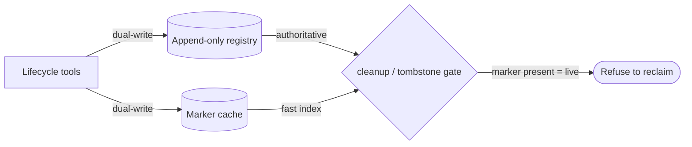

# Agent registry (append-only log + marker cache) — GoF appendix rendering

> **Fill draft.** Worked Structure + Sample Code slots for the catalogue entry
> `agent/lifecycle-and-observability/agent-registry.md`, in the book's Gang-of-Four appendix layout. The
> follow-up pass injects the two filled slots at the placeholders keyed by the entry name
> `Agent registry (append-only log + marker cache)`. The other six sections are projected from the
> catalogue `.md` — reproduced in brief so the entry reads as a complete GoF page.

## Agent registry (append-only log + marker cache)

**Intent** — Keep an append-only registry, dual-written by every lifecycle tool, that is the
*authoritative* record of which agents are in flight, so cleanup, tombstone, and merge decisions read a
fact instead of guessing from filesystem timestamps.

### Motivation

With a fleet of concurrent agents in worktrees, "which agents are live right now?" is the central question
for every reclaim decision. Answer it by scanning directories and comparing mtimes and you get a heuristic
that races with live agents: an agent mid-work can look identical to a stale one and have its worktree
destroyed under it.

### Applicability

Reach for this when every lifecycle tool can dual-write the record, a rule decides which side wins on
divergence, and destructive-op gates consult it before acting.

### Structure

Every lifecycle tool dual-writes the append-only log and a fast marker cache; the log is authoritative,
and a cleanup gate queries a chain of it before reclaiming anything.



*Accessible description: every lifecycle tool dual-writes an append-only registry and a fast marker cache;
the registry is authoritative and the cache a fast index; a cleanup or tombstone gate reads them and
refuses to reclaim any agent whose live marker is present.*

### Sample Code

Liveness becomes a *lookup against a recorded fact*, not an inference from a timestamp. Every lifecycle
tool appends to the log; a reclaim gate reads it and refuses to touch an agent still marked live — the
recorded fact cannot race the way an mtime can.

```python
import json, os

REGISTRY = "agent-registry.jsonl"

def record(agent_id: str, event: str) -> None:
    with open(REGISTRY, "a") as f:                    # append-only: every tool dual-writes here + a marker
        f.write(json.dumps({"agent": agent_id, "event": event}) + "\n")
    open(f".markers/{agent_id}", "w").close() if event == "dispatched" else None

def is_live(agent_id: str) -> bool:
    state = None
    for line in open(REGISTRY):                        # registry wins over the cache on any divergence
        row = json.loads(line)
        if row["agent"] == agent_id:
            state = row["event"]
    return state == "dispatched"

def may_reclaim(agent_id: str) -> bool:
    return not is_live(agent_id)                       # gate consults the fact before any destructive op
```

### Consequences

- **The guarantee is only as strong as the weakest writer.** One tool that mutates lifecycle without
  writing the registry silently brings the mtime-race back.
- **Append-only growth.** The log grows unboundedly and needs rotation.
- **Registry/cache divergence** is possible if one write fails; "registry authoritative" resolves it, but
  the cache can briefly mislead a tool that trusts it alone.

### Known Uses

- An append-only registry log plus a per-agent marker cache, dual-written at dispatch.
- The multi-gate cleanup chain and the live-worktree guard that never operates on a marked agent.

### Related Patterns

- **Enabler** — the merge-train reads it for worktree readiness; the sentinel reads its markers for
  substrate health.
- **Counterpart** — it replaced the mtime heuristic: the authoritative record is the hard fact the racy
  signal could never be.
