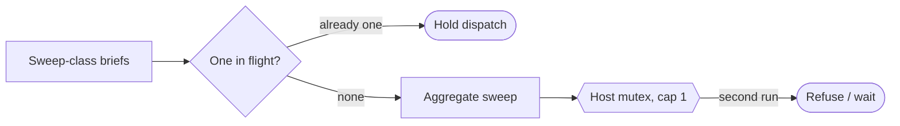

# Aggregate-compute protection (`lint-all` host mutex) — GoF appendix rendering

> **Fill draft.** Worked Structure + Sample Code slots for the catalogue entry
> `agent/mediators-and-resource-locks/aggregate-compute-protection.md`, in the book's Gang-of-Four
> appendix layout. The follow-up pass injects the two filled slots at the placeholders keyed by the entry
> name `Aggregate-compute protection (\`lint-all\` host mutex)`. The other six sections are projected from
> the catalogue `.md` — reproduced in brief so the entry reads as a complete GoF page.

## Aggregate-compute protection (`lint-all` host mutex)

**Intent** — Put a one-per-host mutex on the aggregate lint sweep plus a one-in-flight declaration per
orchestrator, so the single heaviest compute job cannot run twice on a machine or be triggered by many
agents at once.

### Motivation

The aggregate lint sweep is the single heaviest compute in the system; it fans out over the whole tree.
Two concurrent runs, or many agents each triggering one, melt the host. The failure is host exhaustion
from aggregate work that individually looks fine, and it recurs whenever more than one sweep is set in
motion.

### Applicability

Reach for this when a host mutex with a hard timeout is available, briefs declare a compute-class the
orchestrator can count, and a role gate can stop the wrong caller from triggering the sweep.

### Structure

A whole-sweep singleton mutex caps the host to one running sweep, and an orchestrator-side in-flight count
caps dispatched sweeps to one — a coarser instrument than the per-call semaphore over the pieces.



*Accessible description: sweep-class briefs are capped to one in flight by an orchestrator-side count, and
the aggregate sweep acquires a one-per-host mutex; a second run on the same host is refused, so the
heaviest job never overlaps itself.*

### Sample Code

A per-call semaphore over the pieces still lets two whole sweeps overlap; bounding an aggregate needs a
coarser instrument — a **singleton mutex** over the sweep as an indivisible unit, plus an
orchestrator-side in-flight count.

```python
import fcntl, sys

def run_aggregate_sweep(lock_path: str, do_sweep, timeout_s=1800):
    with open(lock_path, "w") as lock:
        try:
            fcntl.flock(lock, fcntl.LOCK_EX | fcntl.LOCK_NB)   # one sweep per host, cap 1
        except BlockingIOError:
            sys.exit("another aggregate sweep holds the host lock — refusing to melt the machine")
        return do_sweep()                                       # indivisible: the whole tree, one at a time

def may_dispatch_sweep(in_flight_sweeps: int) -> bool:
    return in_flight_sweeps == 0        # orchestrator-side: only one sweep-class brief in flight at a time
```

### Consequences

- **Serializes the heaviest gate.** One sweep at a time is the point, but it makes the sweep a throughput
  chokepoint under a busy fleet.
- **The in-flight rule leans on orchestrator discipline.** The host mutex is mechanical; the
  one-in-flight half depends on honest compute-class declaration.
- **Bypass and mis-declaration are holes.** A bypass env var, or a brief that under-declares its
  compute-class, slips past.

### Known Uses

- The aggregate-lint host instance-lock with a hard timeout.
- The compute-class brief declaration plus the one-in-flight discipline.

### Related Patterns

- **Consumer** — reads the role from role-typed dispatch: the role gate refuses the wrong caller.
- **Sibling** — the test-serializer and build-serializer are the finer-grained mediators; this one rations
  the aggregate they cannot.
