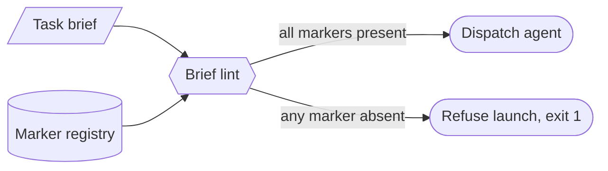

# Brief-linting — GoF appendix rendering

> **Fill draft.** Worked Structure + Sample Code slots for the catalogue entry
> `agent/context-and-dispatch/brief-linting.md`, in the book's Gang-of-Four appendix layout. The
> follow-up pass injects the two filled slots at the placeholders keyed by the entry name `Brief-linting`.
> Intent / Motivation / Applicability / Consequences / Known Uses / Related Patterns are projected from
> the catalogue `.md` — reproduced in brief so the entry reads as a complete GoF page.

## Brief-linting

**Intent** — Statically lint an agent's task brief *before the agent is spawned*, refusing to launch any
brief missing the markers that make the work safe and well-scoped.

### Motivation

A brief is the agent's entire world. A missing marker does not fail loudly; it fails silently and
downstream — the agent edits the wrong branch, or trips a sharp edge twenty minutes in. Because brief
authoring is a manual act repeated for every dispatch, the omission is a class, not a one-off.

### Applicability

Reach for this when a brief is structured text with grep-able marker strings, a registry of mandatory
snippets exists, and a dispatch wrapper can refuse to proceed on a failed check.

### Structure

The linter runs a battery of presence checks over the brief and returns a verdict at the point of no
return: pass launches the agent, any failure refuses the dispatch.



*Accessible description: the brief and a registry of required markers both feed a brief-lint gate; when
every required marker is present the agent is dispatched, and when any is missing the launch is refused
before the agent starts.*

### Sample Code

The lint reads a registry of required marker strings and asserts each appears in the brief text. It is
grep, not parsing — the value is that a malformed brief *cannot* be dispatched, not that it is unlikely
to be. A content check gates on the brief's declared genre, so a citation check fires only on briefs that
require the citation.

```python
import sys

REQUIRED_MARKERS = {"isolation: worktree", "dispatch-id:", "subagent-type:"}
GENRE_CHECKS = {
    # brief genre -> markers that genre must additionally carry
    "code": {"cite:file-line", "scope-allowlist:"},
    "doc": set(),
}

def lint_brief(text: str) -> list[str]:
    findings = [f"missing required marker: {m}" for m in REQUIRED_MARKERS if m not in text]
    genre = next((g for g in GENRE_CHECKS if f"brief-genre: {g}" in text), None)
    for m in GENRE_CHECKS.get(genre, set()):        # no genre -> every genre's checks fire (safe default)
        if genre is not None and m not in text:
            findings.append(f"genre '{genre}' brief missing: {m}")
    return findings

if __name__ == "__main__":
    findings = lint_brief(open(sys.argv[1]).read())
    for f in findings:
        print(f"REJECT: {f}")
    sys.exit(1 if findings else 0)   # non-zero = do not launch
```

### Consequences

- **Structure is not correctness.** A well-formed brief can still task the wrong work; scoping stays a
  human call.
- **Authoring tax.** Every brief now carries boilerplate markers; a template generator that pre-places
  them mitigates the friction.
- **Each new marker is a maintenance edge** — a lint check plus a template thread that can drift apart.

### Known Uses

- The worktree-isolation marker checked as BLOCKING at dispatch.
- A dispatch wrapper's prepare step that emits its go-ahead only after the brief passes.

### Related Patterns

- **Enabler** — the mandatory-snippet registry supplies the markers this lint asserts.
- **Complement** — dynamic context injection is the *content* side of dispatch where this is the
  *structure* side; role-typed dispatch fixes the model and gates the well-formed brief implies.
