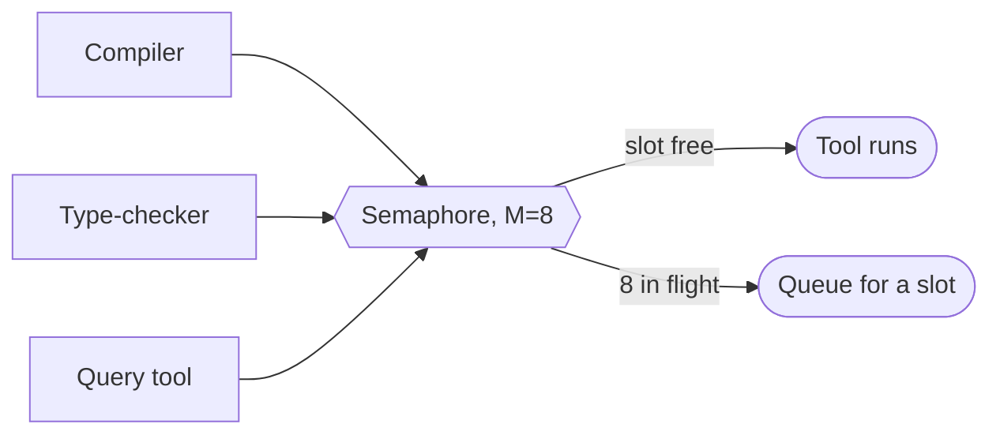

# Build-serializer (M=8 semaphore) — GoF appendix rendering

> **Fill draft.** Worked Structure + Sample Code slots for the catalogue entry
> `agent/mediators-and-resource-locks/build-serializer.md`, in the book's Gang-of-Four appendix layout.
> The follow-up pass injects the two filled slots at the placeholders keyed by the entry name
> `Build-serializer (M=8 semaphore)`. The other six sections are projected from the catalogue `.md` —
> reproduced in brief so the entry reads as a complete GoF page.

## Build-serializer (M=8 semaphore)

**Intent** — Put a host-level counting semaphore (M=8) over the adjacent heavy-compute build tools, so
concurrent worktrees get parallelism up to the machine's capacity without oversubscribing it.

### Motivation

The heavy build tools are a shared-host hazard: N worktrees compiling and type-checking at once saturate
CPU and memory and slow everyone. But unlike the test runner, these tools are numerous and mostly
parallel-safe, so the failure to avoid is both oversubscription (too many melts the host) and
over-serialization (N=1 would waste cores).

### Applicability

Reach for this when the heavy tools are parallel-safe but resource-hungry, a counting-semaphore primitive
is available, and each tool has an enforcer so the mediated path is the only path.

### Structure

Each of the routed tools acquires one of M slots before running and releases after; the semaphore lets
concurrency rise to the host's capacity and caps it there.



*Accessible description: several heavy build tools each acquire one of eight semaphore slots before
running; a tool runs when a slot is free and queues when all eight are in flight, so concurrency rises to
the host's capacity and is capped there.*

### Sample Code

The lock's cardinality follows the resource's contention profile: a bounded semaphore for parallel-safe
but heavy work. Each routed tool acquires a slot before running; an enforcer refuses the un-mediated call
so the cap can't be skipped.

```python
import fcntl

M = 8   # tuned to the host's core / memory budget — parallel-safe but heavy work

def with_build_slot(lock_path: str, run_tool):
    with open(lock_path, "w") as lock:
        for slot in range(M):                          # byte-range semaphore: M independent 1-byte locks
            try:
                fcntl.lockf(lock, fcntl.LOCK_EX | fcntl.LOCK_NB, 1, slot)
                return run_tool()                      # hold the slot for the tool's duration
            except BlockingIOError:
                continue
        raise SystemExit("all build slots busy — queue and retry")

def enforce_mediated(argv0: str, cwd: str) -> None:
    if is_agent_worktree(cwd):                         # the raw call is banned from an agent worktree
        raise SystemExit(f"run {argv0} through the build mediator, not directly")
```

### Consequences

- **M is a fixed guess.** Eight is a static ceiling, not adaptive to host size or current load.
- **Coverage is only as complete as the routed set.** A new heavy tool not wired through the semaphore
  silently escapes the cap.
- **Multiple enforcers to maintain.** Each tool's enforcer is a surface that can drift.

### Known Uses

- The M=8 byte-range semaphore over the heavy build tools.
- The per-tool enforcers that refuse the un-mediated call.

### Related Patterns

- **Sibling** — the test-serializer is the same pattern at N=1; together they are the worked example of
  choosing lock cardinality by contention profile.
- **Layer** — with the test-serializer and the aggregate-compute mutex, the host-compute rationing tier.
