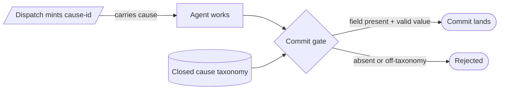

# Caused-by provenance (agent-side change traceability) — GoF appendix rendering

> **Fill draft.** Worked Structure + Sample Code slots for the catalogue entry
> `agent/lifecycle-and-observability/caused-by-provenance.md`, in the book's Gang-of-Four appendix layout.
> The follow-up pass injects the two filled slots at the placeholders keyed by the entry name
> `Caused-by provenance (agent-side change traceability)`. The other six sections are projected from the
> catalogue `.md` — reproduced in brief so the entry reads as a complete GoF page.

## Caused-by provenance (agent-side change traceability)

**Intent** — When an agent-driven change alters system state, trace it back to the reason that caused it,
drawn from a closed taxonomy of causes, enforced by asserting a typed `caused-by` field at the commit
gate — carrying the cause with the dispatch so correlation becomes causation where the cause is known.

### Motivation

The failure is the un-warranted change: a landed diff whose reason survives only as tribal knowledge. When
the fleet does something surprising, RCA of "why did we do this?" becomes guesswork — the diff shows
*what* changed, never *what caused* the fleet to change it. And no causal claim about a nudge or a gate is
defensible if all you can offer is co-occurrence.

### Applicability

Reach for this when there is a commit gate to assert at, a closed taxonomy of causes small enough to be
exhaustive, a dispatch that carries the cause, and an honesty discipline that labels an inferred cause and
never rewards a rate.

### Structure

The cause is minted where the change is decided (the dispatch), travels with it, and is asserted at the
commit gate; an inferred cause carries an honest proxy label.



*Accessible description: a dispatch mints a cause-id and carries it to the agent; at the commit gate the
typed caused-by field is checked against a closed taxonomy; the commit lands when the field is present and
names a known value and is rejected otherwise, with inferred causes labelled as proxies.*

### Sample Code

The cause travels with the dispatch, so the field "comes out for free" at commit — correlation upgraded to
causation because the cause was known when the change was made. A commit gate asserts the field names a
value in the closed taxonomy; an inferred cause is labelled `_proxy`, never hidden.

```python
CAUSES = {"epic", "reflection", "ad-hoc"}   # closed taxonomy — a cause outside it fails loud

def assert_caused_by(commit_msg: str) -> int:
    line = next((l for l in commit_msg.splitlines() if l.startswith("caused-by:")), None)
    if line is None:
        print("REJECT: commit has no caused-by field"); return 1
    value = line.split(":", 1)[1].strip()
    base = value[:-6] if value.endswith("_proxy") else value   # _proxy = the cause had to be inferred
    if base not in CAUSES:
        print(f"REJECT: caused-by '{value}' is not in the taxonomy {sorted(CAUSES)}"); return 1
    return 0

# A telemetry read — NEVER a target. Optimizing the deterministic-vs-proxy ratio would only teach lying.
def caused_by_mix(commits) -> dict[str, int]:
    mix = {}
    for c in commits:
        v = c.caused_by
        mix[v] = mix.get(v, 0) + 1
    return mix
```

### Consequences

- **Some causes are proxy-only.** A change provoked by the agent's own self-check has no external artifact
  holding its cause; label it and be honest. A heavier mechanism relocates the uncertainty, not removes
  it.
- **The taxonomy is a coordination point.** A genuinely new cause needs a declared value, not a local
  string.
- **The signal must not become a target.** The moment anyone rewards the deterministic ratio, the field
  starts lying.

### Known Uses

- A commit gate asserting a caused-by field from the closed taxonomy before a commit lands.
- A telemetry query reporting the caused-by mix per class, read by an operations runbook.

### Related Patterns

- **Specializes** — the reflection substrate's measured leash joins firings to actions by session key;
  this threads an explicit cause-id from cause to effect, a deterministic join where an artifact exists.
- **Counterpart** — product-side mutator stamps record a mutation *inside* the artifact; caused-by records
  the fleet's change *to the repo*.
