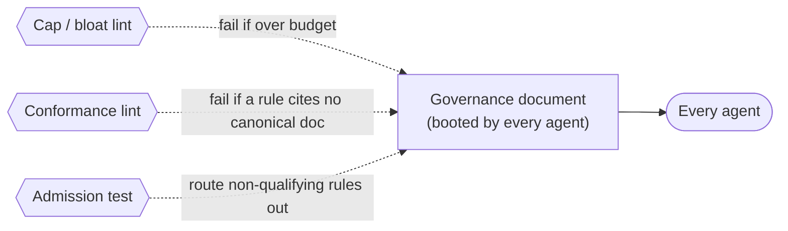

# CLAUDE.md rule index (the governance document as a control) — GoF appendix rendering

> **Fill draft.** Worked Structure + Sample Code slots for the catalogue entry
> `agent/governance-doc-controls/claude-md-rule-index.md`, in the book's Gang-of-Four appendix layout. The
> follow-up pass injects the two filled slots at the placeholders keyed by the entry name
> `CLAUDE.md rule index (the governance document as a control)`. The other six sections are projected from
> the catalogue `.md` — reproduced in brief so the entry reads as a complete GoF page.

## CLAUDE.md rule index (the governance document as a control)

**Intent** — Treat the top-level governance document as enforced infrastructure: a stable-numbered rule
index, loaded into every agent's boot context, held honest by its own enforcement counterpart — a
bloat/cap lint plus a rule-conformance lint — so the document that carries every other mechanism cannot
silently rot.

### Motivation

Governance that doesn't bind and doesn't last fails two ways. *Non-binding*: a convention lives in a stale
wiki page, so a fresh agent never applies it. *Rot*: a living rules document bloats until nothing in it is
read, or its rules drift out of sync with the docs they summarize. Both compound under a fleet, since the
document is booted by every agent.

### Applicability

Reach for this when a boot-context loader injects the document into every agent, a size budget and cap
lint keep it scannable, an admission predicate routes non-qualifying rules elsewhere, and every rule
cross-references one canonical doc.

### Structure

The document is booted by every agent and carries three enforced properties — a size budget, an admission
predicate, and a per-rule cross-reference — each held by a blocking lint.



*Accessible description: the governance document is booted by every agent; a cap lint fails the build if
it exceeds its size budget, a conformance lint fails if any rule stops citing a canonical doc, and an
admission test routes rules that don't earn a spot into sub-docs.*

### Sample Code

The document is governed like an artifact: a size budget bounds the per-invocation context cost, and an
admission predicate — three conditions a rule must all satisfy — keeps the budget satisfiable without
deleting real rules. Anything failing the predicate is routed to a sub-doc instead of the index.

```python
def earns_a_spot(rule) -> bool:
    """Admit a rule to the booted index only if all three hold — else route it out."""
    return (
        rule.regression_preventing        # an agent touching unrelated code could violate it
        and rule.not_derivable_from_local # reading the local file wouldn't surface it
        and rule.crosses_files            # it spans files / subsystems, not one class
    )

def lint_index(rules, line_count, budget: int) -> list[str]:
    findings = []
    if line_count > budget:
        findings.append(f"index over budget ({line_count} > {budget}) — evict a rule to a sub-doc")
    for r in rules:
        if not earns_a_spot(r):
            findings.append(f"rule '{r.name}' fails the admission test — route to a sub-doc")
        if not r.canonical_doc:
            findings.append(f"rule '{r.name}' cites no canonical deep doc")
    return findings
```

### Consequences

- **A hard budget means perpetual triage.** Admitting a new rule eventually means evicting one; the index
  is never "done."
- **Presence is not obedience.** A rule being in the index does not make agents follow it; a separate
  audit re-run is needed to keep its *claims* honest.
- **Stable numbering accretes history.** Never renumbering leaves gaps or tombstones for retired rules.

### Known Uses

- The stable-numbered rule index that is boot context for every agent.
- The bloat lint that caps its size and the conformance lint that enforces the per-rule cross-reference.

### Related Patterns

- **Two lenses** — the same artifact seen as dispatch-time shared context is a sibling entry; this is the
  enforced-infrastructure lens.
- **Counterpart** — the Epic definition-of-done re-run verifies the soft index's *claims* haven't rotted,
  complementing the lints that keep its *form* honest.
