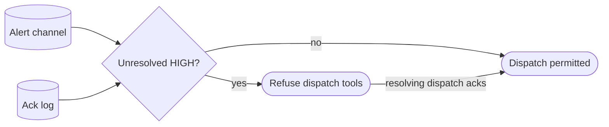

# Cron-alerts gate — GoF appendix rendering

> **Fill draft.** Worked Structure + Sample Code slots for the catalogue entry
> `agent/lifecycle-and-observability/cron-alerts-gate.md`, in the book's Gang-of-Four appendix layout. The
> follow-up pass injects the two filled slots at the placeholders keyed by the entry name
> `Cron-alerts gate`. The other six sections are projected from the catalogue `.md` — reproduced in brief
> so the entry reads as a complete GoF page.

## Cron-alerts gate

**Intent** — Block new orchestrator work-dispatch while an unresolved HIGH-severity cron alert exists,
forcing the orchestrator to ack or resolve it before piling more work onto a possibly-broken substrate.

### Motivation

The cron substrate — merge-train, tombstoning, retries — can break silently. If the orchestrator keeps
dispatching new work on top of a broken substrate, it piles work into a system that cannot land it,
compounding the mess. Surfacing a signal is not enforcing a response; an orchestrator can see or miss a
HIGH alert and keep dispatching.

### Applicability

Reach for this when an append-only alert channel with a severity scale exists, an ack log has terminal
states, the dispatch tools are wired to consult it, and a resolution path is itself exempt so the gate
never deadlocks.

### Structure

The gate reads the alert channel and the ack log; an unresolved HIGH alert refuses the dispatch tools
outright, and only a terminal ack or a resolving dispatch clears it.



*Accessible description: the gate reads the alert channel and the ack log; an unresolved HIGH alert
refuses the dispatch tools, and dispatch is permitted only when no HIGH alert is unresolved — an
alert-resolving dispatch auto-acks and clears the gate.*

### Sample Code

The gate promotes an observability signal into a blocking barrier: an unresolved HIGH alert refuses the
dispatch tools until a terminal ack clears it. Deadlock-freedom is designed in — the resolving path is
exempt, so the gate can always be cleared.

```python
def unresolved_high(alerts, acks) -> list[str]:
    """A HIGH alert with no terminal ack still blocks."""
    terminal = {a.alert_id for a in acks if a.state in {"ACK", "RESOLVE", "BYPASS_AUDIT"}}
    return [a.id for a in alerts if a.severity == "HIGH" and a.id not in terminal]

def gate_dispatch(tool: str, alerts, acks) -> int:
    EXEMPT = {"resolve-alert", "ack-alert"}            # the resolution path must never be blocked
    blocking = unresolved_high(alerts, acks)
    if blocking and tool not in EXEMPT:
        print(f"REFUSED: '{tool}' blocked by unresolved HIGH alerts {blocking} — ack or resolve first")
        return 1
    return 0
```

### Consequences

- **A stuck alert deadlocks dispatch.** Mitigated by exempt tools plus the resolving path plus a recovery
  playbook, but a mis-wired gate can wedge the orchestrator.
- **It depends on correct severity tagging.** A mis-tagged HIGH over-blocks; a mis-tagged LOW under-blocks.
- **The bypass ack is a hole.** A human bypass clears the gate (logged), which can paper over a real
  break.

### Known Uses

- The append-only alerts channel plus the acks log with terminal states.
- The dispatch block on unresolved HIGH alerts and the alert-resolving dispatch that auto-acks.

### Related Patterns

- **Consumer** — reads the typed event bus: alerts are derived events promoted to a gate.
- **Layer** — a dispatch-time health gate upstream of all new work, the health-driven analogue of
  brief-linting's structural dispatch gate.
