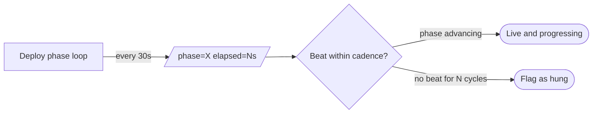

# Deploy heartbeats + stale-worker detection — GoF appendix rendering

> **Fill draft.** Worked Structure + Sample Code slots for the catalogue entry
> `agent/lifecycle-and-observability/deploy-heartbeats.md`, in the book's Gang-of-Four appendix layout.
> The follow-up pass injects the two filled slots at the placeholders keyed by the entry name
> `Deploy heartbeats + stale-worker detection`. The other six sections are projected from the catalogue
> `.md` — reproduced in brief so the entry reads as a complete GoF page.

## Deploy heartbeats + stale-worker detection

**Intent** — Emit periodic `[heartbeat] phase=X elapsed=Ns` from long-running deploys, plus a stale-worker
sweep, so a *hung* deploy or worker is distinguishable from a merely *slow* one.

### Motivation

A long deploy or a stalled worker is indistinguishable from progress without a liveness signal: you cannot
tell "slow build" from "hung process." The orchestrator either kills a healthy-but-slow deploy or waits
forever on a dead one. It recurs on every long-running operation.

### Applicability

Reach for this when the operation is structured into observable phases, the heartbeat format is parseable,
and a consumer knows the expected cadence so a missing beat reads as stale.

### Structure

The phase loop emits phase-plus-elapsed on a fixed cadence; a consumer that knows the cadence reads a
missing beat as a hang rather than mistaking a slow phase for a dead one.



*Accessible description: a deploy phase loop emits a phase-and-elapsed heartbeat every thirty seconds; a
consumer that knows the cadence reads an advancing phase as live-and-progressing and a missing beat over
several cycles as a hang to flag.*

### Sample Code

The heartbeat carries *phase* and *elapsed*, so both liveness and progress are observable; a consumer that
knows the cadence flags a worker that has stopped beating. Process-alive is not enough — a deadlocked
process is alive; only an advancing phase tells slow from hung.

```python
import time

def deploy_with_heartbeat(phases, emit, interval=30.0):
    start = time.monotonic()
    for name, run_phase in phases:
        last = time.monotonic()
        for _ in run_phase():                          # phase yields progress ticks
            now = time.monotonic()
            if now - last >= interval:
                emit(f"[heartbeat] phase={name} elapsed={now - start:.0f}s")
                last = now

def is_stale(last_beat_ts: float, now: float, cadence=30.0, misses=3) -> bool:
    return (now - last_beat_ts) > cadence * misses     # no beat for N cadences ⇒ hung, not slow
```

### Consequences

- **Liveness is not correctness.** A deploy can heartbeat steadily while still failing — the signal proves
  it is moving, not that it is right.
- **Cadence knowledge is required.** Judging staleness needs the consumer to know the cadence; without it
  the signal is noise.
- **Granularity and noise.** Coarse resolution can miss short hangs, and the beats add log volume.

### Known Uses

- The `[heartbeat] phase=X elapsed=Ns` emissions from the deploy phase loop.
- The stale-worker detection sweep and the startup concurrency guard beside it.

### Related Patterns

- **Sibling** — the agent registry and the typed event bus are the fleet's other signal surfaces;
  heartbeats are the deploy-specific one.
- **Layer** — the liveness signal *over* the deploy the staged gates run.
