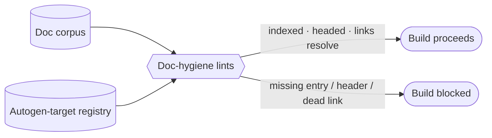

# Doc-hygiene lints (index coverage, autogen provenance) — GoF appendix rendering

> **Fill draft.** Worked Structure + Sample Code slots for the catalogue entry
> `agent/governance-doc-controls/doc-hygiene-lints.md`, in the book's Gang-of-Four appendix layout. The
> follow-up pass injects the two filled slots at the placeholders keyed by the entry name
> `Doc-hygiene lints (index coverage, autogen provenance)`. The other six sections are projected from the
> catalogue `.md` — reproduced in brief so the entry reads as a complete GoF page.

## Doc-hygiene lints (index coverage, autogen provenance)

**Intent** — Hold *documentation* to mechanical checks — index coverage, auto-generated-file provenance
headers, cross-reference validity — so docs cannot silently drift, go stale, or be hand-edited where they
will be overwritten.

### Motivation

Docs drift in ways a diff doesn't reveal: an auto-generated file gets hand-edited and then overwritten, a
new doc never gets indexed, a cross-reference points at a moved file. The result is stale docs that agents
trust as ground truth, and it recurs as the corpus grows. Doc review catches prose and skims right past
the wiring.

### Applicability

Reach for this when a doc index exists to check coverage against, emitted files carry a provenance-header
convention, cross-references are resolvable, and an exemption escape covers legitimate special cases.

### Structure

A family of lints reads the doc corpus and its emitter registry, checking three mechanical invariants:
every doc indexed, every emitted file provenance-headed, every cross-reference resolving.



*Accessible description: doc-hygiene lints read the doc corpus and the autogen-target registry, checking
that every doc is indexed, every emitted file carries its provenance header, and every cross-reference
resolves; the build proceeds when all hold and is blocked on any missing entry, header, or dead link.*

### Sample Code

Each lint is a mechanical presence check the reviewer's eye slides past. The provenance check verifies an
emitted file declares its emitter in the first lines — so a hand-edit, which will be overwritten, is
caught — and the coverage check verifies every doc appears in the index.

```python
import re, sys

def lint_provenance(path: str, head_lines: list[str], is_autogen) -> list[str]:
    if not is_autogen(path):
        return []
    for line in head_lines[:5]:                       # provenance must appear in the first non-blank lines
        if re.search(r"GENERATED by .+ — regen via ", line):
            return []
    return [f"{path}: auto-generated file lacks a provenance header — hand-edits will be overwritten"]

def lint_index_coverage(all_docs: set[str], indexed: set[str]) -> list[str]:
    return [f"{d}: not listed in the doc index (unfindable)" for d in sorted(all_docs - indexed)]

if __name__ == "__main__":
    findings = []  # accumulate across all docs; wire is_autogen to your emitter registry
    print("\n".join(findings))
    sys.exit(1 if findings else 0)
```

### Consequences

- **Mechanical only.** These lints verify a doc is indexed and fresh, never that its prose is correct — a
  well-formed, wrong document passes.
- **Registry maintenance.** The autogen-target registry and the provenance convention need upkeep as
  emitters are added.
- **False positives on legitimate exceptions** require an escape hatch, itself a small hole.

### Known Uses

- The index-coverage lint checking every doc is indexed.
- The autogen-provenance lint plus its registry of emitted targets.

### Related Patterns

- **Family** — the rule-index mechanism is the flagship "documentation with a hard-counterpart lint" this
  generalizes to the whole corpus.
- **Sibling** — the same "read the substrate at lint-time" move, applied to queryable models rather than
  prose docs.
