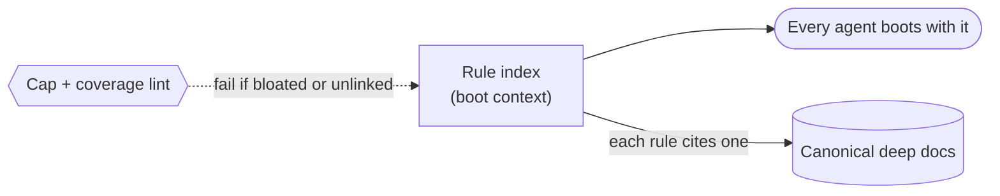

# Docs hierarchy + governance index — GoF appendix rendering

> **Fill draft.** Worked Structure + Sample Code slots for the catalogue entry
> `agent/context-and-dispatch/docs-hierarchy.md`, in the book's Gang-of-Four appendix layout. The
> follow-up pass injects the two filled slots at the placeholders keyed by the entry name
> `Docs hierarchy + governance index`. The other six sections are projected from the catalogue `.md` —
> reproduced in brief so the entry reads as a complete GoF page.

## Docs hierarchy + governance index

**Intent** — Give every agent a single, numbered, cross-referenced rule index (loaded into its boot
context) that points at the canonical deep doc for each rule, so the fleet shares one authoritative map
instead of re-deriving invariants from scattered files.

### Motivation

In a large codebase the knowledge an agent needs is spread across hundreds of docs. Left to find it, an
agent re-derives an invariant badly or violates a cross-file rule it never located. More documentation
makes any single fact *less* findable. Without a canonical index, "the docs say so" is unenforceable.

### Applicability

Reach for this when every rule can cross-reference one canonical deep doc, a cap lint and a coverage lint
can keep the index honest, and a stable-numbering convention lets rules be cited without churn.

### Structure

The index is the one shared map: every agent boots with it, each rule points at exactly one canonical
deep doc, and two lints keep it from rotting back into a pile.



*Accessible description: a single rule index is booted by every agent and points each rule at one
canonical deep doc; a cap-and-coverage lint fails the build if the index bloats past its budget or a rule
stops cross-referencing its doc.*

### Sample Code

Two lints hold the index honest: a **cap lint** bounds its size so it stays scannable, and a
**conformance lint** verifies each rule cross-references exactly one canonical doc that exists. The index
carries the one-line summary; the doc carries the detail.

```python
import sys

LINE_CAP = 1300   # the index must stay scannable, or agents stop reading it

def lint_index(lines: list[str], doc_exists) -> list[str]:
    findings = []
    if len(lines) > LINE_CAP:
        findings.append(f"index is {len(lines)} lines; cap is {LINE_CAP} — evict a rule to a sub-doc")
    for i, line in enumerate(lines, 1):
        if line.lstrip().startswith("#rule"):          # a numbered rule row
            ref = line.split("->")[-1].strip() if "->" in line else ""
            if not ref:
                findings.append(f"line {i}: rule cites no canonical doc")
            elif not doc_exists(ref):
                findings.append(f"line {i}: rule cites '{ref}', which does not resolve")
    return findings

if __name__ == "__main__":
    import os
    text = open(sys.argv[1]).read().splitlines()
    findings = lint_index(text, doc_exists=os.path.exists)   # doc_exists: does the cited path resolve?
    print("\n".join(findings))
    sys.exit(1 if findings else 0)
```

### Consequences

- **Per-invocation context tax.** Every agent pays for every bullet on every dispatch; the cap lint
  exists to bound it.
- **Small index pushes detail elsewhere.** A rule's detail sits in a sub-doc the agent must still fetch;
  dynamic context injection answers that regress.
- **Admission is judgment-heavy.** A lint bounds size but cannot decide what deserves the space.

### Known Uses

- The numbered rule index that is boot context for every agent, enforced by a bloat lint and a
  rule-conformance lint.
- The three-part "what earns a spot" admission test that keeps the index minimal.

### Related Patterns

- **Two lenses** — the same artifact seen as enforced infrastructure (its cap/conformance lints) is a
  sibling entry; this is the shared-context lens.
- **Consumer** — dynamic context injection reads this index and delivers its relevant subset into a brief.
