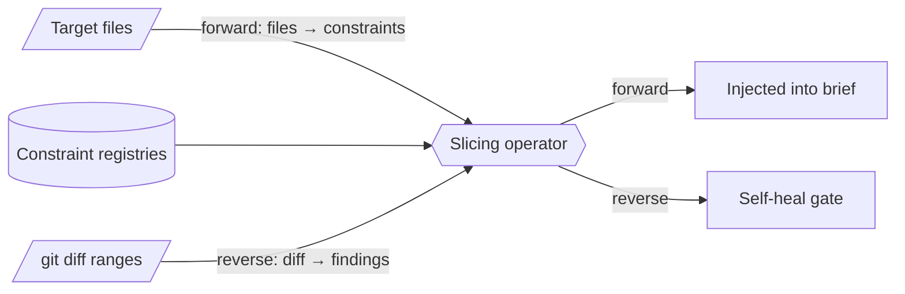

# Dynamic context injection — GoF appendix rendering

> **Fill draft.** Worked Structure + Sample Code slots for the catalogue entry
> `agent/context-and-dispatch/dynamic-context-injection.md`, in the book's Gang-of-Four appendix layout.
> The follow-up pass injects the two filled slots at the placeholders keyed by the entry name
> `Dynamic context injection`. The other six sections are projected from the catalogue `.md` — reproduced
> in brief so the entry reads as a complete GoF page.

## Dynamic context injection

**Intent** — Map the files an agent is about to touch to the exact constraints that govern those files
(lints, conventions, component boundaries, tests) and inject that subset into the brief *before the agent
writes code*, moving detection left of the cheapest CI gate.

### Motivation

The recurring failure is constraint under-specification at dispatch. A coding agent lacks the tacit
knowledge of *which* rules apply to a change, so it makes plausible edits that violate them, then spends
rounds discovering and repairing the violations. A layered validation hierarchy makes it worse: context
is lost between where the change was authored and where the failure surfaces.

### Applicability

Reach for this when every constraint declares a file-addressable scope and lives in a queryable registry,
each rule carries an actionable fix-hint, and the dispatch pipeline has an injection point plus an
on-demand CLI.

### Structure

One slicing operator runs in two directions. Forward maps target files to the constraints that will
govern them and pushes them into the brief; reverse maps a diff's line ranges to the findings it
introduced and feeds a self-heal gate.



*Accessible description: a slicing operator reads the constraint registries and runs in two directions —
forward, mapping target files to the constraints injected into the brief before the agent writes, and
reverse, mapping a diff's line ranges to the findings it introduced, which feed a self-heal gate.*

### Sample Code

The forward slicer intersects each registered constraint's file-scope against the agent's target files
and renders the matches (name, docstring, fix-hint) into the brief. The value of an injected constraint
is bounded by the agent's ability to act on it, so the fix-hint is not optional.

```python
import fnmatch

# each constraint declares the file globs it governs + how to fix it — a self-documenting registry
CONSTRAINTS = [
    {"name": "no-raw-lib", "scope": ["model/**"], "fix": "route mutation through the typed seam"},
    {"name": "typed-new-files", "scope": ["**/*.py"], "fix": "add the file to the strict type set"},
]

def constraints_for(files: list[str]) -> list[dict]:
    """Forward slice: which declared constraints govern *these* files?"""
    hits = []
    for c in CONSTRAINTS:
        if any(fnmatch.fnmatch(f, pat) for f in files for pat in c["scope"]):
            hits.append(c)
    return hits

def render_block(files: list[str]) -> str:
    lines = ["## Constraints governing your target files"]
    for c in constraints_for(files):
        lines.append(f"- **{c['name']}** — fix: {c['fix']}")
    return "\n".join(lines)

if __name__ == "__main__":
    import sys
    print(render_block(sys.argv[1:]))   # paste the block into the brief before dispatch
```

### Consequences

- **Garbage-in.** A rule with no scope tag can't be selected; one with no fix-hint can't be acted on. The
  mechanism depends on that discipline holding fleet-wide.
- **Advisory, not binding.** Forward injection shifts the odds; a downstream gate still guarantees the
  rule.
- **The relevance operator is fallible.** Over-injection floods the brief; under-injection omits a
  governing rule. Precision and recall are a real, tunable surface.

### Known Uses

- A constraint-extraction tool doing the forward slicing and the discovery-time pull.
- The diff-line-range attribution machinery that powers the reverse-direction self-heal.

### Related Patterns

- **Bridge** — a component/zone model supplies the file → component → checks mapping the forward slicer
  reads.
- **Temporal complement** — a tempo-gated reflection facet is the feed-back twin: injection pushes policy
  in at dispatch; reflection pulls the operator back to policy at turn-tempo.
