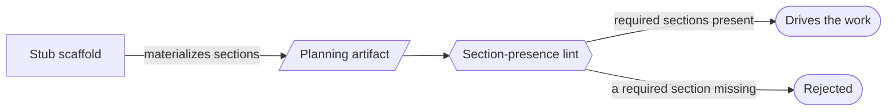

# Epic & design-doc templates — GoF appendix rendering

> **Fill draft.** Worked Structure + Sample Code slots for the catalogue entry
> `agent/governance-doc-controls/epic-and-design-templates.md`, in the book's Gang-of-Four appendix
> layout. The follow-up pass injects the two filled slots at the placeholders keyed by the entry name
> `Epic & design-doc templates`. The other six sections are projected from the catalogue `.md` —
> reproduced in brief so the entry reads as a complete GoF page.

## Epic & design-doc templates

**Intent** — Fixed section-templates for the two core planning artifacts, Epics and design docs, so every
effort is framed with the same required sections (scope, phase decomposition, second-order dynamics,
definition-of-done, observability), and the planning artifact *drives* the work instead of being written
after the fact.

### Motivation

A planning artifact written free-form omits exactly the sections that matter. The design doc that skips
second-order dynamics ships a substrate that deadlocks at tick T+100; the Epic with no explicit
definition-of-done is "done" by assertion. The sections that prevent incidents are the first dropped under
time pressure.

### Applicability

Reach for this when the artifact genre recurs and is worth standardizing, the required sections are each
identified from a real failure, and a scaffold plus lints can materialize and check the shape.

### Structure

A stub scaffold materializes the required sections, a lint asserts their presence, and the checked
artifact then drives the work — the shape is declared, not remembered.



*Accessible description: a stub scaffold materializes the required sections into a planning artifact; a
section-presence lint checks them; when all are present the artifact drives the work, and when one is
missing the artifact is rejected.*

### Sample Code

The template makes required sections structural: a scaffold pre-places them, and a lint checks the
artifact carries each. The section list is itself identified from failure — each earns its place because
omitting it once caused an incident.

```python
import sys

REQUIRED_SECTIONS = [
    "## Scope",
    "## Phase decomposition",
    "## Second-order dynamics",   # omitting this once shipped a substrate that deadlocked under load
    "## Definition of Done",
    "## Observability",           # required for any design that introduces a new event topic
]

def lint_sections(doc_text: str, introduces_topic: bool) -> list[str]:
    findings = []
    for heading in REQUIRED_SECTIONS:
        if heading == "## Observability" and not introduces_topic:
            continue                                   # conditional: only topic-introducing designs need it
        if heading not in doc_text:
            findings.append(f"missing required section: {heading}")
    return findings

if __name__ == "__main__":
    findings = lint_sections(open(sys.argv[1]).read(), introduces_topic=True)
    print("\n".join(findings))
    sys.exit(1 if findings else 0)
```

### Consequences

- **A presence check has a hollow-section hole.** It passes an empty "second-order dynamics" heading; the
  template forces the section, not genuine thought in it.
- **Maintenance surface.** A new required section means updating the template, the scaffold, and the lint
  together; drift among them yields false rejections or silent gaps.
- **Over-templating adds ceremony.** Forcing the full shape onto a trivial change is friction the author
  routes around.

### Known Uses

- The Epic template with its mandatory section shape and multi-criterion definition-of-done.
- The stub scaffold that materializes an Epic and registers it, with registration gates.

### Related Patterns

- **Counterpart** — the Epic definition-of-done is the hard gate that verifies, at close, the template was
  actually satisfied; the template is the soft shape up front.
- **Enabler** — it makes second-order-dynamics and observability required sections, feeding those
  disciplines at design time rather than after an incident.
