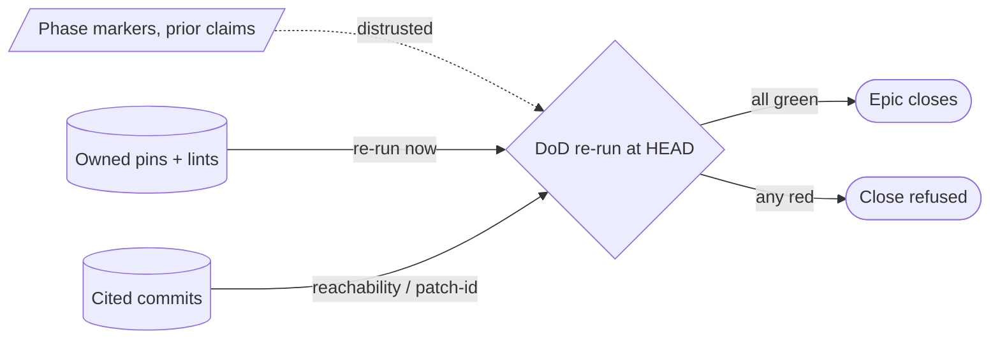

# Epic Definition-of-Done (Final-Opus trust-nothing re-run) — GoF appendix rendering

> **Fill draft.** Worked Structure + Sample Code slots for the catalogue entry
> `agent/governance-doc-controls/epic-definition-of-done.md`, in the book's Gang-of-Four appendix layout.
> The follow-up pass injects the two filled slots at the placeholders keyed by the entry name
> `Epic Definition-of-Done (Final-Opus trust-nothing re-run)`. The other six sections are projected from
> the catalogue `.md` — reproduced in brief so the entry reads as a complete GoF page.

## Epic Definition-of-Done (Final-Opus trust-nothing re-run)

**Intent** — Gate an Epic's close on a "trust nothing" review that re-runs every owned pin test and lint
*at HEAD*, rather than trusting phase markers or prior claims, so an Epic cannot close on stale or rotted
assertions.

### Motivation

An Epic spanning many dispatches accumulates claims — phase markers, "lints pass," pin-test counts — and
those claims rot as sibling sweeps churn the substrate underneath them. Close on the stale claims and you
ship an Epic whose defenses no longer hold. Phase markers and self-reports are exactly what rots.

### Applicability

Reach for this when the close is machine-checkable (reachability or patch-id over cited commits), the
"owned" set of pins and lints per Epic is well-defined, and a reviewer with judgment re-verifies rather
than rubber-stamps.

### Structure

The gate trusts nothing recorded: it re-runs the owned pins and lints against the substrate as it stands
now and checks each cited commit is reachable, closing only when the re-derived verdict is green.



*Accessible description: the definition-of-done gate distrusts recorded phase markers, re-runs the Epic's
owned pins and lints at HEAD, and checks each cited commit is reachable; the Epic closes only when the
re-derived verdict is green and is held otherwise.*

### Sample Code

The gate re-derives the verdict from the substrate rather than reading it off markers. It re-runs every
owned pin and lint at HEAD and verifies each cited commit is reachable; a missing commit forces a logged
override, not a silent pass.

```python
def close_epic(owned_pins, owned_lints, cited_commits, is_reachable, override_reason=None) -> int:
    findings = []
    for pin in owned_pins:            # re-run at HEAD — do NOT trust the recorded "passed" marker
        if pin.run() != "pass":
            findings.append(f"owned pin {pin.name} is red at HEAD")
    for lint in owned_lints:
        if lint.run():
            findings.append(f"owned lint {lint.name} finds violations at HEAD")
    for sha in cited_commits:
        if not is_reachable(sha) and not override_reason:
            findings.append(f"cited commit {sha} is unreachable and no override was given")
    if findings:
        for f in findings:
            print(f"DOD BLOCK: {f}")
        return 1                       # close refused
    return 0                           # atomically rewrite status, move to closed, regenerate the index
```

### Consequences

- **The re-run is expensive.** A full pass of owned pins and lints at close, deliberately heavyweight,
  because a false close is worse.
- **The override is a hole.** It exists for legitimately-unreachable commits, logged, but it is a way past
  the reachability check.
- **"Owned" must be accurate.** An Epic that under-declares what it owns re-runs too little and can still
  close on a rotted-but-unlisted defense.

### Known Uses

- The reachability-gated close tool that requires a logged override for a missing commit.
- The multi-criterion definition-of-done and its final trust-nothing re-run of owned pins and lints.

### Related Patterns

- **Counterpart** — the rule-index lints keep its *form* honest; this re-run keeps *claims* honest.
  Together they are the "keep the enforced documents honest" pair.
- **Consumer** — reads each Epic's owned pins and lints to re-verify at HEAD.
