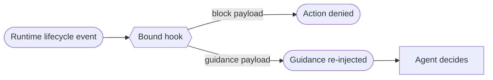

# Lifecycle hooks (interpose on the agent runtime's events) — GoF appendix rendering

> **Fill draft.** Worked Structure + Sample Code slots for the catalogue entry
> `agent/lifecycle-and-observability/lifecycle-hooks.md`, in the book's Gang-of-Four appendix layout. The
> follow-up pass injects the two filled slots at the placeholders keyed by the entry name
> `Lifecycle hooks (interpose on the agent runtime's events)`. The other six sections are projected from
> the catalogue `.md` — reproduced in brief so the entry reads as a complete GoF page.

## Lifecycle hooks (interpose on the agent runtime's events)

**Intent** — Bind a script to the agent runtime's lifecycle events (turn-stop, pre-compaction,
session-start, before-a-tool-call) so a step the operator keeps *omitting at runtime* fires
deterministically, whether or not anyone remembered it.

### Motivation

Some recurring failures live not in the code an agent writes but in the loop that drives it: ending a turn
with ratified work still queued, compacting context without writing a hand-off, opening a session without
reading the alert backlog. A lint can't reach these — there is no source artifact, and the omission
happens at runtime. A house-rule only aims a probabilistic operator and rots.

### Applicability

Reach for this when the runtime exposes lifecycle events and a registration surface, the check is cheap
enough to run on every occurrence, a guidance hook can fail open, and the omission is named and recurring.

### Structure

The runtime fires the hook on a named event; the hook's payload is either a hard block that denies the
action or soft guidance re-injected into the agent's context — the firing is hard, the payload's force
varies.



*Accessible description: a runtime lifecycle event fires a bound hook whose payload is either a hard block
that denies the action or soft guidance re-injected into the agent's context for it to weigh; the firing
is guaranteed by the runtime, the payload's force is the design choice.*

### Sample Code

The hook splits the two halves a lint fuses: the runtime *guarantees the firing*, and the payload is
either a hard veto or soft guidance. The reflex case — *hard delivery of soft guidance* — makes the aiming
deterministic without swapping judgment for machinery. Validate the hook's output against the runtime's
*actual* schema, or a wired-but-dead hook is silently dropped on every fire.

```python
from dataclasses import dataclass

@dataclass
class HookResult:
    decision: str          # "block" | "guide" | "allow" — the runtime's real contract shape
    message: str = ""

def on_turn_stop(work_queued: bool, pool_has_room: bool) -> HookResult:
    if work_queued and pool_has_room:                 # a "guide" payload: aim, don't compel
        return HookResult("guide", "ratified work remains and the pool is under cap — keep going")
    return HookResult("allow")                         # default silent: a false nudge is worse than a miss

def on_pre_edit(path: str, worktree_root: str) -> HookResult:
    if not path.startswith(worktree_root):            # a "block" payload: deny the unsafe action
        return HookResult("block", f"edit outside the sanctioned worktree: {path}")
    return HookResult("allow")

VALID_DECISIONS = {"block", "guide", "allow"}          # build-time check: reject any other shape
```

### Consequences

- **It fires on every event, not only when needed.** A turn-stop hook runs at every stop; the check must
  stay cheap or the tax is constant and resented.
- **A guidance hook can be ignored.** Its payload is soft; only the blocking variant compels.
- **A buggy hook is a loop-level outage.** A blocking hook that misfires, or a guidance hook that crashes
  without fail-open, stalls the whole session.

### Known Uses

- A turn-stop hook that refuses to let the loop rest while ratified work remains and the pool is under cap.
- A pre-compaction hook that writes a hand-off, and a before-a-tool-call guard denying edits outside the
  worktree.

### Related Patterns

- **Counterpart** — the pre-commit hook fires on a *commit* and guards what gets written; this fires on a
  *runtime event* and guards what the loop does.
- **Specialized by** — the reflection-facet substrate is what you build once a second reflection hook
  appears, consolidating many nudges over one shared tempo budget.
