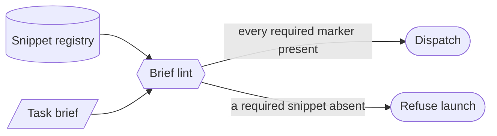

# Mandatory snippet-table enforcement — GoF appendix rendering

> **Fill draft.** Worked Structure + Sample Code slots for the catalogue entry
> `agent/governance-doc-controls/mandatory-snippet-table.md`, in the book's Gang-of-Four appendix layout.
> The follow-up pass injects the two filled slots at the placeholders keyed by the entry name
> `Mandatory snippet-table enforcement`. The other six sections are projected from the catalogue `.md` —
> reproduced in brief so the entry reads as a complete GoF page.

## Mandatory snippet-table enforcement

**Intent** — Keep a registry of mandatory agent-brief snippets (PATH export, commit-cadence, worktree
discovery, submodule check, …) whose presence is asserted at dispatch by brief-linting, so every
dispatched brief carries the safety and context boilerplate it needs.

### Motivation

Every dispatch needs boilerplate to be safe — a PATH export, the commit-cadence discipline, worktree
discovery, a submodule check. An author who forgets one ships an agent that trips exactly that sharp edge
twenty minutes in. Without a registry of what's mandatory, "which snippets does this brief need" is tribal
knowledge that drifts.

### Applicability

Reach for this when each snippet carries a stable grep-able marker, snippet bodies are kept verbatim, an
include-when spec scopes the conditional ones, and brief-linting consumes the table.

### Structure

The table is a registry keyed by snippet, each row carrying an include-when condition and a marker string;
the brief lint reads the table and asserts every applicable marker is present.



*Accessible description: a snippet registry and the task brief both feed the brief lint, which asserts
every applicable snippet's marker is present; the dispatch proceeds when all are and is refused when a
required snippet is absent.*

### Sample Code

The table pairs each snippet with a grep-able marker and an include-when condition; the lint enumerates
the required snippets for a given brief and asserts each marker is present. Always-include snippets have no
condition; conditional ones fire on the brief's declared shape.

```python
SNIPPET_TABLE = [
    {"name": "path-export",    "marker": "<!-- snip:path -->",      "when": lambda b: True},
    {"name": "commit-cadence", "marker": "<!-- snip:commit -->",    "when": lambda b: True},
    {"name": "submodule-check","marker": "<!-- snip:submodule -->", "when": lambda b: "test/samples" in b},
]

def required_snippets(brief: str) -> list[dict]:
    return [s for s in SNIPPET_TABLE if s["when"](brief)]

def lint_snippets(brief: str) -> list[str]:
    return [f"missing mandatory snippet '{s['name']}' (marker {s['marker']})"
            for s in required_snippets(brief) if s["marker"] not in brief]

if __name__ == "__main__":
    import sys
    findings = lint_snippets(open(sys.argv[1]).read())
    print("\n".join(findings))
    sys.exit(1 if findings else 0)
```

### Consequences

- **Verbatim-include means propagation drift.** A snippet updated in the registry must be re-pasted; the
  marker catches *absence*, not *staleness* of the pasted body.
- **The table is a maintenance surface.** Every new snippet is a registry row plus a lint marker plus a
  template thread that can drift.
- **Over-inclusion bloats briefs.** Requiring a snippet where it doesn't apply adds noise.

### Known Uses

- The snippet include-table pairing each snippet with its include-when condition and marker.
- The brief lint's marker-presence assertions over that table.

### Related Patterns

- **Consumer** — brief-linting reads this table and asserts each marker; this registry is its enabler.
- **Sibling** — the rule index is another governance document held honest by a hard counterpart, this one
  via brief-linting rather than a bloat lint.
