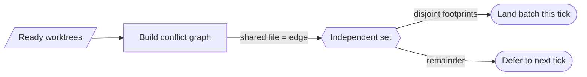

# Merge-train MIS batching — GoF appendix rendering

> **Fill draft.** Worked Structure + Sample Code slots for the catalogue entry
> `agent/gates-and-merge-train/merge-train-mis-batching.md`, in the book's Gang-of-Four appendix layout.
> The follow-up pass injects the two filled slots at the placeholders keyed by the entry name
> `Merge-train MIS batching`. The other six sections are projected from the catalogue `.md` — reproduced
> in brief so the entry reads as a complete GoF page.

## Merge-train MIS batching

**Intent** — Land the largest set of *non-conflicting* agent worktrees per tick by computing a Maximum
Independent Set over their file footprints, so many agents' work merges in one conflict-free pass instead
of thrashing sequentially.

### Motivation

With several agents committing concurrently, a naïve sequential merge serializes all of them and
conflicts thrash: each merge risks colliding with the last, and fleet throughput collapses toward
one-at-a-time. Hot-spot files many agents touch become bottlenecks that stall everything behind them.

### Applicability

Reach for this when per-worktree file footprints are known, a conflict predicate (shared file ⇒ edge) is
cheap, and landed commits can be verified by patch-id or ancestry.

### Structure

Build a conflict graph — worktrees are nodes, a shared file is an edge — then compute an independent set:
the largest group with pairwise-disjoint footprints. That group is non-conflicting by construction and
lands together; the rest defer.



*Accessible description: ready worktrees form a conflict graph where a shared file is an edge; an
independent-set routine picks the largest group with disjoint footprints, lands that group together this
tick, and defers the remainder to the next.*

### Sample Code

Model the tick as a graph problem: worktrees are nodes, a shared file makes an edge, and a greedy
independent set picks a batch whose members share no file. Because no two members touch the same file, the
batch cannot conflict — independence *proves* it, rather than hoping each merge misses the last.

```python
def conflicts(a: set[str], b: set[str]) -> bool:
    return bool(a & b)   # two worktrees conflict iff they share a changed file

def independent_batch(footprints: dict[str, set[str]]) -> list[str]:
    """Greedy maximum independent set over the conflict graph.
    Prefer small footprints first — they exclude the fewest others."""
    batch, claimed = [], set()
    for wt in sorted(footprints, key=lambda w: len(footprints[w])):
        if not conflicts(footprints[wt], claimed):
            batch.append(wt)
            claimed |= footprints[wt]
    return batch

if __name__ == "__main__":
    ready = {"wtA": {"x.py"}, "wtB": {"x.py", "y.py"}, "wtC": {"z.py"}}
    print("land together:", independent_batch(ready))   # -> wtA (or wtC) + wtC (or wtA); wtB defers
```

### Consequences

- **MIS is approximate.** The greedy batch is good enough, not provably maximum every tick.
- **Hot-spot files hard-cap throughput.** If every worktree touches one file, the batch is size 1
  regardless of the algorithm; the win depends on dispatch-side footprint disjointness.
- **It moves complexity upstream.** The orchestrator must plan disjoint waves; a mis-declared footprint
  can let a real conflict slip into a batch.

### Known Uses

- The conflict-graph batcher that lands a disjoint set per tick.
- The disjoint-footprint dispatch recipe that composes waves with non-overlapping file sets.

### Related Patterns

- **Layer** — a stair downstream of the pre-commit hook and the sentinel first-commit check, upstream of
  the staged deploy gates.
- **Consumer** — reads the agent registry to know which worktrees are ready to land.
