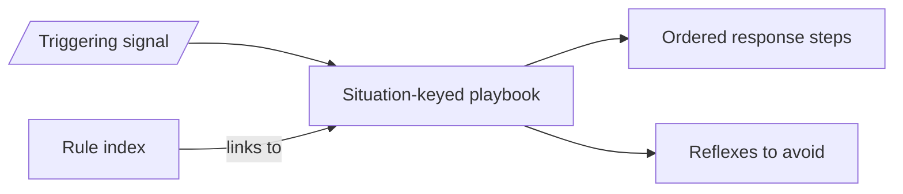

# Operational playbooks — GoF appendix rendering

> **Fill draft.** Worked Structure + Sample Code slots for the catalogue entry
> `agent/governance-doc-controls/operational-playbooks.md`, in the book's Gang-of-Four appendix layout.
> The follow-up pass injects the two filled slots at the placeholders keyed by the entry name
> `Operational playbooks`. The other six sections are projected from the catalogue `.md` — reproduced in
> brief so the entry reads as a complete GoF page.

## Operational playbooks

**Intent** — Keep a library of documented, devops-themed decision procedures (*when situation X arises,
take these steps in this order*) that agents and orchestrators consult instead of reasoning from scratch,
so recurring operational situations get a consistent, pre-reasoned, incident-tested response.

### Motivation

Operational situations recur: a deploy fails a known way, a cron loop can't self-recover, a worktree is
destroyed mid-flight. Each time, an agent under incident pressure re-derives a response and gets the sharp
edges wrong — a flailing reset destroys landed work, a naive restart re-enters the same loop. The cost is
highest exactly when time is shortest.

### Applicability

Reach for this when the operational situation is recurring and nameable, a human has reasoned out the
correct response once (including the reflexes to avoid), and the playbook is discoverable at the moment of
need.

### Structure

Each playbook keys off a triggering situation and gives the ordered response plus the reflexes to avoid;
it is reached two ways — from the terse rule index and from the substrate signal that fires the trigger.

*Accessible description: a triggering signal and the rule index both route to a situation-keyed playbook,
which supplies the ordered response steps and the anti-pattern reflexes to avoid, reasoned once when no
incident was burning.*

### Sample Code

A playbook is human-authored operational judgment, so there is no executable artifact to show. What
a good playbook standardizes is the *shape* of a recurring procedure, and the sharpest way to teach
that shape is to walk one. Here is a config-parameter-space optimization runbook: the situation is
"I want to optimize this system over its config knobs, and I have the performance metrics to say
whether a setting is better." An agent runs the loop; each pass turns some knobs, measures, and
decides what to try next.

<!-- figure: assets/config-optimization-runbook.svg | A config-optimization runbook. A run-measure-assess lifecycle loop wraps a three-step spine: determinize the data space, apply judgment in reasoning space, then determinize the experiment space again. The third, deterministic step logs the reasoning trace for why a configuration was chosen; that trace feeds both the next iteration of the loop and a secondary checker that evaluates the choice. -->

The runbook is anchored to a lifecycle the reader already knows: **run, measure, assess**, then
around again. Every pass of the loop moves through three steps, and the discipline is in how the
steps are typed.

- **Step 1 — determinize the data space.** Fix where the metrics live, their schema, and a model of
  what a normal value looks like against an anomalous one. This step is mechanical. It takes no
  reasoning, so an agent should never improvise it; write it down as an ordered procedure the
  playbook names, and the agent follows it the same way every pass.
- **Step 2 — apply judgment.** From that data, decide which knobs to turn and by how much. This is
  the step that genuinely needs reasoning: reading the measurements, weighing a heuristic against a
  hunch, choosing the next configuration to try. It is where the agent earns its keep, and the one
  step the playbook cannot reduce to a fixed procedure.
- **Step 3 — determinize again.** Render the judgment back into the world. Take the knob choices the
  reasoning produced and apply them to the next experiment. Applying a configuration is mechanical,
  so this step, like the first, should be deterministic rather than improvised.

The two mechanical steps bracket the judgment. That is the pattern the slide names a
*determinize → judgment → determinize* split, and it is worth stating plainly why the split pays
off. The mechanical steps are cheap, repeatable, and auditable. The judgment step is expensive and
variable, so you want as little of the procedure sitting inside it as the problem allows. Determinize
everything that does not need to reason, and the reasoning that remains is smaller, sharper, and
easier to check.

**The determinized third step is where the leverage is.** The natural instinct is to treat step 3 as
plumbing: the reasoning already happened, so just apply the choice and move on. That undersells it.
Because the third step is deterministic, it can capture and log the reasoning trace — the record of
*why* this configuration was chosen — as a first-class output of the pass, not a side effect thrown
away when the experiment starts. That logged trace then does two jobs. It becomes **an input to the
next iteration**, so the loop reads back the rationale it recorded last time and reasons from its own
history instead of from the raw numbers alone. And it becomes **a decision trace for a secondary
checker**: hand a reviewer only the raw output and it can tell you whether the result looks good;
hand it the trace of what was chosen and why and it can tell you whether the *reasoning* was sound,
catch a choice that got a lucky result for a bad reason, and flag a rationale that will not
generalize. Determinize the third step because a deterministic step affords a logged reasoning trace,
and that trace is what lets the loop learn from itself and lets a second checker judge the decision
rather than just the output.

### Consequences

- **Soft: an agent can ignore it.** A playbook informs; nothing forces the agent to open or follow it. Its
  leverage is discoverability plus habit.
- **Playbooks rot.** When the substrate changes, a playbook whose steps aren't updated actively
  mis-directs the response — worse than no playbook.
- **Not a substitute for prevention.** A situation that recurs often enough should be designed out or
  gated, not merely playbooked.

### Known Uses

- The event-bus observability playbook (per topic: baseline-healthy → what-looks-wrong → response).
- The cron-recovery playbook for the "cron is broken and can't restart itself" procedure.

### Related Patterns

- **Counterpart** — the typed event bus *emits* the signals; a playbook says what to *do* about them. A
  signal with no playbook is unactioned noise.
- **Family** — the rule index is the terse index that links out to these long-form procedures.
