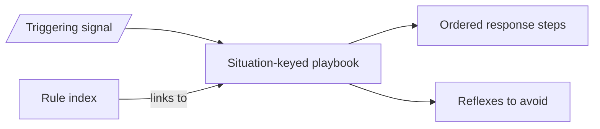

# Operational playbooks — GoF appendix rendering

> **Fill draft.** Worked Structure + Sample Code slots for the catalogue entry
> `agent/governance-doc-controls/operational-playbooks.md`, in the book's Gang-of-Four appendix layout.
> The follow-up pass injects the two filled slots at the placeholders keyed by the entry name
> `Operational playbooks`. The other six sections are projected from the catalogue `.md` — reproduced in
> brief so the entry reads as a complete GoF page.

## Operational playbooks

**Intent** — Keep a library of documented, devops-themed decision procedures (*when situation X arises,
take these steps in this order*) that agents and orchestrators consult instead of reasoning from scratch,
so recurring operational situations get a consistent, pre-reasoned, incident-tested response.

### Motivation

Operational situations recur: a deploy fails a known way, a cron loop can't self-recover, a worktree is
destroyed mid-flight. Each time, an agent under incident pressure re-derives a response and gets the sharp
edges wrong — a flailing reset destroys landed work, a naive restart re-enters the same loop. The cost is
highest exactly when time is shortest.

### Applicability

Reach for this when the operational situation is recurring and nameable, a human has reasoned out the
correct response once (including the reflexes to avoid), and the playbook is discoverable at the moment of
need.

### Structure

Each playbook keys off a triggering situation and gives the ordered response plus the reflexes to avoid;
it is reached two ways — from the terse rule index and from the substrate signal that fires the trigger.

*Accessible description: a triggering signal and the rule index both route to a situation-keyed playbook,
which supplies the ordered response steps and the anti-pattern reflexes to avoid, reasoned once when no
incident was burning.*

### Sample Code

No sample code — this is a process/policy control. A playbook is human-authored operational judgment, not
an executable artifact. The shape it standardizes is a per-situation entry: the triggering question, the
inspect command, the quantified healthy baseline, and *what-looks-wrong → what-it-means → what-to-do*,
with an explicit escape for the case where a substrate wedges. The value is that the correct steps — and
the reflexes to avoid — are written down once and discoverable at the moment they're needed, not
re-derived under pressure.

### Consequences

- **Soft: an agent can ignore it.** A playbook informs; nothing forces the agent to open or follow it. Its
  leverage is discoverability plus habit.
- **Playbooks rot.** When the substrate changes, a playbook whose steps aren't updated actively
  mis-directs the response — worse than no playbook.
- **Not a substitute for prevention.** A situation that recurs often enough should be designed out or
  gated, not merely playbooked.

### Known Uses

- The event-bus observability playbook (per topic: baseline-healthy → what-looks-wrong → response).
- The cron-recovery playbook for the "cron is broken and can't restart itself" procedure.

### Related Patterns

- **Counterpart** — the typed event bus *emits* the signals; a playbook says what to *do* about them. A
  signal with no playbook is unactioned noise.
- **Family** — the rule index is the terse index that links out to these long-form procedures.
