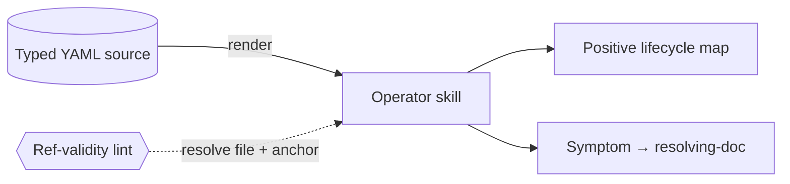

# Operator runbook skill (positive map first, symptom index fallback) — GoF appendix rendering

> **Fill draft.** Worked Structure + Sample Code slots for the catalogue entry
> `agent/governance-doc-controls/operator-runbook-skill.md`, in the book's Gang-of-Four appendix layout.
> The follow-up pass injects the two filled slots at the placeholders keyed by the entry name
> `Operator runbook skill (positive map first, symptom index fallback)`. The other six sections are
> projected from the catalogue `.md` — reproduced in brief so the entry reads as a complete GoF page.

## Operator runbook skill (positive map first, symptom index fallback)

**Intent** — Give an operating agent the *positive* map of how the operational substrate works — its
lifecycles and healthy baselines — first, and a *symptom → resolving-doc* catalog as the fallback when
something breaks. Generate the content from a typed source-of-truth so a reference-validity lint keeps
every pointer honest.

### Motivation

An operator running a complex substrate must know two things: how it works when healthy, and what to do
when it breaks. Both live scattered across a house-rules doc, a docs index, and incident memories a fresh
operator doesn't hold. So the operator re-derives the substrate's shape from scratch, and the routing
itself rots: a doc moves, the pointer dangles, the next operator is sent on a chase.

### Applicability

Reach for this when a typed source-of-truth can be rendered into the skill, a reference-validity lint can
resolve both file and heading anchor, runbook steps can be typed by how automatable they are, and a
partner path routes a recurring failure to a designed mechanism.

### Structure

The skill leads with the positive lifecycle map, falls back to a symptom-keyed index, and is rendered from
typed YAML; a reference-validity lint resolves every pointer's file and anchor on each build.



*Accessible description: a typed YAML source renders into the operator skill, which leads with a positive
lifecycle map and falls back to a symptom-to-doc index; a reference-validity lint resolves every pointer's
file and heading anchor on each build, so a moved doc is a build error.*

### Sample Code

The skill is generated, so its correctness comes from a **reference-validity lint** rather than tests: it
resolves every pointer's file *and* heading anchor against disk, catching a moved doc or renamed section a
file-exists check would miss.

```python
import re, sys

def anchor_exists(path: str, anchor: str, read) -> bool:
    """A pointer resolves only if the file exists AND the heading anchor is present."""
    headings = {re.sub(r"[^a-z0-9]+", "-", h.lower()).strip("-")
                for h in re.findall(r"^#+\s+(.+)$", read(path), re.M)}
    return anchor in headings

def lint_pointers(pointers, file_exists, read) -> list[str]:
    findings = []
    for path, anchor in pointers:                     # each pointer is (file, heading-anchor)
        if not file_exists(path):
            findings.append(f"pointer target missing: {path}")
        elif anchor and not anchor_exists(path, anchor, read):
            findings.append(f"anchor '#{anchor}' not found in {path} (renamed section?)")
    return findings

if __name__ == "__main__":
    findings = []  # feed pointers parsed from the typed YAML source
    print("\n".join(findings))
    sys.exit(1 if findings else 0)
```

### Consequences

- **The skill is soft.** It routes an operator to the right doc; it cannot execute or block. Its value is
  being loaded and heeded.
- **Coverage is soft; validity is the hard half.** The lint guarantees every *listed* pointer resolves; it
  cannot guarantee every *real* symptom is listed.
- **Anchor-resolution is a maintenance tax.** Resolving anchors catches more rot but fires on every
  heading rename.

### Known Uses

- A skill leading with the substrate's lifecycles and healthy baselines, then a symptom-to-doc catalog.
- Runbooks with typed step-kinds (runnable / carried-brief / surface-to-user).

### Related Patterns

- **Counterpart** — operational playbooks are the situation-keyed runbooks themselves; this skill is the
  operator-keyed, positive-first, lint-kept map *over* them.
- **Enabler** — the reference-validity lint is the same "every pointer ↔ a real target" discipline as the
  models' drift-parity gates, applied to a doc-skill.
