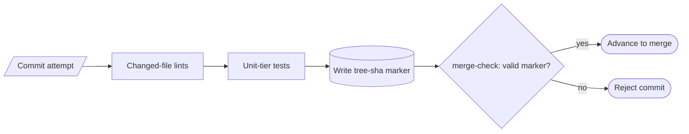

# Pre-commit hook (3-stanza, tree-sha markers) — GoF appendix rendering

> **Fill draft.** Worked Structure + Sample Code slots for the catalogue entry
> `agent/gates-and-merge-train/pre-commit-hook.md`, in the book's Gang-of-Four appendix layout. The
> follow-up pass injects the two filled slots at the placeholders keyed by the entry name
> `Pre-commit hook (3-stanza, tree-sha markers)`. The other six sections are projected from the catalogue
> `.md` — reproduced in brief so the entry reads as a complete GoF page.

## Pre-commit hook (3-stanza, tree-sha markers)

**Intent** — Run changed-file lints and unit-tier tests and write tree-sha-keyed marker files at commit
time, so an agent's commit cannot advance to merge unless the cheap checks passed on *exactly this tree*.

### Motivation

Agents commit fast and often. Without a cheap gate at commit time, a broken change flows downstream to the
expensive gates where the context of what the agent was doing is gone. Worse, one un-checked broken commit
can poison an entire batch when the merge-train batches many agents' work.

### Applicability

Reach for this when changed-file-scoped lints and a unit-tier test set both run in seconds, a marker store
can be keyed to tree identity, and a downstream verifier refuses unmarked commits.

### Structure

Three stanzas fire in order at commit time, then a downstream merge-check reads the tree-keyed marker: a
pass on *this* tree becomes an auditable fact, not a trust assumption.



*Accessible description: a commit attempt runs changed-file lints, then unit-tier tests, then writes a
marker keyed to the tree's sha; a downstream merge-check advances the commit only if a valid marker exists
for its tree and rejects it otherwise.*

### Sample Code

The gate keys its pass-marker to the **tree sha**, so a marker from one tree can never vouch for another.
The downstream verifier re-derives the tree sha and refuses any commit lacking a matching marker — the
early check becomes an independently auditable fact.

```python
import hashlib, os, sys

MARKER_DIR = ".gate-markers"

def tree_sha(files: list[str]) -> str:
    h = hashlib.sha256()
    for f in sorted(files):
        h.update(f.encode()); h.update(open(f, "rb").read())
    return h.hexdigest()

def pre_commit(files: list[str], run_lints, run_unit_tests) -> int:
    if run_lints(files) or run_unit_tests():          # each returns findings; non-empty = fail
        return 1                                       # block the commit; no marker written
    os.makedirs(MARKER_DIR, exist_ok=True)
    open(os.path.join(MARKER_DIR, tree_sha(files)), "w").close()   # marker keyed to THIS tree
    return 0

def merge_check(files: list[str]) -> int:
    ok = os.path.exists(os.path.join(MARKER_DIR, tree_sha(files)))
    return 0 if ok else 1   # refuse to advance a commit whose tree was never gated
```

### Consequences

- **Per-commit latency tax.** Every commit pays the lint + unit-tier cost; a slow unit-tier erodes cadence
  and creates pressure to bypass.
- **Bypass prefixes are a real hole.** Some commit subjects skip the hook by design; correctness there
  rests on honest use.
- **Marker logic is subtle.** If the tree-sha keying drifts, markers silently stop matching and either
  block good commits or vouch for the wrong tree.

### Known Uses

- The three-stanza hook plus the worktree merge-check verification.
- A codemod-wave skip marker that skips the lint stanza while the unit-tier still runs.

### Related Patterns

- **Layer** — the first stair of the commit → merge-train → deploy staircase.
- **Counterpart** — a lifecycle hook is the other kind of hook: this fires on a *commit* and guards what
  gets written; that fires on a runtime event and guards what the loop does.
