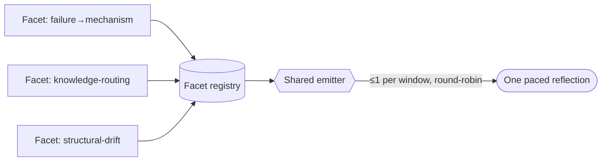

# Reflection-facet substrate (tempo-gated policy nudges) — GoF appendix rendering

> **Fill draft.** Worked Structure + Sample Code slots for the catalogue entry
> `agent/lifecycle-and-observability/reflection-facet-substrate.md`, in the book's Gang-of-Four appendix
> layout. The follow-up pass injects the two filled slots at the placeholders keyed by the entry name
> `Reflection-facet substrate (tempo-gated policy nudges)`. The other six sections are projected from the
> catalogue `.md` — reproduced in brief so the entry reads as a complete GoF page.

## Reflection-facet substrate (tempo-gated policy nudges)

**Intent** — Consolidate the operator's policy-reflection nudges into one tempo-gated substrate: a
registry of Template-Method facets, each reflecting the running context against a single repo-policy
dimension it *references* (never copies), the whole family emitting at most one reflection per window, so
several soft reflections can't compound into the alarm fatigue that would kill them all.

### Motivation

A single lifecycle hook that re-arms one omitted reflex is cheap and clear. The trouble starts at the
second. Fire each policy-reflection as its own hook and three failures compound: alarm fatigue kills the
whole family, the tempo/silence/telemetry machinery duplicates N times, and each hook bakes its rule into
a payload string that rots when the canonical policy moves.

### Applicability

Reach for this once there is a *second* reflection policy worth nudging, a runtime exposes lifecycle-event
hooks, and a canonical referenceable policy corpus exists so a facet can point at its rule rather than
restate it.

### Structure

Facets self-register into a typed registry; a shared emitter, bound to a lifecycle event, round-robins
them and emits at most one reflection per window — the aggregate ceiling no independent hook can share.



*Accessible description: several policy facets self-register into a typed registry; a shared emitter bound
to a lifecycle event round-robins them and emits at most one reflection per window, so the family shares
one anti-overwhelm ceiling instead of each hook firing on its own.*

### Sample Code

A Template-Method base fixes the reflect sequence; a facet fills only the sanctioned steps and declares a
*pointer* to its policy (never a copy). A shared emitter round-robins the registered facets and emits at
most one nudge per window — the ceiling the whole family shares.

```python
from abc import ABC, abstractmethod

class ReflectionFacet(ABC):
    key: str
    policy_ref: str          # a resolvable pointer into the canonical policy — referenced, not copied

    @abstractmethod
    def warrants(self, ctx) -> bool: ...      # is this facet's moment? bias hard toward False (silence)
    @abstractmethod
    def payload(self, ctx) -> str: ...        # the conservative nudge, worded from policy_ref

class Emitter:
    def __init__(self, facets): self._facets, self._cursor = list(facets), 0

    def tick(self, ctx) -> str | None:
        n = len(self._facets)
        for i in range(n):                     # round-robin so no single facet monopolizes the window
            f = self._facets[(self._cursor + i) % n]
            if f.warrants(ctx):
                self._cursor = (self._cursor + i + 1) % n
                return f.payload(ctx)          # AT MOST ONE reflection per window across the whole family
        return None
```

### Consequences

- **Facets compete for the window.** The shared budget means no facet fires on every eligible event; that
  is the anti-overwhelm working, traded against per-facet promptness.
- **The closed surface is a real constraint.** A facet needing a new capability must add a declared
  virtual on the base, not hack it locally.
- **It is over-engineering at N=1.** The registry and shared budget are overhead until there is a second
  facet to consolidate.

### Known Uses

- A Template-Method facet base plus a typed registry, with facets for failure→mechanism, knowledge-routing,
  and structural drift.
- A shared turn-end emitter that round-robins facets and emits at most one reflection per window.

### Related Patterns

- **Specializes** — lifecycle hooks: the single-hook primitive this is built on; its measured leash is
  where the family's evidence discipline lives.
- **Temporal complement** — dynamic context injection pushes policy *into* an agent at entry; a reflection
  facet pulls the operator back to policy at tempo.
