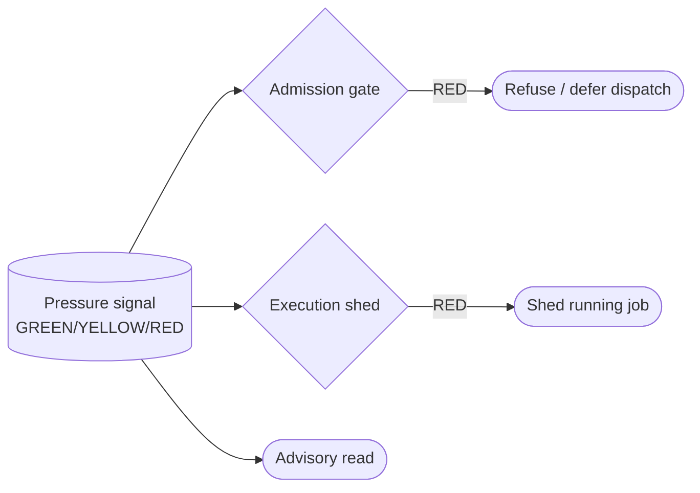

# Resource-pressure gating (admit before, shed during) — GoF appendix rendering

> **Fill draft.** Worked Structure + Sample Code slots for the catalogue entry
> `agent/mediators-and-resource-locks/resource-pressure-gating.md`, in the book's Gang-of-Four appendix
> layout. The follow-up pass injects the two filled slots at the placeholders keyed by the entry name
> `Resource-pressure gating (admit before, shed during)`. The other six sections are projected from the
> catalogue `.md` — reproduced in brief so the entry reads as a complete GoF page.

## Resource-pressure gating (admit before, shed during)

**Intent** — Govern a saturable host resource with a live pressure signal read at two layers: an admission
gate that refuses or defers heavy work *before it is dispatched*, and an execution shed that stops heavy
work *already running* when pressure spikes — both driven by one signal that is also callable for the
operator's own judgment.

### Motivation

A cardinality cap bounds *how many* heavy jobs run, not *whether the host can bear them right now*. Two
failures follow. Dispatch into overload: a heavy agent is admitted onto a saturated machine, reaches the
compute mediators, and is refused, so it polls and sheds — burning wall-clock on work that never had
headroom. Run into overload: pressure rises after a job was admitted, and nothing stops it mid-flight.

### Applicability

Reach for this when a live pressure signal over the resource is cheap to read, a pre-dispatch gate seam
exists, an execution-time shed exists at the compute step, and one shared signal drives both so they can't
disagree.

### Structure

One pressure signal has three readers: an admission gate left of dispatch that refuses doomed work before
a worktree exists, an execution shed at compute that stops a job pressure has overtaken, and an advisory
callable for operator judgment.



*Accessible description: one host-pressure signal feeds three readers — an admission gate that refuses or
defers a heavy dispatch under RED before a worktree exists, an execution shed that stops a running heavy
job under RED, and an advisory callable the operator consults — so heavy work is neither started into nor
left running on an overloaded host.*

### Sample Code

The two layers are not redundant: admission prevents the *startup* cost of doomed work; execution shedding
catches pressure that rose *after* admission. One shared signal drives both, or they disagree and
reintroduce the admit-then-shed churn.

```python
def read_pressure() -> str:
    """One coarse level over the saturable resource — cheap enough for every dispatch and compute entry."""
    ...  # returns "GREEN" | "YELLOW" | "RED"

def admit_dispatch(is_heavy: bool) -> str:
    if is_heavy and read_pressure() == "RED":          # gate LEFT of dispatch — never start doomed work
        return "defer"                                  # defer with a wake condition, never silently drop
    return "admit"

def compute_shed(is_heavy: bool) -> str:
    if is_heavy and read_pressure() == "RED":          # catches pressure that rose AFTER admission
        return "shed"
    return "run"
```

### Consequences

- **Coarse by design.** Three levels is a blunt instrument: a too-eager RED starves throughput, a too-lax
  one still admits overload. The thresholds are a tuning surface.
- **Admission must defer, not drop.** A heavy brief refused under sustained RED needs a retry policy, or it
  starves.
- **Two readers, one signal.** If the gate and the shed read different thresholds, the churn the mechanism
  kills comes back.

### Known Uses

- A host load-pressure monitor read by the compute mediators to refuse-and-shed heavy work under RED.
- A pre-dispatch admission gate that refuses or defers heavy dispatch on the same signal.

### Related Patterns

- **Counterpart** — the cardinality mediators (test-serializer, build-serializer, aggregate mutex) ration
  by *how many* run at once; this rations by *whether the host can bear more now*, across admission and
  execution.
- **Layer** — the two readers sit at two points of the path-to-work; moving the check left to admission is
  the same shift-left logic that puts a cheap gate before an expensive one.
