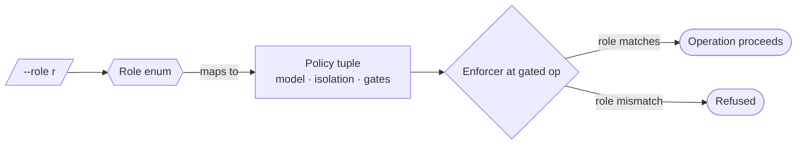

# Role-typed dispatch — GoF appendix rendering

> **Fill draft.** Worked Structure + Sample Code slots for the catalogue entry
> `agent/context-and-dispatch/role-typed-dispatch.md`, in the book's Gang-of-Four appendix layout. The
> follow-up pass injects the two filled slots at the placeholders keyed by the entry name
> `Role-typed dispatch`. The other six sections are projected from the catalogue `.md` — reproduced in
> brief so the entry reads as a complete GoF page.

## Role-typed dispatch

**Intent** — Dispatch every agent under a typed role that fixes its model, isolation mode, permissions,
and which gates apply, so those choices are policy-by-type, not a per-dispatch judgment call.

### Motivation

Every dispatch bundles correlated decisions: which model, whether the agent runs isolated or on the main
line, and which compute gates it must respect. Made ad hoc, they drift apart from the work — a mechanical
model gets pointed at an architecture change, a commit agent runs isolated when the hook needs it on the
main line. The failure recurs on every dispatch and is invisible until wrong-tier output ships.

### Applicability

Reach for this when a closed set of roles covers the work, enforcers can read the role at each gated
operation, and a single dispatch wrapper is the sole way to set it.

### Structure

The role is a small closed enum. Each value maps to one policy tuple (model, isolation, gates), and
downstream enforcers refuse a call whose declared role doesn't match.



*Accessible description: a dispatch declares a role drawn from a closed enum; the enum maps to one policy
tuple of model, isolation, and gates; an enforcer at each gated operation lets the call proceed when the
role matches and refuses it when it does not.*

### Sample Code

A role is a typed enum bound to one policy tuple. Declaring the role once binds the whole bundle; an
enforcer at each gated operation reads the declared role and refuses a mismatch, so the correlated
choices cannot silently diverge.

```python
from dataclasses import dataclass
from enum import Enum

class Role(Enum):
    WORKER = "worker"       # mechanical, isolated
    ARCHITECT = "architect" # design/RCA, isolated
    LINT_RUNNER = "lint"    # may run the aggregate sweep
    COMMITTER = "committer" # runs on the main line so the commit hook fires

@dataclass(frozen=True)
class Policy:
    model: str
    isolated: bool
    may_run_aggregate_lint: bool

POLICY = {
    Role.WORKER:      Policy("small", isolated=True,  may_run_aggregate_lint=False),
    Role.ARCHITECT:   Policy("large", isolated=True,  may_run_aggregate_lint=False),
    Role.LINT_RUNNER: Policy("small", isolated=True,  may_run_aggregate_lint=True),
    Role.COMMITTER:   Policy("small", isolated=False, may_run_aggregate_lint=False),
}

def enforce_aggregate_lint(role: Role) -> None:
    if not POLICY[role].may_run_aggregate_lint:      # the gate refuses the wrong role outright
        raise SystemExit(f"role {role.value} may not run the aggregate lint")
```

### Consequences

- **A closed enum is rigid.** A task that fits no role forces a mis-fit or a new role — the virtue and the
  cost are the same.
- **The role leaks.** As ambient state it can propagate into subprocesses and trip a downstream guard;
  some agents must be special-cased not to export it.
- **Declaring is not matching.** A role fixes model and gates but does not verify the *work* suits it;
  routing judgment stays with the human.

### Known Uses

- Four roles (worker / architect / lint-runner / committer), each with a fixed model and isolation mode.
- The aggregate-lint gate that refuses the mechanical-worker role.

### Related Patterns

- **Consumer** — the pre-commit hook consumes the role fixed at dispatch; the committer role is shaped so
  the hook fires.
- **Complement** — brief-linting checks the brief carries the isolation marker the role implies.
