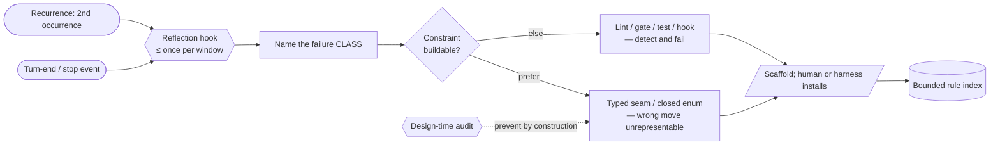

# Self-governance (detect your own recurring issues; convert each into a tasteful control) — GoF appendix rendering

> **Fill draft.** Worked Structure + Sample Code slots for the catalogue entry
> `agent/governance-doc-controls/self-governance.md`, in the book's Gang-of-Four appendix layout. The
> follow-up pass injects the two filled slots at the placeholders keyed by the entry name
> `Self-governance (detect your own recurring issues; convert each into a tasteful control)`. The other
> six sections are projected from the catalogue `.md` — reproduced in brief so the entry reads as a
> complete GoF page.

## Self-governance (detect your own recurring issues; convert each into a tasteful control)

**Intent** — Let the system govern *the way it is governed*: detect its own recurring failures and convert
each **class** into the smallest durable guardrail — a constraint that makes the wrong move
unrepresentable where one can be built, else a sensor that detects and fails it — fired on a cadence so
the loop runs by design, not by whoever remembers.

### Motivation

The recurring failure is re-patching one instance of a class the fleet will hit again: the same
cherry-pick false-rejects twice, the same lint mis-fires, the same manual step gets re-done. Two
sub-failures compound it — the conversion depends on someone *noticing* the recurrence, and even a team
that believes in conversion *forgets* to do it on the run that most needs it. The result is velocity that
never converts into durable trust.

### Applicability

Reach for this when a failure has recurred, and the system has: a recurrence signal (memory, an incident
log) that flags the second occurrence; a runtime lifecycle event to bind the cadence to; a closed control
vocabulary so "pick the durable control" produces a known shape; and a bounded, enforced home for the
converted rule to land in.

### Structure

Two halves, packaged. A hard reflection hook fires on a lifecycle event, at most once per window. It
prompts a soft conversion loop: name the failure **class**, then pick the smallest control from an
ordered vocabulary — prefer a constraint, fall back to a sensor — scaffold it, and hand it off to be
installed in the bounded rule index. A design-time audit runs the same stance forward, preventing a class
by construction.



*Accessible description: a turn-end event and a recurrence signal both feed a reflection hook that fires
at most once per window — the hard, deterministic half. The hook prompts the soft loop: name the failure
class, then decide whether a constraint is buildable; if so emit a typed seam or closed enum that makes
the wrong move unrepresentable, else emit a sensor (lint, gate, test, hook) that detects and fails it.
Either way the scaffolded control is handed to a human or the harness to install into the bounded rule
index. A design-time audit prevents a class by construction before it is ever felt.*

### Sample Code

The conversion is a lookup over a **closed, ordered** control vocabulary: a constraint that makes the
wrong move unrepresentable is preferred; a sensor that detects and fails it is the fallback. The cadence
half is a deterministic window gate, so the reflection fires by design rather than by memory — yet at most
once per window, so it aims without decaying into alarm fatigue.

```python
import time

# The closed control vocabulary, ORDERED. Prefer a constraint that makes the wrong move
# unrepresentable; fall back to a sensor that detects and fails the class.
CONSTRAINTS = ("typed-seam", "closed-enum", "unrepresentable-state")
SENSORS = ("lint", "gate", "test", "runtime-hook")

def pick_control(failure) -> str:
    """The smallest durable control that kills the CLASS — constraint first, sensor as fallback."""
    if failure.constraint_buildable:                 # can the wrong move be made unrepresentable?
        return f"constraint:{failure.constraint_kind}"  # ∈ CONSTRAINTS
    return f"sensor:{failure.sensor_kind}"              # ∈ SENSORS

def should_reflect(now: float, last_fired: float, window_s: float) -> bool:
    """The hard trigger: fire at most once per window — deterministic, memory-independent."""
    return now - last_fired >= window_s

def on_turn_end(state) -> None:
    """Bound to a lifecycle event. On a recurrence, name the class, pick and scaffold the control."""
    if state.recurred and should_reflect(time.time(), state.last_fired, state.window_s):
        control = pick_control(state.failure)   # the soft judgment the hard hook guarantees a prompt for
        state.propose(control)                  # scaffolds only; a human or the harness installs it
        state.last_fired = time.time()
```

### Consequences

- **The proposing half is soft** — the loop recommends and scaffolds; it cannot block a violation or
  install the control on its own. The hard hook guarantees the prompt, not the action.
- **Cadence tuning is a real cost** — fire too often and it becomes the alarm fatigue it was built to
  avoid; too rarely and a recurrence ages past the moment it was cheapest to convert.
- **Taste does not automate** — "proportionate" is a judgment. The loop enumerates the menu and prompts
  the choice; resisting the over-control reflex stays human.
- **It can manufacture noise** — the discipline is to convert a *class*, once, at the second occurrence,
  not to reflexively lint every instance.

### Known Uses

- A production agent-fleet repo ships the conversion loop as a loadable skill with a sharp trigger (the
  same failure recurring a second time in a session) plus a design-time audit mode for new subsystems, and
  fires a turn-end reflection hook — at most once per window — that nudges the operator to run it.
- The bounded, stable-numbered rule index every converted failure lands in is itself under mechanism, with
  its own cap lint and conformance lint.
- The design-time audit turns the same stance forward: before building a queue, a trust boundary, or a
  duplicated-state seam, it names the near-certain failure and prevents it by construction.

### Related Patterns

- **Sibling** — the operator runbook skill: both are loadable skills, and they partner. The runbook
  *responds* to a known situation; this loop *manufactures* the new control when a situation recurs in a
  way no step covers.
- **Generalization** — semantic lints: a lint is one shape the conversion emits. This is the general
  engine; a lint, a gate, or a typed seam is one instance of its output.
- **Consumer** — the CLAUDE.md rule index: the converted control lands in that bounded, enforced home, or
  the estate grows unindexed.
- **Enabler** — lifecycle hooks: the cadence half is a lifecycle-event binding, so the reflection runs
  deterministically instead of on memory.
- **See also** — the control-coverage census: it answers *which targets are covered*; this loop is how a
  discovered gap becomes a new control rather than a noted absence.
