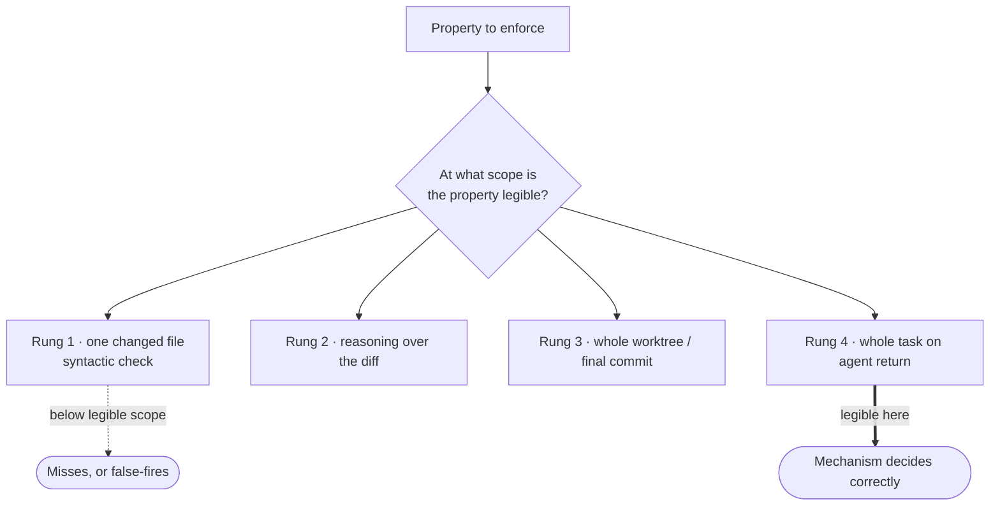

# Enforce at the right semantic level — GoF appendix rendering

> **Fill draft.** Worked Structure + Sample Code slots for the catalogue entry
> `agent/<family>/semantic-level-enforcement.md` (the "Enforce at the right semantic level" mechanism —
> census-67 fill), in the book's Gang-of-Four appendix layout. The follow-up pass injects the two filled
> slots at the placeholders keyed by the entry name `Enforce at the right semantic level`. The other six
> sections are projected from the catalogue `.md` — reproduced in brief so the entry reads as a complete
> GoF page.

## Enforce at the right semantic level

**Intent** — Place a mechanism at the granularity where the property it checks first becomes *legible*, not
at the cheapest or earliest point; a check fired below that scope either can't see the property or rejects
a legitimate partial state (our instance: model↔code drift is checked when an agent *returns* from a
multi-commit task, never at a per-commit hook where the model is legitimately mid-flight).

### Motivation

A property has a scope at which it becomes legible — the smallest window in which enough of the world is
visible to decide it true or false. Place a mechanism below that scope and it fails one of two ways. It
*misses* the property, because the slice it sees cannot contain the evidence: a monitor judging one system
call at a time never sees a data leak, because a leak is a sequence — the call that reads the secret and
the call that ships it are legible together, never apart. Or it *false-fires* on a legitimate partial
state: a per-commit gate on model↔code parity rejects every intermediate commit of a multi-commit feature,
because the model is allowed to lag the code until the work is done. The reflex is to enforce where it is
cheapest and earliest; convenience and legibility are different axes, and when they diverge the convenient
placement is wrong.

### Applicability

Reach for this when you are placing any mechanism — a lint, a gate, a hook, a validator, a monitor — and the
property it checks is a claim about a *unit* larger than the smallest thing the mechanism could fire on.
Signals: the property is a *sequence* (legible only across several events), or a claim about a *finished*
unit (correctly inconsistent mid-way).

### Structure

Rank the candidate placements as a ladder of widening scope; find the rung where the property is legible;
place the mechanism there. Below that rung the check is blind or false-fires; at or above it, the property is
decidable.



*Accessible description: a property to enforce is matched against a ladder of placements ordered by widening
scope — one changed file, reasoning over the diff, the whole worktree, the whole task on agent return. A
mechanism placed below the scope at which the property is legible either misses it or false-fires on a partial
state; a mechanism placed at the rung where the property is legible decides correctly.*

### Sample Code

Placement is a design-time judgment, so the "code" is the decision procedure, not a runtime call: for a
given property, pick the coarsest window it needs, and refuse to wire the mechanism any lower. Here the
property `model_and_code_agree` is a claim about a *finished* unit, so it is legible only at agent-return
scope; wiring it at the commit rung is the mis-placement the procedure rejects.

```python
from enum import IntEnum

class Scope(IntEnum):                 # the ladder, ordered by widening semantic scope
    CHANGED_FILE   = 1                # a syntactic check over one file
    DIFF_REASONING = 2                # a pass that reasons over the whole diff
    WORKTREE       = 3                # the whole worktree / final commit
    TASK_RETURN    = 4                # the whole unit of work, when the agent returns

def legible_scope(prop: str) -> Scope:
    # the smallest window in which the property's evidence is fully visible
    if prop == "banned_api_absent":      return Scope.CHANGED_FILE     # evidence is in one file
    if prop == "no_data_exfiltration":   return Scope.DIFF_REASONING   # a SEQUENCE, not one call
    if prop == "model_and_code_agree":   return Scope.TASK_RETURN      # a FINISHED-unit claim
    raise ValueError(f"unranked property: {prop}")

def place_mechanism(prop: str, chosen: Scope) -> None:
    need = legible_scope(prop)
    if chosen < need:                                                  # below legible scope = blind / false-fires
        raise SystemExit(
            f"'{prop}' is legible at {need.name}, not {chosen.name}: "
            "the mechanism would miss it or reject a legitimate partial state"
        )
    wire_mechanism(prop, chosen)                                       # at or above: the property is decidable
```

### Consequences

- **It is a soft, design-time judgment.** Nothing blocks a mis-placement automatically; the discipline is
  applied when a mechanism is built or reviewed, so a careless author can still wire a check too low.
- **The right rung costs more.** Legibility often lives at a coarser scope than convenience, so the correct
  placement runs later and over more context than the cheap one — a task-return audit over a per-commit hook.
- **The ladder is per-property.** Two mechanisms guarding the same subsystem can belong on different rungs;
  there is no single "correct" scope for a codebase, only for a property.

### Known Uses

- Model↔code drift checked at the definition-of-done review when an agent returns from an Epic, never at a
  per-commit hook.
- A data-exfiltration policy judged across a sequence of calls, not at a single syscall.

### Related Patterns

- **Instances** — the Epic definition-of-done sits at the top rung (a finished feature and its plan both in
  view); the pre-commit hook sits at the bottom (a property legible in one changed tree). This mechanism is
  the ladder those two are rungs on.
- **Counterpart** — a linter-scope flag selects the *files* a syntactic check reads; this selects the
  *semantic altitude*, which changes what kind of judgment is possible, not just how much text is scanned.
