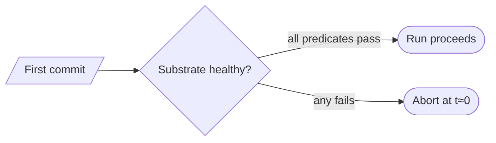

# Sentinel first-commit early-abort — GoF appendix rendering

> **Fill draft.** Worked Structure + Sample Code slots for the catalogue entry
> `agent/gates-and-merge-train/sentinel-first-commit.md`, in the book's Gang-of-Four appendix layout. The
> follow-up pass injects the two filled slots at the placeholders keyed by the entry name
> `Sentinel first-commit early-abort`. The other six sections are projected from the catalogue `.md` —
> reproduced in brief so the entry reads as a complete GoF page.

## Sentinel first-commit early-abort

**Intent** — Run a health check on an agent's *first* commit that surfaces orphaned-worktree and
broken-substrate failures at minute zero, before the agent burns its whole budget producing work that can
never land.

### Motivation

An agent dispatched into a subtly broken worktree — a missing marker, stale substrate, an empty submodule,
a wrong branch — works happily for the better part of an hour and then fails at commit, or produces work
that cannot be rebased. The failure is invisible until the end, so its cost is the entire dispatch, and it
recurs whenever the substrate drifts between dispatch and consumption.

### Applicability

Reach for this when there is a detectable "first commit" moment to hang the check on, substrate-health
predicates are cheap and total, and an abort path can stop the run cleanly.

### Structure

The first commit is the trip-wire: assert the substrate is healthy, and abort the whole run early if any
assertion fails, converting an hour of waste into a one-minute abort.



*Accessible description: on the agent's first commit a sentinel asserts a set of substrate-health
predicates; if all pass the run proceeds, and if any fails the run aborts at minute zero rather than at
minute sixty.*

### Sample Code

The check hangs on the first-commit event and asserts a set of cheap, total substrate-health predicates —
correct worktree root, live marker present, expected branch, CWD inside the worktree. Any failure aborts
the run before the budget is spent.

```python
import os, sys

def substrate_healthy(agent_id: str, cwd: str, branch: str, marker_exists) -> list[str]:
    """Cheap, total predicates. Each failure is a reason to abort at t≈0."""
    problems = []
    root = os.environ.get("AGENT_WORKTREE_ROOT", "")
    if not root or not cwd.startswith(root):
        problems.append("CWD is not under the agent's worktree root")
    if not marker_exists(agent_id):
        problems.append("live marker file is missing")
    if branch != f"worktree-agent-{agent_id}":
        problems.append(f"on branch '{branch}', expected worktree-agent-{agent_id}")
    return problems

def on_first_commit(agent_id, cwd, branch, marker_exists) -> int:
    problems = substrate_healthy(agent_id, cwd, branch, marker_exists)
    for p in problems:
        print(f"SENTINEL ABORT: {p}")
    return 1 if problems else 0   # non-zero aborts the run at its first commit
```

### Consequences

- **It only catches what it asserts.** The predicates are a hand-maintained set; a new failure mode not in
  the list still slips to the end.
- **A false abort kills a healthy agent.** An over-strict predicate blocks good work; landing audit-only
  before promoting to blocking buys confidence first.
- **First-commit latency.** Small, but on the critical path of every agent's first commit.

### Known Uses

- The first-commit substrate assertion with an early abort.
- Its boot-time sibling: a self-check the agent runs as its first step.

### Related Patterns

- **Layer** — runs at the same commit-time stair as the pre-commit hook: this guards *substrate* health,
  the hook guards *content* correctness.
- **Counterpart** — the boot-time self-check and this first-commit sentinel bracket the window a substrate
  can break in.
