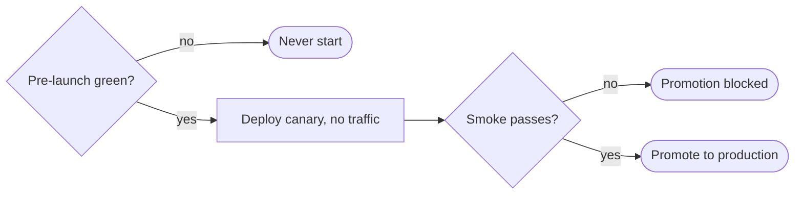

# Staged deploy gates (canary → smoke → promote) — GoF appendix rendering

> **Fill draft.** Worked Structure + Sample Code slots for the catalogue entry
> `agent/gates-and-merge-train/staged-deploy-gates.md`, in the book's Gang-of-Four appendix layout. The
> follow-up pass injects the two filled slots at the placeholders keyed by the entry name
> `Staged deploy gates (canary → smoke → promote)`. The other six sections are projected from the
> catalogue `.md` — reproduced in brief so the entry reads as a complete GoF page.

## Staged deploy gates (canary → smoke → promote)

**Intent** — Escalate a deploy through canary → smoke → promote, blocking promotion to production until
each cheaper stage passes on a traffic-free revision, so a bad build is caught before users see it.

### Motivation

Shipping a build straight to production means a regression lands on users; the failure *is* the incident.
It matters more at agentic velocity: the more often you ship, the more often an un-gated bad build reaches
users. A pre-launch predicate matters too — don't even start a deploy that will predictably fail.

### Applicability

Reach for this when you can deploy a revision that takes no production traffic, a smoke suite meaningfully
exercises the canary URL, promotion and rollback primitives exist, and a cheap pre-launch green signal is
available.

### Structure

The pipeline is a staircase: a cheap pre-launch predicate gates the whole thing, then a canary takes no
traffic, smoke tests it against its own URL, and promotion happens only on green.



*Accessible description: a pre-launch predicate gates the deploy; if green a canary revision is deployed
taking no traffic and smoke-tested against its own URL, and promotion to production happens only when the
smoke stage passes, otherwise promotion is blocked.*

### Sample Code

The deploy is a staircase of gates, each cheaper than the next stage it guards. The pre-launch predicate
avoids paying build minutes for a doomed deploy; the canary and smoke gates catch a break on a revision no
user can reach.

```python
def staged_deploy(pre_launch_green, build, deploy_canary, smoke, promote) -> int:
    if not pre_launch_green():           # cheapest gate: lints green, no known flaky class, changed-set clean
        print("pre-launch predicate red — not starting"); return 0
    artifact = build()
    canary = deploy_canary(artifact)     # a revision taking NO production traffic
    if not smoke(canary.url):            # exercise the canary's own URL with real dependencies
        print("smoke failed on canary — promotion blocked"); return 1
    promote(canary)                      # only a green canary reaches users
    return 0
```

### Consequences

- **Staging costs real build minutes.** The pre-launch predicate exists to avoid spending them on a deploy
  that was never going to pass.
- **Smoke is not full coverage.** A thin smoke suite lets real breaks through; the canary is only as good
  as what smoke checks.
- **The gate infrastructure itself can drift.** A drifted canary or smoke path gives false confidence.

### Known Uses

- The staged deploy driver: canary tag → smoke → promote → revision GC.
- The pre-deploy predicate combining lints-green, no-flaky-class, and a clean changed-set pass.

### Related Patterns

- **Layer** — the last and most expensive stair of the staircase, reached only after the cheap gates
  passed.
- **Complement** — the product-side per-pass validators run *inside* the shipped artifact; these gates
  wrap the deploy *of* it.
