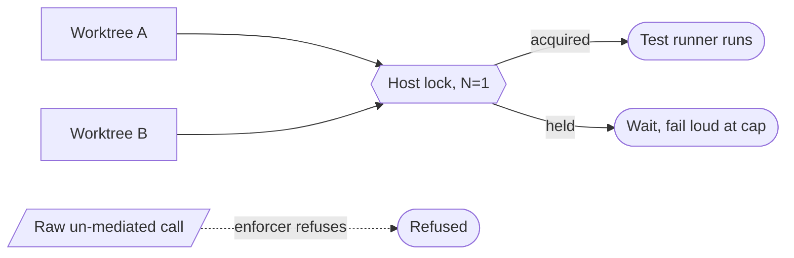

# Test-serializer (N=1 flock on the test runner) — GoF appendix rendering

> **Fill draft.** Worked Structure + Sample Code slots for the catalogue entry
> `agent/mediators-and-resource-locks/test-serializer.md`, in the book's Gang-of-Four appendix layout. The
> follow-up pass injects the two filled slots at the placeholders keyed by the entry name
> `Test-serializer (N=1 flock on \`dotnet test\`)`. The other six sections are projected from the
> catalogue `.md` — reproduced in brief so the entry reads as a complete GoF page.

## Test-serializer (N=1 flock on the test runner)

**Intent** — Serialize the test runner to a single writer per host via an exclusive flock, so concurrent
agent worktrees on one machine don't saturate I/O and interfere with each other's test runs.

### Motivation

Several worktrees each running the test runner on one host saturate CPU and disk and interfere — port
contention, shared build artifacts, I/O thrash — so tests flake or hang for reasons unrelated to the code
under test. Worse, a false flake sends an agent chasing a non-bug. It recurs whenever two or more agents
test at once.

### Applicability

Reach for this when the test runner is mutually destructive on a shared host, an enforcer can intercept
the raw tool, and a wait cap fails loud so a stuck lock surfaces instead of hanging forever.

### Structure

The serializer holds one exclusive host lock around the run, and an enforcer inside the test process makes
the un-mediated path impossible — the ban is what makes the single-writer real.



*Accessible description: worktrees contend for one exclusive host lock around the test runner; the holder
runs while others queue and fail loud at a wait cap, and an in-process enforcer refuses any raw
un-mediated invocation so serialization is structural, not a convention.*

### Sample Code

An exclusive flock gives N=1, and — decisively — an enforcer that runs *before any test* refuses a raw
invocation from an agent worktree, so the mediated path is the only path. The ban makes the serialization
real rather than a convention agents forget under time pressure.

```python
import fcntl, sys

def serialized_test(lock_path: str, run_tests, wait_cap_s=1800):
    with open(lock_path, "w") as lock:
        try:
            fcntl.flock(lock, fcntl.LOCK_EX)           # N=1: exclusive, one writer per host
        except OSError:
            sys.exit("test lock stuck past the wait cap — failing loud instead of hanging")
        return run_tests()

def enforce_no_raw_test(cwd: str, mediated: bool) -> None:
    # runs before any test executes; a raw runner from an agent worktree is refused
    if is_agent_worktree(cwd) and not mediated:
        raise SystemExit("raw test runner is banned from an agent worktree — route through the serializer")
```

### Consequences

- **Serialization is wall-clock cost.** N=1 means tests queue; a long run blocks every other worktree
  behind it — the deliberate trade of correctness over raw parallelism.
- **A stuck lock stalls everyone.** The fail-loud cap bounds the damage but does not eliminate it.
- **The bypass is a hole**, and the lock coordinates one machine only.

### Known Uses

- The N=1 flock wrapper around the test runner.
- The in-process enforcer that refuses a raw runner from an agent worktree.

### Related Patterns

- **Counterpart** — the in-process enforcer holds the serializer's discipline in place: without the ban,
  the flock is an unenforced convention.
- **Sibling** — the build-serializer is the same mediator pattern at M=8; the pair illustrates the
  lock-cardinality choice by contention profile.
