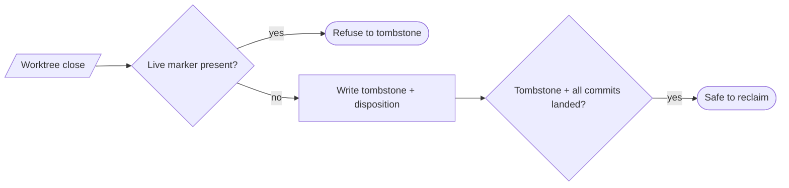

# Tombstone commits (lifecycle close records) — GoF appendix rendering

> **Fill draft.** Worked Structure + Sample Code slots for the catalogue entry
> `agent/lifecycle-and-observability/tombstone-commits.md`, in the book's Gang-of-Four appendix layout.
> The follow-up pass injects the two filled slots at the placeholders keyed by the entry name
> `Tombstone commits (lifecycle close records)`. The other six sections are projected from the catalogue
> `.md` — reproduced in brief so the entry reads as a complete GoF page.

## Tombstone commits (lifecycle close records)

**Intent** — Write a tombstone commit at a worktree's branch tip that durably records its lifecycle close
and *disposition* (cherry-picked / declared-skipped), so cleanup can *prove* a worktree is safely
reclaimable instead of guessing.

### Motivation

Reclaiming a worktree safely requires knowing its work is fully accounted for — every commit either
cherry-picked or deliberately skipped. Without a durable close record, cleanup faces a dilemma: delete
eagerly and risk destroying unlanded work, or never delete and leak worktrees forever.

### Applicability

Reach for this when there is a place to write the close record at the branch tip, a disposition vocabulary
makes it machine-checkable, a dedup mechanism serializes concurrent closers, and a live-worktree guard
prevents tombstoning a working agent.

### Structure

The tombstone at the branch tip records the disposition; a dedup event serializes concurrent closers, a
live-marker guard refuses a working agent, and cleanup reads the record as its safe-to-reclaim proof.



*Accessible description: a worktree close first checks the live marker and refuses to tombstone a working
agent; otherwise it writes a tombstone carrying the disposition, and cleanup reclaims the directory only
when a tombstone tips the branch and every non-tombstone commit is cherry-picked or declared skipped.*

### Sample Code

The tombstone records the *disposition*, so cleanup can verify a precise predicate rather than guess off a
"looks finished" heuristic. A dedup event serializes concurrent closers, and the reclaim predicate demands
both the tip tombstone and full accounting of every other commit.

```python
def safe_to_reclaim(branch_commits, is_landed) -> bool:
    """Reclaim only if a tombstone tips the branch AND every other commit is landed or skipped."""
    if not branch_commits or not branch_commits[-1].is_tombstone:
        return False
    return all(is_landed(c) or c.declared_skipped
               for c in branch_commits if not c.is_tombstone)

def write_tombstone(agent_id, disposition, marker_exists, dedup_claim) -> int:
    if marker_exists(agent_id):                        # live-worktree guard: never close a working agent
        print(f"REFUSE: agent {agent_id} is still live"); return 1
    if not dedup_claim(agent_id):                      # registry event serializes concurrent closers
        print(f"REFUSE: another closer already started for {agent_id}"); return 78
    # ... append a tombstone commit carrying `disposition` at the branch tip ...
    return 0
```

### Consequences

- **Bypass-prefix hole.** Tombstone commits skip the pre-commit hook by design — needed for the mechanism,
  but a gap resting on honest use.
- **Dedup depends on the registry.** If the dedup event is missed, two closers can race.
- **A wrong disposition is dangerous.** A tombstone that mis-records "skipped" for unlanded work would
  greenlight an unsafe reclaim.

### Known Uses

- The tombstone tool that writes the disposition-bearing close record.
- The dedup event, the explicit-id-list requirement, and the live-worktree guard.

### Related Patterns

- **Consumer** — reads the agent registry's live markers before writing a close record.
- **Enabler** — the cleanup pass verifies the record it writes before reclaiming a directory.
