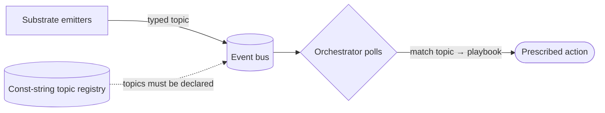

# Orchestrator-as-reactor over an event bus — GoF appendix rendering

> **Fill draft.** Worked Structure + Sample Code slots for the catalogue entry
> `agent/lifecycle-and-observability/typed-event-bus.md`, in the book's Gang-of-Four appendix layout. The
> follow-up pass injects the two filled slots at the placeholders keyed by the entry name
> `Orchestrator-as-reactor over an event bus`. The other six sections are projected from the catalogue
> `.md` — reproduced in brief so the entry reads as a complete GoF page.

## Orchestrator-as-reactor over an event bus

**Intent** — Run a typed event bus with a closed, const-string topic registry and a companion playbook,
over which substrate emits lifecycle and health events. The bus turns the orchestrator into a *reactor*:
it reads health from a queryable, self-documenting signal surface and reacts to each event with a
playbook-prescribed response.

### Motivation

A fleet's health — is cron running, is the merge-train yielding — is invisible without a signal surface,
so degradation accretes silently. Worse, without a reaction loop the orchestrator is a passive observer;
it can only steer the fleet if it *reacts* to what the substrate reports. The fleet slowly stops being
productive while each dispatch still looks locally fine.

### Applicability

Reach for this when topics can be a closed typed registry, emit points are wired into the substrate at the
events that matter, a playbook is keyed by topic, and the orchestrator actually polls on a defined
cadence.

### Structure

Emitters publish topics drawn from a closed registry; the orchestrator polls the queryable surface,
matches each event to its playbook entry, and takes the prescribed action — the playbook is the active
half that turns a signal into a reaction.



*Accessible description: substrate emitters publish typed topics, drawn from a closed const-string
registry, onto the event bus; the orchestrator polls the queryable surface, matches each event to its
playbook entry, and takes the prescribed action.*

### Sample Code

Topics are a closed const-string namespace, so a typo can't silently create a dead topic that disables a
signal; every topic must carry a playbook entry, so a raw signal becomes an actionable reaction. The
reactor loop is: poll, match topic to playbook, act.

```python
TOPICS = {"cron.tick", "merge_train.yield", "tombstone.stuck"}   # closed registry — emit off-list = fail loud

PLAYBOOK = {
    "merge_train.yield": {"healthy": "0-1 per session", "wrong": "repeated yields",
                          "do": "open the merge-train recovery playbook"},
    "tombstone.stuck":   {"healthy": "none queued", "wrong": "queued with no progress",
                          "do": "inspect the dedup event, clear the stuck closer"},
}

def emit(topic: str, bus: list) -> None:
    assert topic in TOPICS, f"undeclared topic '{topic}'"        # typo-proof by construction
    bus.append(topic)

def react(bus: list) -> list[str]:
    actions = []
    for topic in bus:
        entry = PLAYBOOK.get(topic)                              # a topic with no entry is un-actionable noise
        if entry:
            actions.append(f"{topic}: {entry['do']}")
    return actions
```

### Consequences

- **Only as useful as playbook coverage.** A topic without a playbook entry is emitted but not
  interpretable; the observability rule exists because that gap is the common failure.
- **Consumption is discipline.** Emission is mechanical, but acting on it depends on the orchestrator
  honoring the poll cadence.
- **Registry and emit-point maintenance.** New topics need registry rows, emit wiring, and playbook
  entries kept in sync.

### Known Uses

- The event bus and its const-string topic registry.
- The per-topic playbook and the session-start plus post-cherry-pick monitoring cadence.

### Related Patterns

- **Consumer** — each topic's operational playbook entry is the situation-keyed procedure the orchestrator
  runs when the event fires.
- **Enabler** — the cron-alerts gate promotes derived alerts on this bus into a blocking gate.
