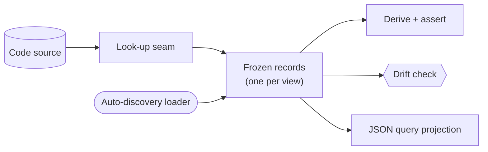

# The agent-first MBSE harness — GoF appendix rendering

> **Draft fill.** Worked Structure + Sample Code slots for the catalogue entry
> `models-bridge/system-models/agent-first-mbse-harness.md`, rendered in the book's Gang-of-Four appendix
> layout. The follow-up pass injects the two filled slots at the placeholders keyed by the entry name
> `The agent-first MBSE harness`. Intent / Motivation / Applicability / Consequences / Known Uses /
> Related Patterns are projected from the catalogue `.md` — reproduced in brief so the entry reads as a
> complete GoF page.

## The agent-first MBSE harness

**Intent** — Build the typed system-models as a thin harness over plain frozen records: adopt the
vocabulary of the right modeling genre per view, skip its runtime, and hand-roll five disciplines that
keep the records equal to the code.

### Motivation

A real modeling tool fails two ways at once. Its fixed schema does not carry your project's own
invariants, so you fight the tool more than you build the model. And it draws or solves but never runs
inside your own build, so nothing stops the model drifting from the code. A drifted model that looks
authoritative is worse than no model.

### Applicability

Reach for this when you want an executable model but no off-the-shelf metamodel fits your invariants,
and code is cheap enough that a few hundred lines of harness beats bending a tool. You need frozen
records that import nothing, a code source each field can look up from, and a per-view drift check wired
into the build.

### Structure

Five disciplines wrap the frozen records. The loader discovers each record file; the look-up seam
projects fields from the code; the derive-and-assert step recomputes any function-of-other-fields; the
drift check set-diffs model against reality; the query projection turns records into JSON for the fleet.



*Accessible description: frozen records sit at the center. The look-up seam feeds them from the code
source, the loader discovers them, and three consumers read them — a derive-and-assert step, a drift
check that fails the build on divergence, and a query projection that emits JSON.*

### Sample Code

A frozen record holds the model. One field is *derived* from other fields, so a check recomputes the
derivation and fails if the stored value went stale — the discipline that turns a snapshot into a bridge
that cannot lie about its own inputs.

```python
from dataclasses import dataclass
import sys

@dataclass(frozen=True)
class Invariant:
    name: str
    temporal_form: str        # "always" (safety) or "leads-to" (liveness)
    verification_tier: str    # DERIVED from temporal_form — never hand-typed

def derive_tier(temporal_form: str) -> str:
    """The one derivation function. Stored tier must equal what this returns."""
    return "exhaustive-check" if temporal_form == "leads-to" else "state-search"

def assert_derived(records: list[Invariant]) -> list[str]:
    findings = []
    for r in records:
        expected = derive_tier(r.temporal_form)
        if r.verification_tier != expected:
            findings.append(f"{r.name}: stored tier '{r.verification_tier}' != derived '{expected}'")
    return findings

if __name__ == "__main__":
    # `load_view` auto-discovers and loads the frozen records for one model view.
    findings = assert_derived(load_view())
    for f in findings:
        print(f"STALE-DERIVED: {f}")
    sys.exit(1 if findings else 0)   # a hand-typed derived field that drifted fails the build
```

### Consequences

- **Five disciplines to hold per view** — the harness is thin, but each view must follow the look-up,
  derive, and drift rules or it degrades to a snapshot.
- **A drift lint per view to author** — they share no code by design; that is real surface.
- **Modeling discipline up front** — deciding what to model, and in which genre's vocabulary, is design
  work; do it only where a failure lives.

### Known Uses

- A directory of frozen dataclass models (state machines, component catalogue, deployment topology) with
  an auto-discovery loader and a generic record→JSON projection.
- A verification tier stored per invariant but derived from its temporal shape, with a lint asserting
  stored-equals-derived.

### Related Patterns

- **Enables** — executable source-of-truth: this is the *how* of building those models when you choose
  hand-rolled records over a modeling tool.
- **Counterpart** — drift & parity gates: the per-view drift lints this harness's fourth discipline names.
- **See also** — model-driven codegen and the query surface, the two consumers of the frozen records.
