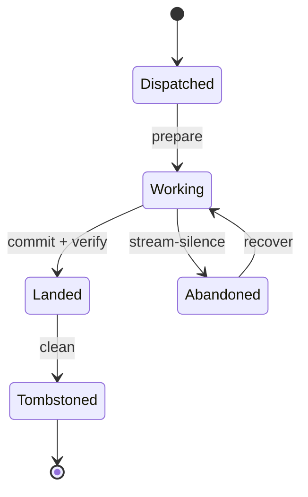

# Agent-orchestration model (developer journeys) — GoF appendix rendering

> **Draft fill.** Worked Structure + Sample Code slots for the catalogue entry
> `models-bridge/system-models/agent-orchestration-model.md`, rendered in the book's Gang-of-Four appendix
> layout. The follow-up pass injects the two filled slots at the placeholders keyed by the entry name
> `Agent-orchestration model (developer journeys)`. Intent / Motivation / Applicability / Consequences /
> Known Uses / Related Patterns are projected from the catalogue `.md` — reproduced in brief so the entry
> reads as a complete GoF page.

## Agent-orchestration model (developer journeys)

**Intent** — Model the agent fleet and the orchestrator's own loop with the same MBSE method you point at
the product: typed lifecycle states, typed seams, and invariants whose verification tier is derived, all
held to reality by a drift gate. The substrate that *produces* the software becomes as checkable as the
software.

### Motivation

The fleet that builds the product usually goes unmodeled. Its lifecycle — dispatch, work, land,
tombstone — and the orchestrator's refill loop live implicitly across several tools. Nothing names them
as typed state machines, so the failures stay invisible: an agent reaches a state no transition allows;
the orchestrator rests with ratified work queued; a fleet invariant is asserted nowhere.

### Applicability

Reach for this when the fleet lifecycle is enacted through addressable substrate — a registry, a
tombstone record, a worktree tool — that a model can reconcile against, and a trunk MBSE method already
exists to reuse. Without a real event vocabulary to check the states against, you get a hand-authored
doc, not a checked model.

### Structure

Two typed state machines carry the developer journey. The agent lifecycle runs from dispatch to a clean
teardown, with an abandoned/recovered branch; the orchestrator loop observes a completion, lands it,
refills the freed slot, and banks state. A drift gate reconciles the declared states against the live
registry's event vocabulary.



*Accessible description: an agent moves from dispatched to working to landed to tombstoned, with a branch
where a stalled agent is abandoned and later recovered back to working. The declared states are what a
drift gate checks against the live registry.*

### Sample Code

The lifecycle is a transition table, not scattered flags. A guard function accepts a move only if the
table allows it, and a reconcile step fails when a declared state has no counterpart in the live event
vocabulary — the check that keeps the model equal to the fleet it describes.

```python
import sys

# The fleet lifecycle as an explicit transition table (the source of truth).
TRANSITIONS = {
    "dispatched": {"working"},
    "working":    {"landed", "abandoned"},
    "abandoned":  {"working"},          # recover branch
    "landed":     {"tombstoned"},
    "tombstoned": set(),
}

def legal(frm: str, to: str) -> bool:
    return to in TRANSITIONS.get(frm, set())

def reconcile(live_events: set[str]) -> list[str]:
    """Every declared state must appear in the live event vocabulary, and vice versa."""
    declared = set(TRANSITIONS)
    findings  = [f"declared state '{s}' has no live event" for s in declared - live_events]
    findings += [f"live event '{e}' has no declared state"  for e in live_events - declared]
    return findings

if __name__ == "__main__":
    # `read_registry_vocab` returns the state names the live registry actually emits.
    findings = reconcile(read_registry_vocab())
    for f in findings:
        print(f"MODEL-DRIFT: {f}")
    sys.exit(1 if findings else 0)
```

### Consequences

- **The fleet lifecycle gains one authoritative source of truth** — a new state or facet is now a model
  edit, or the drift gate fails.
- **Modeling the operator's own loop can feel like navel-gazing** until it first catches the orchestrator
  resting with ratified work queued.
- **It inherits the product method's ceremony** — derived tiers, drift gates — worth paying only because
  the fleet is operated constantly and its failures are expensive.

### Known Uses

- A fleet-lifecycle state machine plus an orchestrator-loop state machine, a closed set of typed seams,
  and invariants with derived verification tiers reconciled against the registry.
- The reflection substrate modeled as first-class nodes, with a drift gate reconciling declared nodes
  against the live registry both ways.

### Related Patterns

- **Sibling** — the product-facing service-flow and user-journey models; this is the *developer*-journey
  counterpart, same method reified toward the fleet.
- **See also** — formal invariant verification (the tier derivation applied to fleet invariants) and
  drift & parity gates (the node-vs-registry reconciliation).
