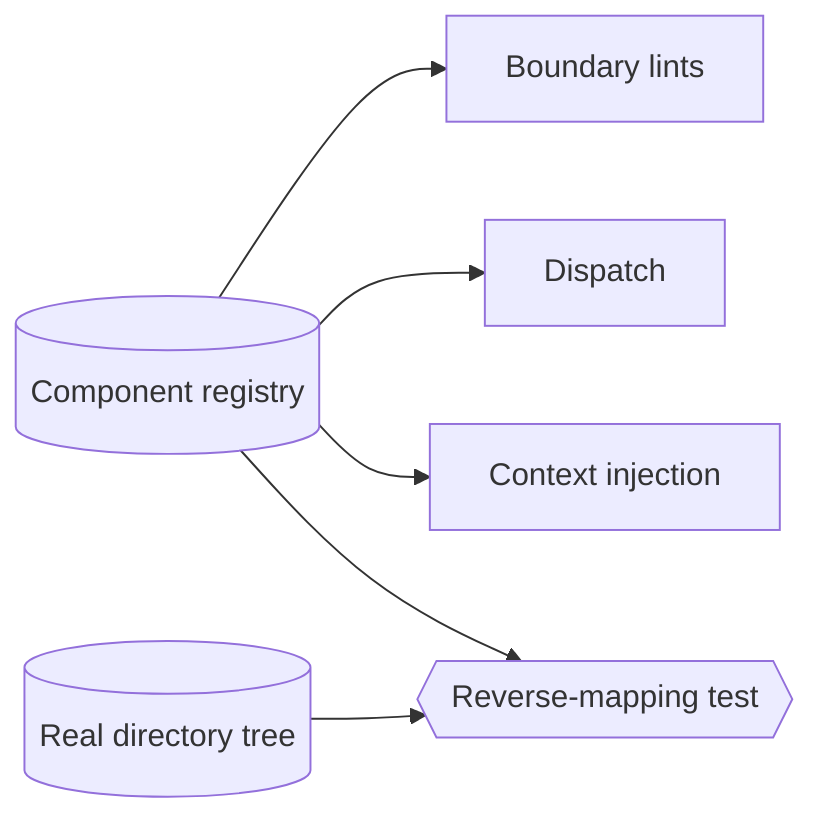

# Component & zone model — GoF appendix rendering

> **Draft fill.** Worked Structure + Sample Code slots for the catalogue entry
> `models-bridge/system-models/component-zone-model.md`, rendered in the book's Gang-of-Four appendix
> layout. The follow-up pass injects the two filled slots at the placeholders keyed by the entry name
> `Component & zone model`. Intent / Motivation / Applicability / Consequences / Known Uses / Related
> Patterns are projected from the catalogue `.md` — reproduced in brief so the entry reads as a complete
> GoF page.

## Component & zone model

**Intent** — A typed catalogue of every component's code zone — its directories, tags, boundary kind, and
seams — so "which component owns this file, and what may touch it" is a queried fact, not a guess.

### Motivation

Governance keeps asking which component owns a file and what boundary it sits behind. Answered ad hoc,
with a hardcoded path list here and a grep there, those answers drift the moment a directory moves, and
each tool keeps passing while reasoning from a stale map.

### Applicability

Reach for this when many tools need the same ownership map — dispatch for zones, lints for scope,
context-injection to slice constraints — and each currently infers it privately from paths. You need a
typed registry with the fields consumers need and a reverse-mapping test that fails when the model and
the real tree disagree.

### Structure

A typed registry names each component's zone once. Consumers read the registry instead of re-inferring
from paths, and a reverse-mapping test walks the real tree and asserts parity in both directions.



*Accessible description: a typed component registry feeds three consumers — boundary lints, dispatch, and
context injection — so they read one answer. A reverse-mapping test compares the registry against the
real directory tree and fails on divergence.*

### Sample Code

A frozen record names each component's zone. Ownership is a lookup that finds the record whose directory
prefixes the path, and a reverse-mapping check asserts every real directory maps back to exactly one
component — the parity that stops the map staling as directories move.

```python
from dataclasses import dataclass
import sys

@dataclass(frozen=True)
class Component:
    name: str
    focus_dir: str      # the directory prefix this component owns
    boundary: str       # e.g. "leaf" / "group" / "external-seam"

REGISTRY = [
    Component("editor", "src/editor/", "leaf"),
    Component("worker", "src/worker/", "leaf"),
]

def owner_of(path: str) -> str | None:
    for c in REGISTRY:
        if path.startswith(c.focus_dir):
            return c.name
    return None

def reverse_map(real_dirs: set[str]) -> list[str]:
    """Every real top-level dir must map to exactly one component (no unmodeled zone)."""
    owned = {c.focus_dir for c in REGISTRY}
    return [f"'{d}' exists but no component owns it" for d in sorted(real_dirs - owned)]

if __name__ == "__main__":
    # `list_real_dirs` enumerates the code tree's owned directories.
    findings = reverse_map(list_real_dirs())
    for f in findings:
        print(f"UNMODELED-ZONE: {f}")
    sys.exit(1 if findings else 0)
```

### Consequences

- **Add-a-component upkeep** — a new component means a registry row plus a boundary classification, or the
  reverse-mapping test fails.
- **Centralization blast radius** — a wrong zone misroutes every consumer at once, the cost of the
  fix-once affordance.

### Known Uses

- A typed component registry read by the lint fleet, dispatch, and audit surfaces.
- The boundary / seam / read-surface classifiers.
- The reverse-mapping test that holds model-vs-tree parity.

### Related Patterns

- **Bridge** — agents consume it to know where they are; it governs the product through boundary and
  focus-dir lints.
- **Counterpart** — drift & parity gates: the reverse-mapping test that keeps it honest.
- **See also** — meta-model consumption (read it, don't hardcode) and the query surface.
