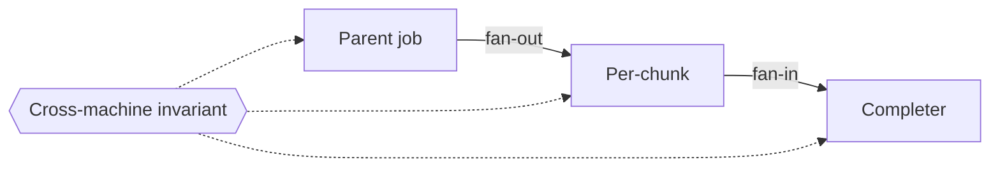

# Composed state-machine model (typed lifecycles + cross-machine invariants) — GoF appendix rendering

> **Draft fill.** Worked Structure + Sample Code slots for the catalogue entry
> `models-bridge/system-models/composed-state-machine-model.md`, rendered in the book's Gang-of-Four
> appendix layout. The follow-up pass injects the two filled slots at the placeholders keyed by the entry
> name `Composed state-machine model (typed lifecycles + cross-machine invariants)`. Intent / Motivation /
> Applicability / Consequences / Known Uses / Related Patterns are projected from the catalogue `.md` —
> reproduced in brief so the entry reads as a complete GoF page.

## Composed state-machine model (typed lifecycles + cross-machine invariants)

**Intent** — Model a concurrent lifecycle as a *set* of typed state machines that run at once, name the
predicates that must hold **across** those machines as first-class invariants, and derive each invariant's
verification obligation from its shape — a safety predicate earns an exhaustive state-space check, a
liveness predicate a temporal one, a linear predicate a property test.

### Motivation

A distributed lifecycle rarely lives in one machine: a parent job fans out into chunks, each chunk moves
through its own states, a completer fans results back in. The correctness properties that matter *span the
machines* — a chunk is never both leased and free, output is uploaded before the row is marked done,
exactly one completer fires. Left implicit, each lives as scattered boolean flags, and the cross-machine
predicate is asserted nowhere. A test that walks each machine alone reports green while the composition is
broken.

### Applicability

Reach for this when a real lifecycle is enacted through addressable state (a status column, an event
stream) you can reconcile against, each invariant can carry a *required, consumed* temporal-form field,
and at least one exhaustive checker exists for a safety form to route to.

### Structure

Each lifecycle is one typed machine — a states enum, a transition table, a terminal set. The machines are
declared as a composed set with their handoff seams. Cross-machine predicates are first-class invariants;
each declares a temporal form, and the form *derives* the checker it is routed to. A drift gate reconciles
the declared states against the live lifecycle.



*Accessible description: a parent-job machine fans out into a per-chunk machine, which fans back in to a
completer machine; a cross-machine invariant spans all three, checked by the verifier its declared temporal
form routes it to.*

### Sample Code

A machine is a states enum plus a transition table that names every legal edge, so an illegal transition
is unrepresentable. Each cross-machine invariant declares a temporal form, and the form is *consumed*: one
lookup derives the checker its shape demands, forcing the hairiest races onto the strongest checker while a
simple ordering stays a cheap property test.

```python
from enum import Enum

class ChunkState(Enum):
    QUEUED = "queued"; LEASED = "leased"; DONE = "done"; FAILED = "failed"

# The transition table names every legal edge; anything absent is unrepresentable, not a runtime surprise.
LEGAL = {
    ChunkState.QUEUED: {ChunkState.LEASED, ChunkState.FAILED},
    ChunkState.LEASED: {ChunkState.DONE, ChunkState.QUEUED, ChunkState.FAILED},  # QUEUED = preemption re-entry
    ChunkState.DONE:   set(),   # terminal
    ChunkState.FAILED: set(),   # terminal
}

# Each cross-machine invariant declares a temporal FORM; the form DERIVES the checker it must pass.
CHECKER = {
    "safety":   "exhaustive-state-space-search",  # []P    — no reachable state violates P
    "liveness": "temporal-model-checker",         # P ~> Q — P eventually leads to Q
    "linear":   "property-test",                  # an ordering predicate over a single run
}

def checker_for(form: str) -> str:
    """Route an invariant to the checker its temporal shape demands — derived, not chosen per invariant."""
    return CHECKER[form]  # KeyError == an invariant whose form no checker reads: a decorative-form finding
```

### Consequences

- **One authoritative source of truth** — a new state or cross-machine invariant is a model edit or the
  drift gate fails. That friction is the freshness guarantee.
- **Exhaustive only within the modeled bounds** — a state-space check proves the invariant across the
  *modeled* interleavings; the proof is as strong as the model's fidelity, no stronger.
- **The composition is where effort concentrates** — drawing each machine alone is easy; the value and
  cost both live in naming the *cross*-machine predicates a single-machine view never forces you to state.

### Known Uses

- A composed model of a fan-out/fan-in document pipeline: a parent-job machine, a per-chunk machine, and a
  fan-in completer machine, declared together with the seams between them.
- A dozen-plus cross-service invariants (lease-or-free exclusivity, upload-before-terminal-write,
  exactly-one-completer, preemption re-entry order), each a declared entity carrying a temporal form.
- The temporal form as a *required* field that derives the verification tier — safety to a bounded
  state-space search, liveness to a temporal model checker, linear to property tests.

### Related Patterns

- **Consumer** — formal invariant verification: the verifier that *reads* this model's invariants and
  proves each by the checker its temporal form demands. This entry is the specification; that one is the
  proof engine.
- **Counterpart** — the process view: the same concurrency seen from the other question — "what runs at
  once and where do they race?" — over one concurrency structure.
- **Sibling** — the agent-orchestration model: the same typed-machines-plus-derived-tier method pointed at
  the fleet's own lifecycle instead of the product's runtime.
- **Layer** — concurrency contracts: the single-writer and mediator contracts that keep the machines'
  shared state from being trampled, one layer beneath the machines that transition it.
- **See also** — drift & parity gates: the reconciliation that keeps the declared machines equal to the
  live lifecycle.
