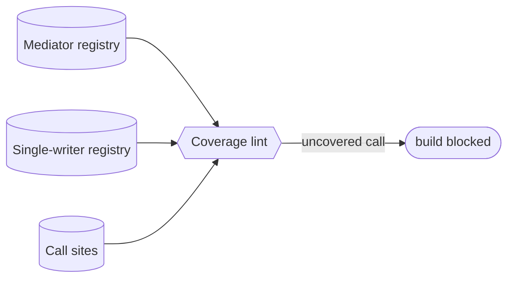

# Mediator & single-writer contracts — GoF appendix rendering

> **Draft fill.** Worked Structure + Sample Code slots for the catalogue entry
> `models-bridge/system-models/concurrency-contracts.md`, rendered in the book's Gang-of-Four appendix
> layout. The follow-up pass injects the two filled slots at the placeholders keyed by the entry name
> `Mediator & single-writer contracts`. Intent / Motivation / Applicability / Consequences / Known Uses /
> Related Patterns are projected from the catalogue `.md` — reproduced in brief so the entry reads as a
> complete GoF page.

## Mediator & single-writer contracts

**Intent** — Typed registries of the system's concurrency contracts: which subprocess invocations a
mediator serializes, and which state-mutation functions are single-writer. "Who may run this, and how
many at once" becomes declared and enforceable.

### Motivation

Concurrent worktrees share a host and shared state. A raw call that should go through the serializer
slips it; a second writer corrupts state. The breakage is a race, discovered late and hard, and it
recurs every time a new subprocess or mutator lands that nobody remembered to contract.

### Applicability

Reach for this when enforcers already exist but act blind — they can only guard what reaches them, and a
newly-added call is simply not covered. You need a declared contract per mediated subprocess and per
single-writer function, plus a coverage lint that flags a call which should be contracted but isn't.

### Structure

Two registries declare the contracts. A coverage lint reads them, scans the code for the contracted
call classes, and names any call site that is not wired to its mediator.



*Accessible description: a mediator registry and a single-writer registry both feed a coverage lint,
which also scans the code's call sites. When a contracted call class appears at a site not wired to its
mediator, the lint reports it and blocks the build.*

### Sample Code

The registry declares which subprocess each mediator serializes. A coverage lint walks the code for calls
to those subprocesses and fails on any that isn't routed through the declared mediator — closing the gap
where an enforcer can't guard a call nobody routed to it.

```python
import ast, sys

# Declared contracts: subprocess name -> the mediator that must wrap it.
MEDIATED = {"run_tests": "test-serializer", "build_image": "build-semaphore"}
MEDIATOR_MODULE = "mediators"   # the file allowed to invoke the raw subprocess

def lint(path: str, source: str) -> list[str]:
    if path.endswith(f"{MEDIATOR_MODULE}.py"):
        return []               # the mediator is the sanctioned caller
    findings = []
    for node in ast.walk(ast.parse(source)):
        if isinstance(node, ast.Call) and isinstance(node.func, ast.Name):
            if node.func.id in MEDIATED:
                need = MEDIATED[node.func.id]
                findings.append(f"{path}:{node.lineno}: '{node.func.id}' must route through {need}")
    return findings

if __name__ == "__main__":
    hits = [f for p in sys.argv[1:] for f in lint(p, open(p).read())]
    print("\n".join(hits))
    sys.exit(1 if hits else 0)
```

### Consequences

- **New mediated subprocess or mutator ⇒ a registry entry**, or a coverage-lint failure.
- **The contract is only as good as the enforcer** — a declared-but-unenforced contract is documentation.

### Known Uses

- A dev-mediator registry of subprocess serializers for the host's concurrency locks.
- A single-writer / monopoly registry for state-mutation functions.
- The mediator enforcers that refuse an unmediated call.

### Related Patterns

- **Bridge** — the agent mediators enforce these contracts; the model declares the concurrency the code
  must honor.
- **See also** — the synchronization model, the OS-lock layer beneath these higher-level contracts.
- **Counterpart** — drift & parity gates: the coverage lints keeping the registries complete.
