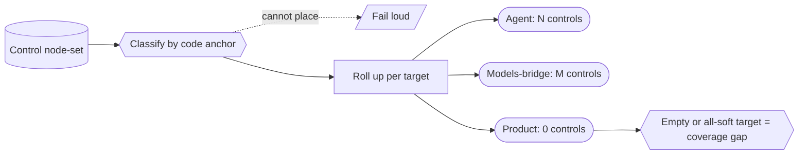

# Control-coverage census (controls per governance target) — GoF appendix rendering

> **Draft fill.** Worked Structure + Sample Code slots for the catalogue entry
> `models-bridge/system-models/control-coverage-census.md`, rendered in the book's Gang-of-Four appendix
> layout. The follow-up pass injects the two filled slots at the placeholders keyed by the entry name
> `Control-coverage census (controls per governance target)`. Intent / Motivation / Applicability /
> Consequences / Known Uses / Related Patterns are projected from the catalogue `.md` — reproduced in brief
> so the entry reads as a complete GoF page.

## Control-coverage census (controls per governance target)

**Intent** — Classify every governance control by which of a system's complementary control targets it
guards — derived from the control's own code anchor, never hand-declared — and roll the control set up per
target. A target with zero controls, or with only soft aims and no hard hold, is a re-derived coverage
gap.

### Motivation

A control portfolio grows toward the last painful failure. Effort piles onto the target that just hurt —
usually the fleet that produces work — while another target accretes nothing. Each control is well-formed;
the *set* is lopsided, and the imbalance stays invisible because no artifact ever asks whether the controls
are balanced across the things that need governing.

### Applicability

Reach for this when the controls are modeled as a queryable node-set, a closed complementary-targets
taxonomy carries a completeness claim (every target should be non-empty), and each control has a stable
anchor the target rule can resolve, so classification tracks the code rather than a hand-maintained copy.

### Structure

Each control classifies into its target by a rule read off its own code anchor; a control the rule cannot
place fails loud, never a silent default. A read-through projection rolls the node-set up per target and
reports each target's count and enforcement shape. A target with zero controls, or only soft aims, is a
first-class finding.



*Accessible description: the typed control node-set feeds a classifier that derives each control's
governance target from its code anchor. A control the classifier cannot place fails loud rather than
falling into a silent default bucket. The placed controls roll up per target — agent, models-bridge,
product — each cell reporting a control count and its soft/hard enforcement shape. A target with zero
controls, or only soft aims and no hard hold, is a re-derived coverage-gap finding that points at where the
next control should go.*

### Sample Code

The target is *derived* from each control's anchor, never a hand-authored tag, and an unplaceable control
fails loud so the map cannot mis-credit. The roll-up regrows its denominator from a closed targets
taxonomy: add a target and its gap reopens, fill a cell and it closes — an empty (or all-soft) cell is the
finding.

```python
TARGETS = ("agent", "models-bridge", "product")   # closed taxonomy with a completeness claim

def classify(control) -> str:
    """Derive the governance target from the control's code anchor; fail loud on one we cannot place."""
    target = target_of_anchor(control.anchor)      # a rule read off the anchor, not a hand tag
    if target not in TARGETS:
        raise SystemExit(f"unplaceable control {control.name!r}: anchor maps to no known target")
    return target

def coverage_gaps(controls) -> list[str]:
    """A target with zero controls, or only soft aims, is a re-derived coverage gap."""
    rollup: dict[str, list] = {t: [] for t in TARGETS}
    for c in controls:
        rollup[classify(c)].append(c)
    gaps = []
    for t in TARGETS:
        held = rollup[t]
        if not held:
            gaps.append(f"{t}: no controls")
        elif all(c.enforcement == "soft" for c in held):
            gaps.append(f"{t}: only soft aims, no hard hold")
    return gaps
```

### Consequences

- **Honest partial coverage is a feature** — a target read at zero is a named gap, not an embarrassment;
  the value is that the zero is *stated*, re-derived, and drives the next work.
- **The taxonomy must fit the governance dimension** — a target the closed set cannot express forces a
  change to the set, the honest signal the doctrine grew a dimension.
- **It measures balance, not quality** — a populated target counts as covered even if its controls are
  weak; the census closes the "no control at all" gap and leans on other mechanisms to judge strength.

### Known Uses

- A derived control-target axis over the typed control node-set, projected by a read-only per-target
  roll-up that reported one target fully populated and two at zero — the empty cells naming the estate's
  blind spots, and driving a fix-wave that filled one from zero to a dozen controls.
- The classifier fails loud on any control whose anchor it cannot place, keeping the coverage map honest as
  controls move.
- The census files its own anchor-drift guard, so the control set censuses the very governor that measures
  it.

### Related Patterns

- **Counterpart** — the reflection-facet substrate: the soft reflex that converts each recurring failure
  into a new control *extends* the graph this census *measures*. The reflex grows controls toward targets
  that already failed; the census is the proactive per-target audit that catches that blind spot.
- **Sibling** — the governance graph: the interaction view of the one graph (pairwise conflict edges),
  where this is the coverage-per-target view. Two projections of a single control node-set.
- **Sibling** — the model-derived test-obligation census: both derive a should-exist set from a model and
  lint the gap — that one over the test corpus, this one over the control portfolio (reflexive).
- **See also** — control-to-substrate dependency: a different query over the same control-as-node idea —
  computed blast radius, not coverage completeness.
- **See also** — the query surface the roll-up rides on, and the drift & parity gates family the fail-loud
  anchor classifier joins.
