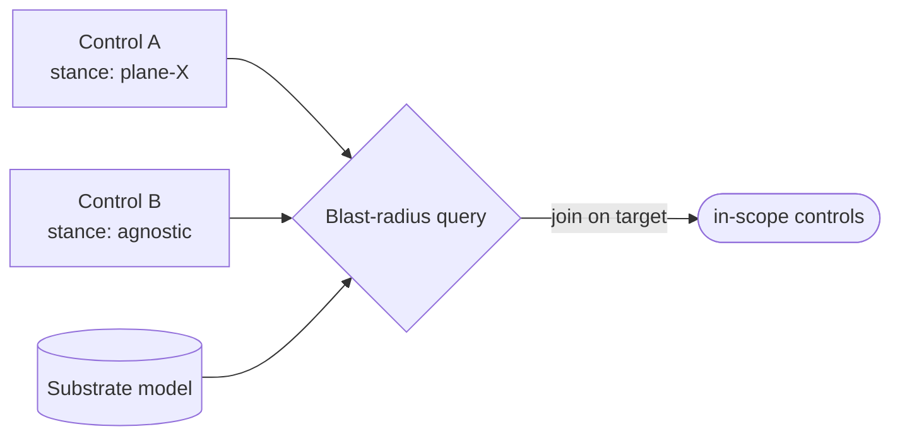

# Control↔substrate dependency (computed blast-radius) — GoF appendix rendering

> **Draft fill.** Worked Structure + Sample Code slots for the catalogue entry
> `models-bridge/system-models/control-substrate-dependency.md`, rendered in the book's Gang-of-Four
> appendix layout. The follow-up pass injects the two filled slots at the placeholders keyed by the entry
> name `Control↔substrate dependency (computed blast-radius)`. Intent / Motivation / Applicability /
> Consequences / Known Uses / Related Patterns are projected from the catalogue `.md` — reproduced in
> brief so the entry reads as a complete GoF page.

## Control↔substrate dependency (computed blast-radius)

**Intent** — Make each control *declare* the substrate assumption it bakes in as typed metadata, so
"which controls depend on which part of the substrate, and what breaks when I change it" is a computed
query, not a grep-and-read.

### Motivation

A lint or gate usually bakes an assumption about the substrate it checks — "a service is a Deployment
under this directory," "the manifest carries this field." The assumption sits buried in the control's
body, invisible until you change the substrate. Then a migration lands and half the fleet misfires: some
controls false-FAIL on the old shape, others false-PASS because the migrated service vanished from their
totality checks.

### Applicability

Reach for this when a cross-cutting substrate change is live or foreseeable, the substrate is already a
queryable model, and controls already carry a metadata block a declaration can extend. You need a closed
enum of substrate stances small enough to be exhaustive.

### Structure

Each substrate-reading control declares its stance in a typed field. A query joins those declarations
against the substrate model and, given a migration target, prints exactly which controls a change puts in
scope — the blast radius, computed before you touch the substrate.



*Accessible description: two controls each declare a substrate stance. A query joins those declarations
against the substrate model and, for a migration target, emits the table of controls that change puts in
scope. The table is derived, not hand-maintained.*

### Sample Code

Each control carries a typed stance toward the substrate. A join reads every declaration and, given a
migration target, returns the controls that assume the old shape — the blast radius, computed from
declarations rather than grepped and read body-by-body.

```python
from dataclasses import dataclass

# A small closed enum keeps the stance exhaustive and typed.
STANCES = {"assumes_plane_a", "assumes_plane_b", "branches_per_plane", "agnostic"}

@dataclass(frozen=True)
class Control:
    name: str
    stance: str      # one of STANCES; a topology-reading control MUST declare it

def blast_radius(controls: list[Control], migrate_to: str) -> list[str]:
    """Controls put in scope by a migration to `migrate_to` (they assume a different plane)."""
    hits = []
    for c in controls:
        assumes_other = c.stance.startswith("assumes_") and c.stance != f"assumes_{migrate_to}"
        if assumes_other:
            hits.append(f"{c.name}: stance '{c.stance}' misfires on migration to {migrate_to}")
    return hits

def undeclared(controls: list[Control]) -> list[str]:
    return [c.name for c in controls if c.stance not in STANCES]   # declaration lint

if __name__ == "__main__":
    import sys
    controls = load_controls()          # reads each control's declared stance metadata
    for line in blast_radius(controls, migrate_to="plane_b"):
        print(f"IN-SCOPE: {line}")
    sys.exit(1 if undeclared(controls) else 0)
```

### Consequences

- **Every substrate-reading control gains one declaration** — the intended tax; it is what makes the edge
  queryable.
- **The enum must fit the substrate dimension** — a stance it can't express forces an enum change, the
  honest signal that the substrate itself grew a dimension.
- **It pays off only at a substrate change** — a design-time-on-the-smell control, over-built if added
  speculatively to a substrate you will never change.

### Known Uses

- Each control reading the deployment-topology model declares a typed plane-assumption; a query joins
  those against the topology to print, per control, whether a migration puts it in scope.
- A declaration lint that fails any topology-reading control missing its stance, composed into the deploy
  realization gate.

### Related Patterns

- **Enabler** — the deployment-topology model, whose facts the controls assume and this makes them
  declare against.
- **See also** — meta-model consumption (read-don't-copy for values, extended here to dependency edges)
  and the query surface the computed table rides on.
- **See also** — drift & parity gates: a different question (does the model match reality?) about a
  different join.
