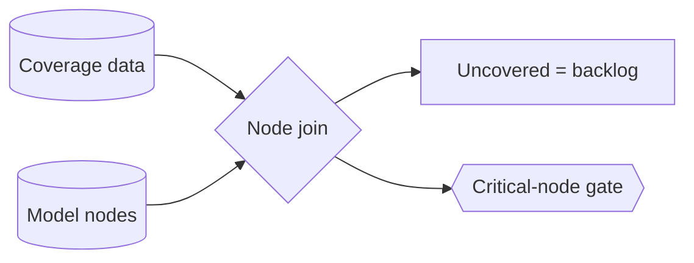

# Coverage → model-node mapping — GoF appendix rendering

> **Draft fill.** Worked Structure + Sample Code slots for the catalogue entry
> `models-bridge/system-models/coverage-model-mapping.md`, rendered in the book's Gang-of-Four appendix
> layout. The follow-up pass injects the two filled slots at the placeholders keyed by the entry name
> `Coverage → model-node mapping (which invariants are actually tested)`. Intent / Motivation /
> Applicability / Consequences / Known Uses / Related Patterns are projected from the catalogue `.md` —
> reproduced in brief so the entry reads as a complete GoF page.

## Coverage → model-node mapping (which invariants are actually tested)

**Intent** — Project test coverage onto the *model's nodes* — its states, seams, and invariants — so "is
this invariant tested?" is a queried fact per node, not a guess from a line-coverage percentage. An
uncovered node is a visible gap that drives the next test.

### Motivation

Line coverage tells you what fraction of the code ran, not which of the system's invariants got
exercised. A model can show 90% line coverage while a critical race invariant has zero tests touching its
states, because coverage counts lines, not meanings. The failure is a false sense of test adequacy — a
green number sitting over an untested critical invariant.

### Applicability

Reach for this when a typed model already names states, seams, and invariants as first-class nodes, and
coverage data can be attributed to the code realizing each node. You need a node→code join and a
criticality policy naming which nodes *must* be covered.

### Structure

The mapping joins coverage data to the model's nodes through the node→code map. Each node comes out
covered or uncovered; the uncovered critical ones drive a backlog, and a promoted gate can require a test
for each critical node.



*Accessible description: coverage data and the model's nodes both feed a join keyed on the node-to-code
map. The join labels each node covered or uncovered; uncovered nodes become a test backlog, and a gate
can fail the build on an uncovered critical node.*

### Sample Code

The map joins per-node coverage to the model. A node is covered when any covering test hits a function
that realizes it; an uncovered *critical* node is a finding — the model becomes a test work-list instead
of a percentage to chase.

```python
import sys

# node -> the set of functions that realize it (the node->code join key).
NODE_FUNCS = {"lease_invariant": {"acquire", "renew"}, "requeue": {"on_preempt"}}
CRITICAL   = {"lease_invariant"}

def uncovered(covered_funcs: set[str]) -> list[str]:
    """A node is covered iff some covering test hit a function realizing it."""
    findings = []
    for node, funcs in NODE_FUNCS.items():
        if not (funcs & covered_funcs):
            tag = "CRITICAL" if node in CRITICAL else "node"
            findings.append(f"{tag} '{node}' has no covering test")
    return findings

if __name__ == "__main__":
    # `covered_functions` reads the coverage report and returns the functions any test exercised.
    findings = uncovered(covered_functions())
    for f in findings:
        print(f"UNTESTED: {f}")
    # Gate mode: fail only on uncovered CRITICAL nodes; the rest is a backlog.
    sys.exit(1 if any("CRITICAL" in f for f in findings) else 0)
```

### Consequences

- **The join is only as good as the node→code map** — a node mapped to the wrong functions gets
  mis-attributed coverage.
- **Coverage ≠ correctness** — a covered node is exercised, not proven; pair it with formal verification
  where proof is needed.
- **Backlog-vs-gate is a judgment** — gating every node starves throughput; gating none leaves criticals
  untested.

### Known Uses

- A coverage reference projecting test coverage onto a state-machine model's nodes at function
  granularity.
- The model-as-work-list: a sweep that walks the uncovered critical nodes and writes the missing tests.
- A promotable gate requiring a covering test for each critical invariant node.

### Related Patterns

- **Counterpart** — formal invariant verification *proves* an invariant across every interleaving; this
  *measures* whether any test exercises the node at all.
- **Enabler** — executable source-of-truth: the nodes coverage joins to are fields on the typed model.
- **See also** — drift & parity gates: three angles on trusting the model — matches the world, claims are
  true, claims are exercised.
