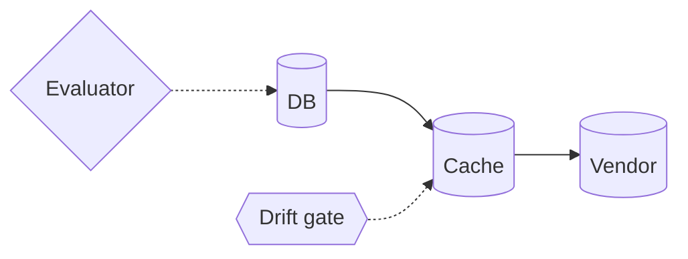

# Compliance data-flow model (typed sinks and edges for privacy reasoning) — GoF appendix rendering

> **Draft fill.** Worked Structure + Sample Code slots for the catalogue entry
> `models-bridge/system-models/data-flow-model.md`, rendered in the book's Gang-of-Four appendix layout.
> The follow-up pass injects the two filled slots at the placeholders keyed by the entry name
> `Compliance data-flow model (typed sinks and edges for privacy reasoning)`. Intent / Motivation /
> Applicability / Consequences / Known Uses / Related Patterns are projected from the catalogue `.md` —
> reproduced in brief so the entry reads as a complete GoF page.

## Compliance data-flow model (typed sinks and edges for privacy reasoning)

**Intent** — Model where data of a governed kind can *flow* as a typed graph — the sinks that hold it, the
edges that move it between them — so a question like "where does a user's personal data land, and can we
erase all of it?" is answered by walking a declared model, not by grepping the codebase and trusting the
result.

### Motivation

Privacy and erasure obligations are about *where data goes*, and that knowledge is scattered across every
module that writes a row, uploads a file, or forwards a payload. Asked "erase everything about this user,"
a team without a model answers by memory and search, and misses the cache, the log sink, the analytics
stream, the vendor the data was forwarded to two releases ago. The erasure runs, reports success, and
leaves data behind in a sink nobody remembered.

### Applicability

Reach for this when a governed data kind carries an obligation (erasure, permitted-flow, retention), the
sinks and transfers are enumerable and reconcilable against code, and a policy evaluator walks the graph to
compute the property — a graph with no evaluator is a picture.

### Structure

Every place a governed data kind comes to rest — a table, a cache, a blob store, a log stream, a vendor —
is a typed node; every transfer between sinks is an edge, typed by data category. A policy evaluator walks
the graph to check erasability, permitted-flow, and retention. A drift gate reconciles the declared sinks
and edges against the real storage and transfer sites.



*Accessible description: a typed graph of data sinks joined by transfer edges — here a database, a cache,
and a vendor. A policy evaluator walks the graph to check erasability, permitted-flow, and retention, and a
drift gate reconciles the declared sinks against the real storage and transfer sites.*

### Sample Code

The model is a *graph*, so an erasure question is transitive reachability, not a table lookup. The
evaluator walks every edge from every personal-data source; a reachable sink with no covering erasure path
is a finding — the cache or vendor a memory-and-grep answer misses.

```python
def personal_data_sinks(graph) -> set:
    """Every sink reachable by a personal-data edge — transitively, not just the direct writes."""
    reached, frontier = set(), [n for n in graph.nodes if n.holds("personal")]
    while frontier:
        n = frontier.pop()
        for edge in graph.edges_from(n):
            if edge.category == "personal" and edge.dst not in reached:
                reached.add(edge.dst)
                frontier.append(edge.dst)
    return reached

def erasability_gaps(graph, erasure_paths: set) -> list[str]:
    """A personal-data sink with no covering erasure path is a build finding, not an audit surprise."""
    return sorted(f"{s.name}: personal data lands here, no erasure path"
                  for s in personal_data_sinks(graph) if s.name not in erasure_paths)
```

### Consequences

- **Erasure and flow questions become model walks** — "can we erase everything?" is answered by traversing
  declared edges, so a new sink forces the author to declare its node and its erasure coverage.
- **The graph must track reality to be trusted** — a sink the code writes but the model omits makes the
  evaluator confidently wrong; the reconciliation gate forces a new store into the model.
- **Edges are the expensive part to keep honest** — sinks are easy to enumerate; the transfers between
  them, especially to third parties, are where the real graph hides.

### Known Uses

- A typed sink-and-edge registry over an application's personal-data flows: databases, caches, blob stores,
  and third-party transfers as nodes, the movements between them as edges.
- Erasure and information-flow policies evaluated over the graph — "every personal-data sink is erasable,"
  "no edge carries personal data into an unpermitted sink kind" — as checks a walker computes, not
  hand-audits.
- The graph reconciled against the real write and transfer sites, so a store added without a model node is
  a build finding rather than an erasure gap found under audit.

### Related Patterns

- **Sibling** — the component & zone model: both are typed maps of the system's structure; that one models
  *what code lives where*, this one models *where governed data flows*.
- **Consumer** — formal invariant verification: a flow property ("no path carries personal data into an
  uncovered sink") is the kind of predicate a checker proves over the declared graph.
- **Layer** — drift & parity gates: the reconciliation that keeps the declared sinks and edges equal to the
  real storage and transfer sites.
- **See also** — the deployment-topology model: the physical placement of the sinks the flow graph names —
  where each store actually runs.
