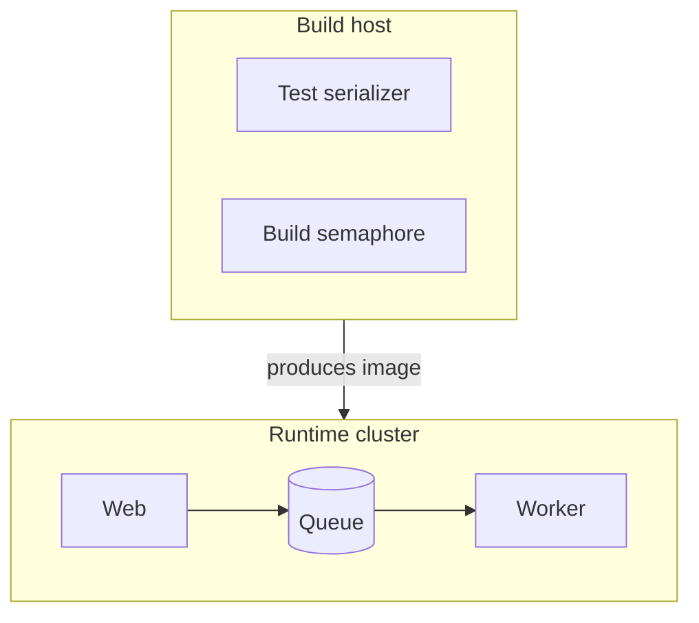

# Deployment & tier topology — GoF appendix rendering

> **Draft fill.** Worked Structure + Sample Code slots for the catalogue entry
> `models-bridge/system-models/deployment-topology-model.md`, rendered in the book's Gang-of-Four appendix
> layout. The follow-up pass injects the two filled slots at the placeholders keyed by the entry name
> `Deployment & tier topology`. Intent / Motivation / Applicability / Consequences / Known Uses / Related
> Patterns are projected from the catalogue `.md` — reproduced in brief so the entry reads as a complete
> GoF page.

## Deployment & tier topology

**Intent** — Typed models of *where things run and how they layer* — the managed-deployment topology,
each service's tier class, and the substrate's layer boundaries — so deploy scripts and layering lints
reason about a declared topology, not scattered constants.

### Motivation

Deployment facts — which layer a service is in, its tier, what may depend on what — end up hardcoded in
deploy scripts and import checks. Hardcoded, they drift from the real topology: a service moves tier, a
layer boundary is quietly crossed, and the deploy or an architectural invariant breaks.

### Applicability

Reach for this when placement matters — a lock held per host, a queue crossing a network boundary, a
layer that may not import another — and those facts currently live as constants in the deploy scripts.
You need a typed topology schema plus parity lints against the real deploy tables and import graph.

### Structure

Typed models declare where each service runs and how the layers may depend. A deployment diagram places
the parts by runtime boundary; parity lints check the declared topology against the real deploy tables
and imports.



*Accessible description: a build host runs the test serializer and build semaphore and produces the image
that the runtime cluster deploys, where the web service enqueues onto a queue drained by a worker. The
model declares this placement; parity lints hold it to the real deploy tables.*

### Sample Code

A frozen record declares each service's layer and tier. A parity check reads the real deploy table and
fails when a declared service is missing or a tier drifted — one declared topology validated against the
running system, instead of constants that stale silently.

```python
from dataclasses import dataclass
import sys

@dataclass(frozen=True)
class Service:
    name: str
    layer: str      # e.g. "web" / "worker" / "shared"
    tier: str       # e.g. "critical" / "batch"

MODEL = [Service("web", "web", "critical"), Service("worker", "worker", "batch")]

def parity(deploy_table: dict[str, str]) -> list[str]:
    """Declared tier must match the real deploy table; no service may go unmodeled."""
    findings = []
    declared = {s.name: s.tier for s in MODEL}
    for name, tier in declared.items():
        if deploy_table.get(name) != tier:
            findings.append(f"'{name}': model tier '{tier}' != deploy '{deploy_table.get(name)}'")
    for name in deploy_table.keys() - declared.keys():
        findings.append(f"'{name}' is deployed but absent from the topology model")
    return findings

if __name__ == "__main__":
    # `read_deploy_table` returns the live service->tier map the deploy scripts use.
    findings = parity(read_deploy_table())
    for f in findings:
        print(f"TOPOLOGY-DRIFT: {f}")
    sys.exit(1 if findings else 0)
```

### Consequences

- **Topology changes are model edits** — a moved tier or new layer boundary means a model edit or a
  parity failure.
- **Layering contracts constrain the code** — a declared boundary blocks a cross-layer import, a real cost
  to expedient shortcuts.

### Known Uses

- A typed topology loader, a service-tier registry, and layer-boundary contracts.
- The deploy-phase-table parity lint and the import-layer boundary lints.

### Related Patterns

- **Bridge** — agents reason about layering and tiers through these models; they govern the real
  deployment and import structure.
- **Enabler** — feeds model-driven codegen (deploy and env generation).
- **Counterpart** — drift & parity gates: the deploy-parity and layer lints.
