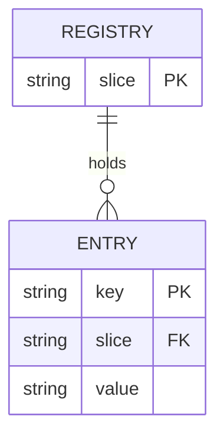

# Domain registries — GoF appendix rendering

> **Draft fill.** Worked Structure + Sample Code slots for the catalogue entry
> `models-bridge/system-models/domain-registries.md`, rendered in the book's Gang-of-Four appendix
> layout. The follow-up pass injects the two filled slots at the placeholders keyed by the entry name
> `Domain registries`. Intent / Motivation / Applicability / Consequences / Known Uses / Related Patterns
> are projected from the catalogue `.md` — reproduced in brief so the entry reads as a complete GoF page.

## Domain registries

**Intent** — Frozen, typed registries for the system's *domain facts* — the supported filetypes, the
conformance gaps, the cron entries, the competitor set — each the single source of truth for its slice,
read by the tools that need it and generated into the docs that present it.

### Motivation

Domain facts get restated in code, docs, and dashboards: "which filetypes do we support," "which
conformance criteria are gaps," "who are our competitors." Restated, they drift — a filetype list
diverges, a doc goes stale. Each is a small correctness or stale-doc failure, multiplied across many
slices.

### Applicability

Reach for this when a domain fact is a set that several tools read and at least one doc presents. You need
a typed registry per fact with the fields its consumers need, consumers that read it rather than
hardcoding, and a coverage or parity lint per registry.

### Structure

Each registry is one frozen typed record set. Tools read it for the fact; a doc generator emits the
presentation surface from it; a parity lint fails when a consumer or generated doc diverges.



*Accessible description: a registry is keyed by its domain slice and holds many entries, each a key-value
fact within that slice. Tools read the entries and a doc generator emits from them, with a parity lint
holding both to the registry.*

### Sample Code

Each registry is a frozen set of typed entries. Consumers query it and a doc is generated from it, so the
fact has one home; a parity check fails the build when a consumer's copy diverges from the registry.

```python
from dataclasses import dataclass
import sys

@dataclass(frozen=True)
class Filetype:
    ext: str
    label: str

SUPPORTED = frozenset({Filetype("pdf", "PDF"), Filetype("docx", "Word")})

def is_supported(ext: str) -> bool:
    return any(f.ext == ext for f in SUPPORTED)   # consumers query, never hardcode

def parity(doc_listed: set[str]) -> list[str]:
    """A generated doc's listed set must equal the registry (neither may drift)."""
    reg = {f.ext for f in SUPPORTED}
    findings  = [f"doc lists '{e}' not in registry" for e in sorted(doc_listed - reg)]
    findings += [f"registry has '{e}' the doc omits" for e in sorted(reg - doc_listed)]
    return findings

if __name__ == "__main__":
    # `read_doc_listed` parses the generated doc's presented set.
    findings = parity(read_doc_listed())
    for f in findings:
        print(f"REGISTRY-DRIFT: {f}")
    sys.exit(1 if findings else 0)
```

### Consequences

- **Many small registries to maintain** — the cost is breadth, not depth; each is simple but each is a
  surface.
- **Frozen sets resist expedient edits** — changing "the supported four" is a deliberate model change.

### Known Uses

- Supported-filetypes, conformance-gap, periodic-cron, write-authority, competitor, and rule-metadata
  registries.
- Their generators (e.g. a competitor-catalog generator) and coverage or parity lints.

### Related Patterns

- **Bridge** — agents and checkers read these facts; the registries govern and generate product surfaces.
- **Consumer** — the rule-metadata registry feeds the rule index; the conformance-gap registry feeds the
  standards rule engine.
- **Counterpart** — drift & parity gates: each registry's coverage or parity lint.
