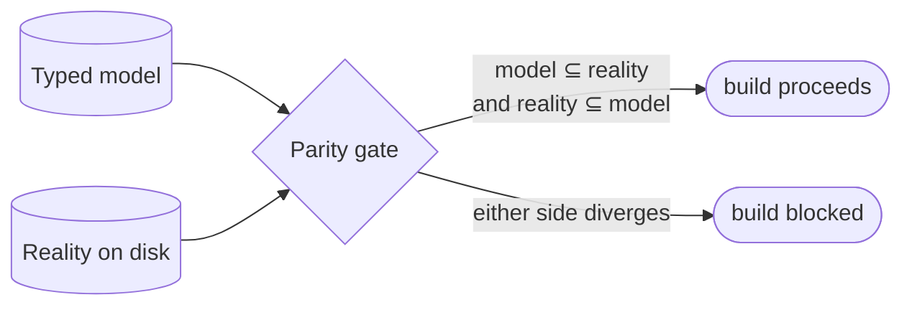

# Drift & parity gates — GoF appendix rendering

> **Exemplar draft.** Worked Structure + Sample Code slots for the catalogue entry
> `models-bridge/system-models/drift-parity-gates.md`, rendered in the book's Gang-of-Four appendix
> layout. This is the reference bar for the drift / parity-gate archetype (typed model as
> source-of-truth + a build-time check that fails when model and reality disagree). The follow-up pass
> injects the two filled slots at the placeholders keyed by the entry name `Drift & parity gates`.
> Intent / Motivation / Applicability / Consequences / Known Uses / Related Patterns are projected from
> the catalogue `.md` — reproduced in brief so the entry reads as a complete GoF page.

## Drift & parity gates

**Intent** — A build-time check that enforces **bidirectional parity between a typed model and reality**
— every model row maps to a real thing on disk, and every real thing maps back to a model row — so the
model cannot silently drift from the system it describes.

### Motivation

An executable model is only trustworthy if it stays true. The failure this kills is **silent model
drift**: the model says one thing, the code does another, and everything downstream that reasons from
the model reasons from a lie. Because the model *looks* authoritative, drift is worse than absence. It
recurs whenever the code changes without the model, or the model changes without the code.

### Applicability

Reach for this when a typed model is the source of truth that downstream steps trust — dispatch,
codegen, deploy — and both the model and the reality it describes are machine-readable. You need a
predicate that runs in *both* directions (neither side may drift unilaterally) and a blocking placement
in the gates, or drift is merely reported.

### Structure

The gate reads the model and enumerates reality, then checks the two set-inclusions that together make
parity: model ⊆ reality (no phantom rows) and reality ⊆ model (nothing on disk goes unmodeled). Either
direction failing turns the gate red.



*Accessible description: the parity gate takes two inputs — the typed model and the enumerated reality
on disk. It checks both inclusions: every model row exists in reality, and every real thing is modeled.
When both hold the build proceeds; when either side diverges the build is blocked.*

### Sample Code

The gate is a set comparison run in both directions. Read the model into a set of expected keys,
enumerate reality into a set of actual keys, and fail if either set has a member the other lacks. The
two directions are the whole point: one direction alone lets the *other* side drift undetected.

```python
import sys

def parity_gate(model_keys: set[str], reality_keys: set[str]) -> list[str]:
    """Bidirectional parity: every model row must exist on disk, and every real
    thing must be modeled. Either half failing is drift."""
    findings = []
    for missing in sorted(model_keys - reality_keys):
        findings.append(f"model row '{missing}' has no match on disk (phantom row)")
    for unmodeled in sorted(reality_keys - model_keys):
        findings.append(f"'{unmodeled}' exists on disk but is absent from the model")
    return findings

if __name__ == "__main__":
    # `load_model` reads the source-of-truth; `scan_reality` enumerates the world it describes.
    findings = parity_gate(load_model(), scan_reality())
    for f in findings:
        print(f"DRIFT: {f}")
    sys.exit(1 if findings else 0)   # blocking: any drift fails the build
```

### Consequences

- **A gate per model to author and maintain** — real breadth of enforcement surface.
- **Bidirectional is stricter** — it catches more, and also fails more often on legitimate transitions.
  That is the point: the transition must update both sides.
- **A wrong parity predicate** produces false drift (blocks good changes) or false confidence (misses
  real drift).

### Known Uses

- Parity lints pairing a typed model against its realization: a service-flow model against the real
  service trees, a public-API model against the live handlers, a deploy-phase table against the deploy
  scripts.
- Reverse-mapping tests that walk reality and assert each item resolves to a model row.

### Related Patterns

- **Counterpart** — each typed system model is the *construction*; its drift gate is the *detection*
  that holds it true. Construction-held-by-detection is the family's pervasive pairing.
- **See also (sibling)** — the product-side coherence lints apply the same relational-invariant idea
  across product data sources, where this applies it across model and reality.
