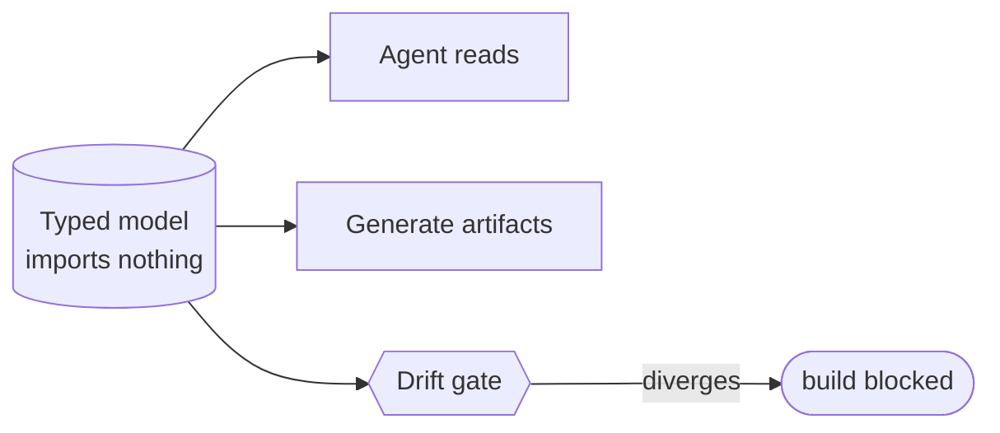

# Executable source-of-truth models — GoF appendix rendering

> **Draft fill.** Worked Structure + Sample Code slots for the catalogue entry
> `models-bridge/system-models/executable-source-of-truth.md`, rendered in the book's Gang-of-Four
> appendix layout. The follow-up pass injects the two filled slots at the placeholders keyed by the entry
> name `Executable source-of-truth models`. Intent / Motivation / Applicability / Consequences / Known
> Uses / Related Patterns are projected from the catalogue `.md` — reproduced in brief so the entry reads
> as a complete GoF page.

## Executable source-of-truth models

**Intent** — Model the system as typed data that tools read on every run and generate real artifacts
from. The model becomes executable documentation that cannot drift, and the codebase becomes operable by a
context-bounded agent.

### Motivation

A large codebase exceeds any agent's context window. Left to read the raw code, an agent re-derives the
architecture badly and drifts; the architecture itself lives only implicitly, so humans re-derive it too.
The failure is no shared, authoritative, compact representation of the system — which caps how large a
codebase agents can operate on at all.

### Applicability

Reach for this when you want one compact map that agents reason from and the build is generated from, and
you have agents to pay the upkeep humans resent. You need typed models that import nothing, continuous
consumption on real runs, and a drift gate per model.

### Structure

The typed model sits at the center. Agents read it to reason; the build generates artifacts from it; a
drift gate holds it equal to reality. Because it is read and checked on every run, it cannot go stale.



*Accessible description: one typed model that imports nothing feeds three consumers — an agent that reads
it, generators that emit real artifacts from it, and a drift gate that blocks the build when the model
diverges from reality. Continuous reads and checks keep it from staling.*

### Sample Code

The model is data, not code — a record set anything can load cheaply. One consumer reads it at run time
and a drift gate checks it against reality, so the model is exercised on every run and cannot quietly fall
behind the code it describes.

```python
from dataclasses import dataclass
import sys

@dataclass(frozen=True)
class Node:
    name: str
    kind: str

# The model: typed data that imports nothing, so any tool loads it for free.
MODEL = [Node("web", "service"), Node("worker", "service")]

def consume() -> set[str]:
    return {n.name for n in MODEL}          # a real run reads the model, not a hardcoded copy

def drift_gate(reality: set[str]) -> list[str]:
    model = consume()
    findings  = [f"model row '{n}' not in reality" for n in sorted(model - reality)]
    findings += [f"'{n}' in reality, unmodeled"    for n in sorted(reality - model)]
    return findings

if __name__ == "__main__":
    # `scan_reality` enumerates the real things the model claims to describe.
    findings = drift_gate(scan_reality())
    for f in findings:
        print(f"DRIFT: {f}")
    sys.exit(1 if findings else 0)          # the model is checked every run, so drift can't hide
```

### Consequences

- **Upkeep is real** — the models must be maintained and the drift gates satisfied on every change, the
  tedium that stops humans and the reason it needs agents.
- **A wrong model is worse than none** — an authoritative-looking model that has drifted misleads
  everything downstream; the drift gates are not optional.
- **Modeling discipline up front** — deciding what to model, and in what dialect, is design work.

### Known Uses

- A model catalog of typed data plus loaders that import nothing.
- The preference order: a stable lint that reads the meta-file, over codegen, over a hand-rolled copy.
- Each model's doc-derived characterization pin.

### Related Patterns

- **Bridge** — every model here couples an agent-side use (query/inject) to a product-side use
  (govern/generate).
- **Counterpart** — drift & parity gates: the hard mechanism that makes "cannot drift" true.
- **See also** — the models it names (component-zone, synchronization, service-flow, topology, registries)
  and the mechanisms over them (codegen, query surface, consumption).
