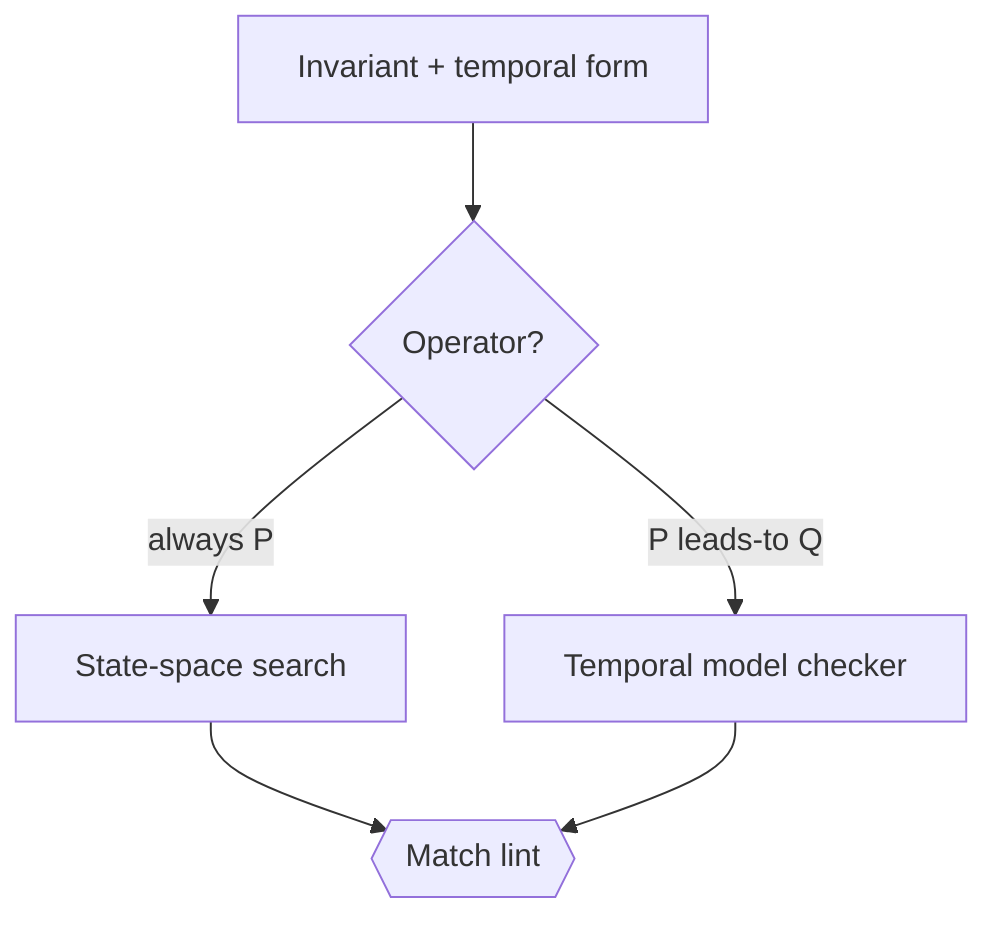

# Formal invariant verification (temporal form → model checking) — GoF appendix rendering

> **Draft fill.** Worked Structure + Sample Code slots for the catalogue entry
> `models-bridge/system-models/formal-invariant-verification.md`, rendered in the book's Gang-of-Four
> appendix layout. The follow-up pass injects the two filled slots at the placeholders keyed by the entry
> name `Formal invariant verification (temporal form → model checking)`. Intent / Motivation /
> Applicability / Consequences / Known Uses / Related Patterns are projected from the catalogue `.md` —
> reproduced in brief so the entry reads as a complete GoF page.

## Formal invariant verification (temporal form → model checking)

**Intent** — Give every model invariant a temporal form — a temporal-logic operator saying whether it is
*safety* (always holds) or *liveness* (eventually leads to) — and make that form the routing input that
derives which exhaustive checker verifies it. The invariant is proven by the method its shape demands, not
sampled.

### Motivation

Some invariants are about a single reachable state; others about interleavings over time. Stated in prose
or pinned by one example, either kind can be *believed* true while a rare schedule violates it — a
property test samples the input space and sails past the one adversarial interleaving. Worse, a
mis-declared liveness invariant routed to a safety runtime cannot be seen to fail, with zero signal.

### Applicability

Reach for this when a typed invariant model exists, at least one exhaustive checker is available, and the
state space is bounded. You need a required, *consumed* temporal-form field — optional or defaulted, it
rots — so the form both routes the checker and is validated against it.

### Structure

Each invariant declares a temporal operator. A router reads the operator and picks the checker its shape
demands; a match lint asserts the routed checker matches the operator, so a mis-declared invariant is a
build error, not a silent gap.



*Accessible description: an invariant carries a temporal operator that a decision routes — a safety
"always" operator to a state-space search, a liveness "leads-to" operator to a temporal model checker. A
match lint checks the routed checker against the operator and fails on a mismatch.*

### Sample Code

The temporal form is a required field that *derives* the checker. A router maps the operator to an
exhaustive checker, and a match lint fails when the two disagree — so "a liveness property checked by a
safety runtime" is impossible rather than silent.

```python
import sys

def route(temporal_form: str) -> str:
    """The operator shape derives the checker. Required field, consumed here."""
    if "~>" in temporal_form:            # leads-to => liveness
        return "temporal-model-checker"
    if temporal_form.startswith("[]"):   # always => safety
        return "state-space-search"
    raise ValueError(f"unrecognized temporal form: {temporal_form!r}")

def match_lint(invariants: list[dict]) -> list[str]:
    """The routed checker must match the operator (no mis-declared invariant)."""
    findings = []
    for inv in invariants:
        want = route(inv["temporal_form"])
        if inv["checker"] != want:
            findings.append(f"{inv['name']}: routed to '{inv['checker']}', form needs '{want}'")
    return findings

if __name__ == "__main__":
    # `load_invariants` returns each invariant's name, temporal_form, and routed checker.
    findings = match_lint(load_invariants())
    for f in findings:
        print(f"MIS-ROUTED: {f}")
    sys.exit(1 if findings else 0)
```

### Consequences

- **Exhaustive, within bounds** — the check proves the invariant over the modeled state space; a bug
  outside the model is out of scope.
- **Heavier than a unit test, typically CI-only** — the derived-tier routing keeps simple invariants on
  cheap checkers and reserves the model checker for the races that earn it.
- **The form must stay honest** — its value is being *consumed*; a decorative temporal string no checker
  reads is worse than none, which is why the match lint exists.

### Known Uses

- Temporal-logic operators as a required field on each cross-service invariant, deriving the verification
  tier from the operator shape.
- The exhaustive runtimes — a temporal model checker plus a bounded-BFS simworld over the reachable states.
- The match lint that makes a mis-routed invariant a build error.

### Related Patterns

- **Enabler** — executable source-of-truth: the invariants are fields on the typed model; the temporal
  form is one more consumed field.
- **Counterpart** — drift & parity gates keep the model equal to *reality*; this keeps its *invariants*
  sound. Two faces of trusting the model.
- **See also** — a sampled property test raises confidence where a full model-check is too costly; the
  temporal form routes each invariant to the strength its shape demands.
