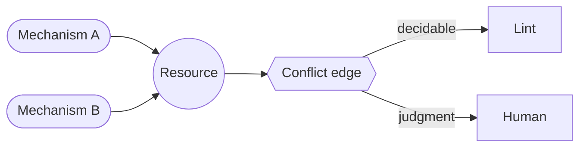

# Governance graph (mechanism-interaction model) — GoF appendix rendering

> **Draft fill.** Worked Structure + Sample Code slots for the catalogue entry
> `models-bridge/system-models/governance-graph.md`, rendered in the book's Gang-of-Four appendix layout.
> The follow-up pass injects the two filled slots at the placeholders keyed by the entry name
> `Governance graph (mechanism-interaction model)`. Intent / Motivation / Applicability / Consequences /
> Known Uses / Related Patterns are projected from the catalogue `.md` — reproduced in brief so the entry
> reads as a complete GoF page.

## Governance graph (mechanism-interaction model)

**Intent** — Model the fleet's process-governance mechanisms as a typed graph — each mechanism a node
tagged by the event it fires on and the resources it reads, writes, or locks; each edge a **conflict**
between two mechanisms over one shared resource — so a collision between two guardrails is caught by
construction, not when they trip each other in production.

### Motivation

A governed fleet accumulates guardrails — turn-end hooks, pre-commit checks, dispatch gates, lock
mediators — and each earns its place alone. But two can place contending demands on one shared resource: a
commit-set two mechanisms shape incompatibly, a turn-end slot two hooks both fire on. Nothing sees the
collision until a real operation trips both, and every new mechanism is a new pair against every existing
one.

### Applicability

Reach for this when several mechanisms touch the same resources on the same events and "which pairs can
collide, over what?" has no answer but a production incident. You need a closed, typed resource
vocabulary as the join key, mechanisms reachable by a stable anchor, and a derived
deterministic-versus-judgment classifier that splits the sensor path from the human-prompt path.

### Structure

Nodes are typed mechanisms; the closed resource vocabulary is the join key. An edge joins two mechanisms
that collide on one resource, typed by a four-value conflict taxonomy. Each edge's nature is *derived* from
its conflict type: a decidable edge routes to a consistency lint, a semantic one to a human prompt. A
drift lint re-resolves each node's code anchor to hold the graph equal to the wired reality.



*Accessible description: two mechanism nodes collide on one shared resource, forming a typed conflict edge
in a closed taxonomy — contradiction, contention, ordering, soft-versus-hard. The edge's nature routes it:
a decidable edge to a consistency lint, a judgment edge to a human prompt.*

### Sample Code

The resource is the join key, so conflicts are found by grouping mechanisms that share one. A same-slot
pair with no declared order is a mechanically decidable *ordering* finding; whether two constraints on a
commit-set truly contradict is a *judgment* the graph routes to a reader. One classifier derives which
path an edge takes from its conflict type — never a per-edge guess.

```python
import itertools, sys

# The closed conflict taxonomy. An edge's NATURE is DERIVED from its kind, one rule for all edges.
DECIDABLE = {"contention", "ordering"}          # lock cycle / same-slot-no-order — a lint decides
JUDGMENT = {"contradiction", "soft-vs-hard"}    # incompatible required shapes — a reader decides

def edge_nature(kind: str) -> str:
    return "decidable" if kind in DECIDABLE else "judgment"

def same_slot_findings(mechs, declared_orders: set) -> list[str]:
    """Two mechanisms firing on one event slot with no declared order between them → an ordering edge."""
    findings = []
    by_event: dict[str, list] = {}
    for m in mechs:
        by_event.setdefault(m.fires_on, []).append(m)
    for event, group in by_event.items():
        for a, b in itertools.combinations(group, 2):
            if (a.name, b.name) not in declared_orders and (b.name, a.name) not in declared_orders:
                findings.append(f"{a.name} × {b.name} both fire on '{event}' with no declared order")
    return findings

if __name__ == "__main__":
    # `wired_mechanisms` / `declared_orders` read the graph's typed nodes and its ordering edges.
    fs = same_slot_findings(wired_mechanisms(), declared_orders())
    for f in fs:
        print(f"CONFLICT[ordering]: {f}")
    sys.exit(1 if fs else 0)
```

### Consequences

- **The graph must not drift** — a stale interaction model claims conflicts are covered when a mechanism
  changed underneath it. The drift lint is what makes the model trustworthy, and it earns the
  code-anchoring requirement.
- **Resource granularity is a tuning surface** — too coarse and every pair sharing a broad token looks
  like a conflict; too fine and the graph is noise. A dense graph is a mis-grained vocabulary, not a wall
  of real conflicts.
- **The model describes; it does not mandate** — it models the mechanisms that exist and checks proposed
  ones on request. It does not manufacture conflict-lints for collisions that have never happened.

### Known Uses

- A governance-graph model in the fleet's model layer: mechanism nodes tagged by firing event and typed
  shared-resource footprint, conflict edges in the four-value taxonomy with a derived decidable-or-judgment
  nature, a check-new query that runs the decidable checks against a proposed mechanism before it lands,
  and a drift lint reconciling each node's anchor against the wired hook and mediator set.
- Its two motivating collisions — a commit-set contradiction and a turn-end contention — are the canonical
  edges it was built to surface.

### Related Patterns

- **Bridge** — the fleet's gates, mediators, and lifecycle hooks are the *nodes* this model reasons over;
  the model *governs* their interactions, and the drift lint keeps its node set equal to the wired reality.
- **Enabler** — the synchronization model: the lock-ordering deadlock analysis is the contention edge's
  checker, generalized from OS locks to the turn-end slot.
- **Counterpart** — drift & parity gates: the anchor-drift lint that holds this model true.
- **Sibling** — the agent-orchestration model draws the fleet's *lifecycle*; this one draws the
  *interactions between the controls* that govern it.
- **See also** — the query surface the consistency questions are asked through; and the symbol-anchored
  traceability graph, whose derived-anchor discipline the node-to-code join reuses.
