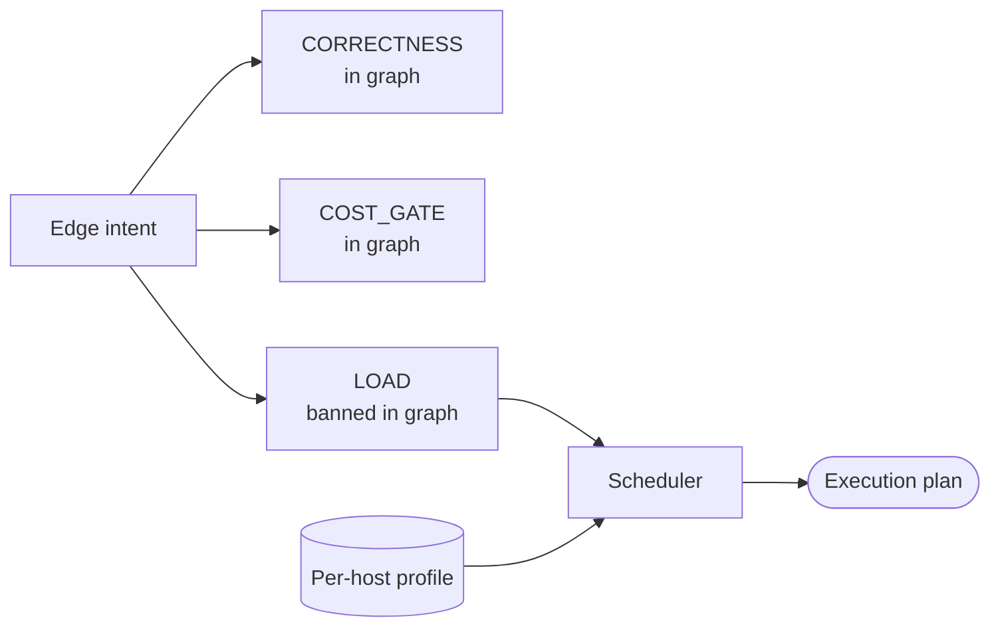

# Invariant-DAG execution policy — GoF appendix rendering

> **Draft fill.** Worked Structure + Sample Code slots for the catalogue entry
> `models-bridge/system-models/invariant-dag-execution-policy.md`, rendered in the book's Gang-of-Four
> appendix layout. The follow-up pass injects the two filled slots at the placeholders keyed by the entry
> name `Invariant-DAG execution policy (a typed Scheduler separates correctness from resource + cost)`.
> Intent / Motivation / Applicability / Consequences / Known Uses / Related Patterns are projected from the
> catalogue `.md` — reproduced in brief so the entry reads as a complete GoF page.

## Invariant-DAG execution policy (a typed Scheduler separates correctness from resource + cost)

**Intent** — Keep a build/deploy dependency graph a statement of correctness only, identical on every
host, and push every environment-specific concern — how much may run at once, and whether a costly step is
worth running — into a typed Scheduler that reads a per-host profile and produces the execution plan.

### Motivation

A pipeline graph is meant to state correctness: `B needs A` because B is wrong without A. In practice two
other intents leak into the same syntax — a *resource* wait (they contend for one box) and a *cost* gate
(run the cheap check before the paid one). The graph now lies to its reader, three intents wear one edge,
and the usual patch — a per-host `if prod: drop edge` — mutates the graph per host and hides a dropped
correctness edge among dropped rations.

### Applicability

Reach for this when hosts differ in a real cost or concurrency gradient — one elastic, one single-boxed,
one budget-bounded — and the graph currently varies per host. You need a typed edge record to declare
intent on, a closed set of rationed resource classes, and a stable roster the graph is a function of.

### Structure

Every edge declares one of three intents. Only correctness and cost-gate edges live in the graph, which
is host-identical; load edges migrate to a typed Scheduler that reads a per-host profile and emits the
execution plan.



*Accessible description: an edge declares one of three intents. Correctness and cost-gate edges stay in
the host-identical graph; load edges are banned from it and move to a Scheduler, which reads a per-host
profile and produces the execution plan.*

### Sample Code

Each edge carries a typed intent. A lint bans load edges from the graph, and a Scheduler maps a per-host
`(ceiling, budget)` profile to a plan — so raising a host's concurrency is a one-row profile edit, never a
graph edit.

```python
from dataclasses import dataclass
import sys

DAG_RESIDENT = {"CORRECTNESS", "COST_GATE"}   # the single source the load lint reads

@dataclass(frozen=True)
class Edge:
    frm: str
    to: str
    intent: str        # CORRECTNESS | COST_GATE | LOAD

def load_lint(edges: list[Edge]) -> list[str]:
    """A LOAD edge in the graph is a finding — load rationing belongs to the Scheduler."""
    return [f"{e.frm}->{e.to}: intent {e.intent} not allowed in graph"
            for e in edges if e.intent not in DAG_RESIDENT]

def plan_for(concurrency_ceiling: int, budget: float) -> dict:
    """Pure map from a host profile to an execution plan (permits + cost-gate honoring)."""
    return {"permits": concurrency_ceiling, "run_cost_gated": budget > 0.0}

if __name__ == "__main__":
    edges = load_graph()                  # reads the built dependency graph's typed edges
    findings = load_lint(edges)
    for f in findings:
        print(f"LOAD-IN-GRAPH: {f}")
    # A new host is a new profile row, e.g. plan_for(concurrency_ceiling=1, budget=0.0)
    sys.exit(1 if findings else 0)
```

### Consequences

- **The graph gains a second axis to author** — every edge now declares an intent, the cost of legibility.
- **Behavior identity across the migration must be pinned** — turning a single-worker queue-drain edge
  into a permits-1 semaphore is equal at N=1 but diverges at N>1; pin that the low-concurrency host still
  serializes.
- **Two rationing layers may coexist** — an out-of-graph mediator may guard a different scope than the
  deploy Scheduler until they are unified.

### Known Uses

- A three-value edge-intent enum on the deploy driver, with only correctness and cost-gate edges DAG-
  resident and a frozen resident-set the load lint reads.
- A typed Scheduler mapping a frozen per-host `(ceiling, budget)` profile to a plan, over named host
  profiles; moving a stress test between hosts is a one-cell profile edit.
- The load-edge lint plus a superset lint asserting the edge set is host-consistent.

### Related Patterns

- **Sibling** — journey-criticality test placement: a typed policy layer over the same deploy substrate,
  different subject — places tests by criticality where this rations execution by resource and budget.
- **Ground truth** — the deployment-topology model supplies the host taxonomy the profile keys on.
- **Kin** — control↔substrate dependency: both attach typed metadata to edges and compute a decision from
  it.
