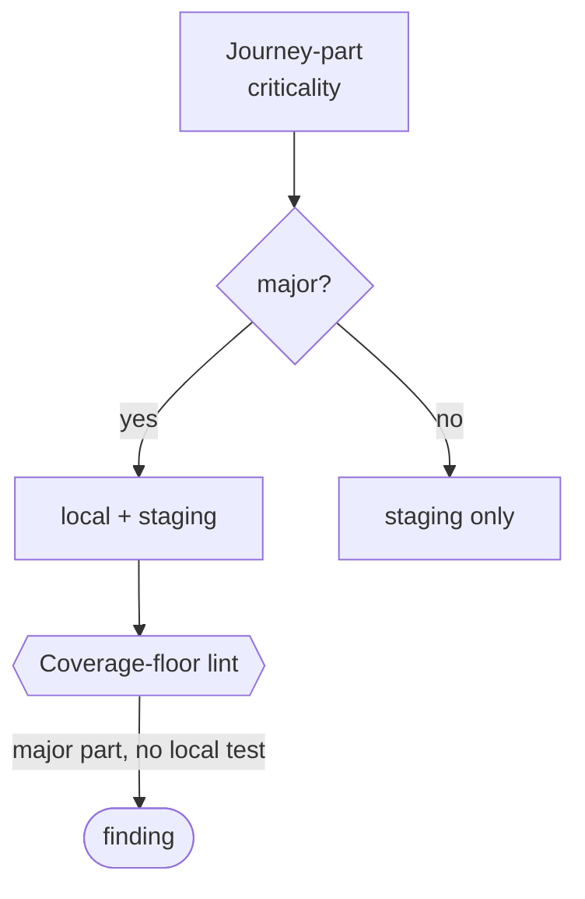

# Journey-criticality → test-tier placement — GoF appendix rendering

> **Draft fill.** Worked Structure + Sample Code slots for the catalogue entry
> `models-bridge/system-models/journey-criticality-test-placement.md`, rendered in the book's Gang-of-Four
> appendix layout. The follow-up pass injects the two filled slots at the placeholders keyed by the entry
> name `Journey-criticality → test-tier placement (which host a test runs on, derived)`. Intent /
> Motivation / Applicability / Consequences / Known Uses / Related Patterns are projected from the
> catalogue `.md` — reproduced in brief so the entry reads as a complete GoF page.

## Journey-criticality → test-tier placement (which host a test runs on, derived)

**Intent** — Make a journey's criticality the single input that *derives* which environment tier its tests
run in, and hold a coverage floor over the derivation: every high-criticality journey-part carries a test
in the fast local tier, so a green local run means the major paths work.

### Motivation

A test suite runs across tiers of different cost — a fast local gate on every commit, a heavy staging
matrix. Which test runs where is usually a hand-drawn line, and it drifts from what actually matters. So a
major path lands staging-only: local passes, a reviewer merges, and the broken revenue-core flow surfaces
later. The fast gate is trusted to mean more than it covers.

### Applicability

Reach for this when environments differ in cost enough that placement matters, and a typed journey model
carries a criticality field on addressable parts. You need a total criticality→tier derivation, a
sanctioned set of local test homes, and a join key from a journey-part to its tests.

### Structure

Each journey-part's criticality derives its host tier by a total function, stored nowhere by hand. A
coverage-floor lint walks the model and fails when a major part has no test in a local home.



*Accessible description: a journey-part's criticality routes through a derivation — a major part to local
plus staging, a minor part to staging only. A coverage-floor lint checks that every major part has a local
test and reports one that does not.*

### Sample Code

The tier is a pure function of criticality — a stored tier literal is banned, so demoting a part to
staging-only forces a visible criticality edit. The coverage-floor lint fails when a major part has no
local test, making "local-green ⟹ every major path ran locally" a checked property.

```python
import sys

def derive_tier(criticality: str) -> str:
    """Total function: criticality alone decides the host tier. No hand-typed tier literal."""
    return "local-depth" if criticality == "major" else "staging-full"

def coverage_floor(parts: list[dict], local_tests: set[str]) -> list[str]:
    """Every major journey-part must have a test in a sanctioned local home."""
    findings = []
    for p in parts:
        if p["criticality"] == "major" and p["join_key"] not in local_tests:
            findings.append(f"major part '{p['name']}' has no local test")
    return findings

if __name__ == "__main__":
    # `load_parts` reads journey-parts + criticality; `local_test_keys` lists tests in local homes.
    findings = coverage_floor(load_parts(), local_test_keys())
    for f in findings:
        print(f"UNCOVERED-MAJOR: {f}")
    sys.exit(1 if findings else 0)
```

### Consequences

- **The floor closes *absence*, not *quality*** — it proves a major part has a local test, not that the
  test drives the real gesture.
- **The join key is load-bearing** — a major part with no key to its tests can't be checked, so it is
  itself a finding.
- **Reclassification is the only escape, by design** — moving a part off the local floor forces a
  criticality demotion, friction that is the point.

### Known Uses

- A typed journey-criticality model whose two-value axis derives each part's local-vs-staging tier at
  load, storing the tier nowhere by hand.
- The coverage-floor lint: every major part must map to a real-gesture spec in a sanctioned local home.
- A per-context selector — a pure function from a deploy context to a frozen test roster — that the deploy
  path gates each phase on, in place of per-environment guards.

### Related Patterns

- **Sibling derivation** — formal invariant verification: both derive a verification tier from a typed
  trait; there the temporal shape routes the checker, here criticality routes the host.
- **Counterpart** — coverage → model-node mapping asks *which invariants have any test*; this derives
  *which host tier* a test runs on and holds a floor that the fast tier covers the majors.
- **Ground truth** — the user-journey and service-flow models supply the journeys and steps this consumes.
