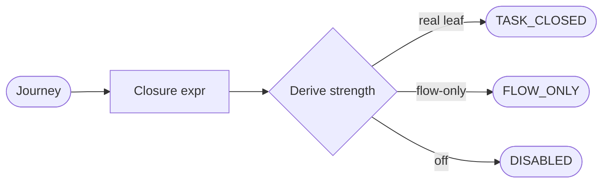

# Journey task-closure (type the terminal post-condition, derive its strength) — GoF appendix rendering

> **Draft fill.** Worked Structure + Sample Code slots for the catalogue entry
> `models-bridge/system-models/journey-task-closure.md`, rendered in the book's Gang-of-Four appendix
> layout. The follow-up pass injects the two filled slots at the placeholders keyed by the entry name
> `Journey task-closure (type the terminal post-condition, derive its strength)`. Intent / Motivation /
> Applicability / Consequences / Known Uses / Related Patterns are projected from the catalogue `.md` —
> reproduced in brief so the entry reads as a complete GoF page.

## Journey task-closure (type the terminal post-condition, derive its strength)

**Intent** — Type a journey's terminal post-condition as a boolean expression over reusable,
accessibility-observable leaf-predicates, derive a closure-strength verdict from the expression, and hold
that every major journey derives `TASK_CLOSED` — so a journey test can no longer green while the user's
task is broken.

### Motivation

A journey test usually asserts that the *flow ran* — a page returned 200, a URL was reached — not that the
*task closed* — the artifact the user came for is present, valid, and operable. The two are one hop apart,
and that hop is where a real break hides: navigation to the editor succeeds and the test asserts exactly
that, then the accessibility view fails to fetch and never paints. The terminal assertion stopped at "the
URL loaded," and the spec passes against broken production.

### Applicability

Reach for this when journeys live in a structured model with addressable parts, each observable can resolve
to a real signal (an accessibility role, an HTTP status, a file's magic bytes), a criticality axis scopes
the gate to major journeys, and a reviewed registry holds the leaf-predicate library.

### Structure

Each journey carries a typed `closure` block: a small sealed boolean algebra (AND / OR / NOT) over leaves
drawn from a shared predicate library, each leaf resolving to an accessibility observable. A pure function
derives the strength verdict — `TASK_CLOSED`, `FLOW_ONLY`, or `DISABLED` — and a gate makes a major journey
deriving `FLOW_ONLY` a finding. Because the closure is typed, a second resolver checks it against the
deployed canary.



*Accessible description: a journey carries a typed closure expression over a shared leaf-predicate library;
a pure derivation reads it and returns a strength verdict — TASK_CLOSED on a non-flow-only leaf, FLOW_ONLY
when every positive leaf is flow-only (a build finding for a major journey), DISABLED when the asserting
spec is switched off.*

### Sample Code

The strength is *derived* from the typed expression, stored nowhere by hand, so a weak terminal assertion
is a finding, not a judgment call. The two flow-only leaves may be referenced freely but can never
constitute a closure alone — that asymmetry is the teeth.

```python
FLOW_ONLY_LEAVES = {"navigated_to_url", "route_returned_2xx"}   # referenced freely, never a closure alone

def derive_strength(closure) -> str:
    """A total function over the typed closure expression — TASK_CLOSED / FLOW_ONLY / DISABLED."""
    if closure.spec_disabled:
        return "DISABLED"
    positives = closure.positive_leaves()                  # leaves asserted true in the expression
    if any(leaf.key not in FLOW_ONLY_LEAVES for leaf in positives):
        return "TASK_CLOSED"                               # at least one real task observable
    return "FLOW_ONLY"                                     # only flow-only leaves — the one-hop-short gap

def gate(journeys) -> list[str]:
    """A major journey deriving FLOW_ONLY is the mechanical form of 'a journey test should have caught it'."""
    return sorted(f"{j.name}: terminal assertion is FLOW_ONLY"
                  for j in journeys if j.is_major and derive_strength(j.closure) == "FLOW_ONLY")
```

### Consequences

- **The gate closes *meaning*, not *robustness*** — a `TASK_CLOSED` closure asserts the right shape of
  outcome; it cannot prove the assertion is deep. That residual stays human review.
- **The library must be extended deliberately** — a new leaf is a reviewed registry addition, not a
  per-journey predicate, or the library sprawls into the bespoke tangle it exists to prevent.
- **A disabled closure must be visible, not invisible** — a closure behind a switched-off spec derives
  `DISABLED` and stays in the model as a visible gap.
- **Audit-only-first is the honest landing** — existing journeys derive `FLOW_ONLY` until migrated, so the
  gate lands non-blocking, a wave drains the backlog, then it promotes.

### Known Uses

- Typed `closure` blocks on the major journeys, the exemplar being *the artifact rendered AND a control is
  inspectable AND no error-fallback* — the fixed form of the one-hop-past break.
- The pure strength derivation and its gate: a major journey deriving `FLOW_ONLY` is a finding, landed
  audit-only first while the migration backlog drains.
- A canary closure-probe that resolves each major journey's typed closure against a pre-promotion revision,
  closing the containment hole where a configuration-only break is invisible to a local assertion.

### Related Patterns

- **Sibling** — journey-criticality test-placement: both derive a verdict from a typed journey trait. There
  criticality derives the host tier; here a closure expression derives the strength of the terminal
  assertion — picking up exactly where that entry's floor stops, at quality rather than absence.
- **Counterpart** — coverage-to-model mapping: that asks *is this endpoint tested at all* (presence); this
  asks *does the terminal assertion mean the task closed* (meaning).
- **Consumer** — the user-journey model supplies the `Journey` carrier this adds the `closure` field to.
- **See also** — drift & parity gates: the strength gate is that parity mechanism applied to the terminal
  assertion; and executable source-of-truth: the closure is data, read every run, not prose that rots.
