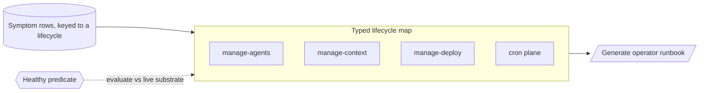

# Lifecycle model (typed operational map → generated runbook) — GoF appendix rendering

> **Draft fill.** Worked Structure + Sample Code slots for the catalogue entry
> `models-bridge/system-models/lifecycle-model.md`, rendered in the book's Gang-of-Four appendix layout.
> The follow-up pass injects the two filled slots at the placeholders keyed by the entry name
> `Lifecycle model (typed operational map → generated runbook)`. Intent / Motivation / Applicability /
> Consequences / Known Uses / Related Patterns are projected from the catalogue `.md` — reproduced in brief
> so the entry reads as a complete GoF page.

## Lifecycle model (typed operational map → generated runbook)

**Intent** — Model *how the operating substrate works* as a typed object: each lifecycle a named subsystem
with a one-line summary of its mechanics and a machine-checkable healthy-state predicate, and each
operational symptom a row keyed to the lifecycle it belongs to. Then generate the operator's runbook from
that model, so the runbook can't drift from the system it describes.

### Motivation

An operator runs a substrate with many moving parts: how agents are dispatched and reclaimed, how context
is banked, how the repo stays deployable, how deploys stage. The knowledge of *how each part works when
healthy* and *what to do when it isn't* lives in one person's head and a scatter of stale docs. The
operator diagnoses from memory — wrong precisely on the rare failure that matters — and an agent operator
has no cross-session memory at all, re-deriving the substrate slowly or wrongly every time.

### Applicability

Reach for this when the operation decomposes into a small set of named lifecycles, each has a checkable
notion of healthy (a status file, a lock table, an alert stream a predicate can read), and a generation
step actually projects the runbook from the model rather than hand-copying it once.

### Structure

Each lifecycle is a named node carrying a one-line mechanics summary and a machine-evaluable healthy
predicate. Each known failure signature is a symptom row keyed to the lifecycle it belongs to. The operator
runbook is *projected* from the nodes and their symptom rows, so it is a view of the model; the healthy
predicates are evaluated against the live substrate.



*Accessible description: a typed map of named operating lifecycles — manage-agents, manage-context,
manage-deploy, the cron plane, and the rest — each a node with a one-line mechanics summary. A catalog of
symptom rows, each keyed to the lifecycle it belongs to, hangs off the map, so troubleshooting is sorted by
the system's real structure. The operator runbook is generated from the nodes and their symptom rows, a
projection of the model rather than a parallel document. Each lifecycle's healthy-state predicate is
evaluated against the live substrate, so "is this lifecycle well?" is a check, not a vibe.*

### Sample Code

The healthy predicate is what separates a description from a check — it is *evaluated* against the live
substrate, not read as prose. The runbook is generated from the same nodes the health checks run on, so
prose cannot drift from the map.

```python
from dataclasses import dataclass
from typing import Callable

@dataclass(frozen=True)
class Lifecycle:
    name: str
    summary: str                      # one-line mechanics when healthy
    healthy: Callable[[], bool]       # machine-evaluable against the live substrate
    symptoms: list[tuple[str, str]]   # (failure signature, fix), each keyed to THIS lifecycle

def health_report(lifecycles: list[Lifecycle]) -> list[str]:
    """Evaluate each lifecycle's predicate against the live substrate — a check, not a memory."""
    return [f"{lc.name}: UNHEALTHY" for lc in lifecycles if not lc.healthy()]

def generate_runbook(lifecycles: list[Lifecycle]) -> str:
    """Project the runbook FROM the model, so a changed lifecycle regenerates its prose (no drift)."""
    out = []
    for lc in lifecycles:
        out.append(f"## {lc.name}\n{lc.summary}")
        out += [f"- symptom: {sig} -> {fix}" for sig, fix in lc.symptoms]
    return "\n".join(out)
```

### Consequences

- **Operating knowledge stops living only in a head** — a new failure mode is a new symptom row on the
  right lifecycle; a new subsystem is a new node with its own predicate.
- **The healthy predicates must stay honest** — a predicate that drifts from what "well" really means gives
  false confidence; the generation gate pushes an out-of-date predicate to the surface.
- **It models the operator's own work** — which can feel like navel-gazing until the first incident a fresh
  agent resolves in seconds by reading a generated runbook keyed to a failing health check.

### Known Uses

- A typed operating map of a fleet's substrate: named lifecycles for managing agents, context, the git
  repository, deploys, the dev machine, the periodic-GC plane, and the orchestrator's hooks, each with a
  one-line mechanics summary and a healthy-state predicate.
- A symptom-to-fix catalog whose rows each name the lifecycle they key to, so an operator lands on the right
  subsystem before reading the fix.
- An operator skill generated from that map — the positive "how it works" map first, troubleshooting as the
  keyed fallback.

### Related Patterns

- **Sibling** — the agent-orchestration model: both model the fleet substrate. That one models the
  *lifecycle transitions* as typed state machines; this one models the *operation* of those subsystems —
  their health and failure signatures — and generates the runbook.
- **Bridge** — it models the very substrate the agents run on, so an agent operating the fleet reasons
  through this map the way the product-facing models let it reason through the product.
- **Generalization** — the genre generalizes any single operating runbook into a typed map: a specific
  "how to recover the cron plane" note is one node's symptom rows.
- **See also** — model-driven codegen: generating the runbook from the model is that mechanism applied to
  operator documentation, with the same provenance-and-drift discipline.
